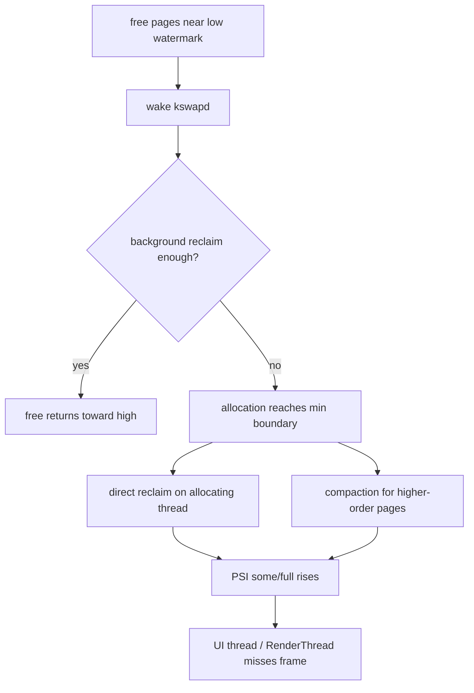
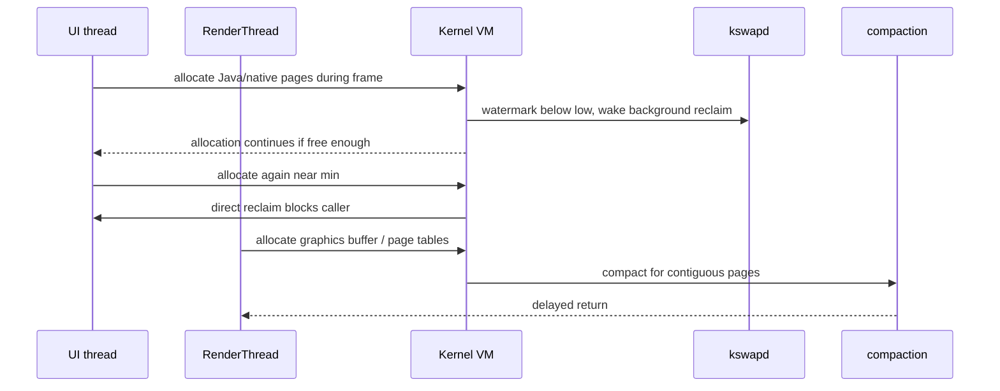
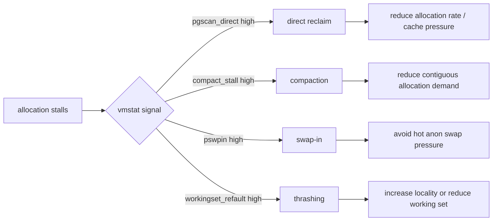
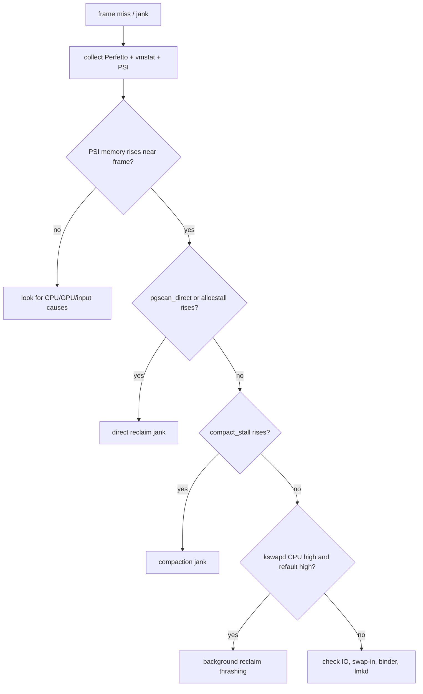

# Day 51: 低端机卡顿根因：kswapd、direct reclaim、compaction 与 UI 抖动

> 目标：承接 Day 50 的 watermark 边界，把 `low/min` 跌破后的内核动作对齐到 UI 线程 stall、RenderThread 抖动和帧时间尖刺。

---

## 1. 从水位到卡顿



| 阶段 | 内核信号 | 用户侧信号 |
|---|---|---|
| 接近 `low` | `pgscan_kswapd` 上升 | 通常轻微 |
| 接近 `min` | `pgscan_direct` 上升 | 分配点卡顿 |
| 碎片化 | `compact_*` 上升 | 大对象/图形路径尖刺 |
| stall 扩散 | PSI `some/full` 上升 | 连续掉帧或 ANR 风险 |

---

## 2. UI 执行路径



| 线程 | 常见触发 | 排查重点 |
|---|---|---|
| UI thread | 列表创建、图片 wrapper、布局对象 | `sched` slice + allocation 周期 |
| RenderThread | display list、纹理、buffer 生命周期 | frame timeline + graphics memory |
| Binder thread | 大结果、跨进程 buffer | binder 调用耗时和 shared memory |
| Background worker | 预取、解码、缓存增长 | 是否把压力提前推给前台帧 |

---

## 3. Direct reclaim 与 compaction 分界



| 指标 | 更像什么 | 下一步 |
|---|---|---|
| `pgscan_direct` | 分配线程自己回收 | 找同时间片的分配调用 |
| `allocstall` | 同步分配卡住 | 对齐 frame miss |
| `compact_stall` | 连续页整理 | 查大页、buffer、图形路径 |
| `compact_fail` | 碎片化严重 | 看 pagetype 和长期 pin |
| `pswpin/pswpout` | ZRAM 换入换出 | 查 anon 工作集 |

---

## 4. 排障决策流



| 证据组合 | 结论强度 |
|---|---|
| frame miss + PSI `some` + `pgscan_direct` | 强：direct reclaim 影响帧 |
| frame miss + `compact_stall` + graphics allocation | 强：compaction 影响帧 |
| kswapd 高 CPU + refault 高 + cache 波动 | 中强：后台 reclaim 干扰 |
| 只有 MemFree 低 | 弱：不能单独证明卡顿根因 |

---

## 5. 采集模板

```bash
adb shell cat /proc/vmstat > vmstat.before.txt
adb shell cat /proc/pressure/memory > psi.before.txt
adb shell cat /proc/zoneinfo > zoneinfo.before.txt
adb shell cat /proc/pagetypeinfo > pagetypeinfo.before.txt
adb shell dumpsys gfxinfo <package> framestats > framestats.before.txt
```

```bash
adb shell perfetto -o /data/misc/perfetto-traces/mem-jank.pftrace -t 20s \
  sched freq idle am wm gfx view binder_driver hal meminfo android.mem
adb pull /data/misc/perfetto-traces/mem-jank.pftrace .
```

```bash
rg -n "Bitmap|ByteBuffer|HardwareBuffer|allocate|malloc|LruCache|RecyclerView|onTrimMemory" app src .
```

---

## 今日检查清单

- [ ] 已确认卡顿帧附近 PSI memory `some/full` 是否升高。
- [ ] 已对比 `pgscan_kswapd`、`pgscan_direct`、`allocstall`、`pgsteal_*`。
- [ ] 已检查 `compact_stall`、`compact_fail` 和 `/proc/pagetypeinfo`。
- [ ] 已把 Perfetto frame miss 对齐到 UI thread、RenderThread 或 Binder 线程。
- [ ] 已区分 direct reclaim、compaction、swap-in、CPU/GPU 非内存瓶颈。
- [ ] 已定位触发分配的业务路径：图片、列表、缓存、跨进程 buffer 或 native malloc。
- [ ] 已做 before/after，证明 PSI、direct reclaim、compaction 和掉帧同时下降。

---

## 6. 优化动作矩阵

| 根因 | 优先动作 | 验证 |
|---|---|---|
| UI 分配过密 | 复用对象、延后创建、分页加载 | frame miss + allocstall 下降 |
| 图片峰值过高 | 降采样、tile、取消无效解码 | Graphics/native + direct reclaim 下降 |
| 缓存挤压工作集 | 降低缓存上限、响应 trim | refault 和 PSI 下降 |
| 连续页需求高 | 减少大 buffer 突发申请 | compact_stall 下降 |
| 后台预取干扰 | 限速、错峰、低内存停预取 | kswapd CPU 和 jank 下降 |

---

## 7. 今天的结论

| 结论 | 工程含义 |
|---|---|
| kswapd 高不一定卡 | 关键看是否扩散到 PSI 和帧时间 |
| direct reclaim 很危险 | 谁分配，谁可能被迫回收 |
| compaction 是另一类 stall | 常和大页、buffer、碎片化相关 |
| 低端机更敏感 | watermark 余量小，缓存和突发分配更容易越线 |
| 根因必须时间对齐 | frame、PSI、vmstat、线程 slice 缺一不可 |

Day 52 继续深入 PSI：`some/full`、`avg10/60/300` 与 thrashing 判断。
