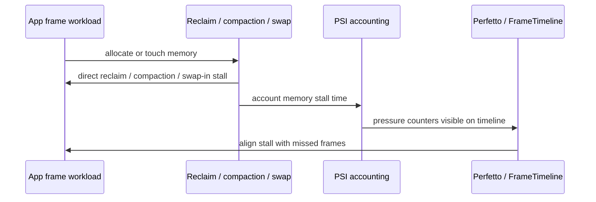
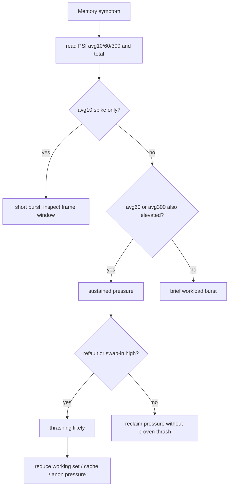
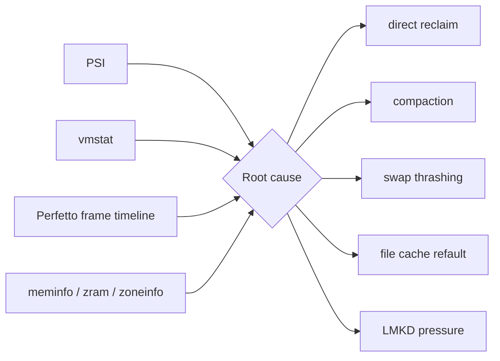

# Day 52: PSI 内存压力：some/full、avg10/60/300 与 thrashing 判断

> 目标：承接 Day 51 的 jank 模型，用 PSI 判断 reclaim、compaction、swap 压力是否已经变成用户可见且持续的 stall。

---

## 1. PSI 读数结构

```mermaid
flowchart TD
    A[/proc/pressure/memory] --> B[some]
    A --> C[full]
    B --> D[at least one task stalled]
    C --> E[all non-idle tasks stalled]
    B --> F[avg10 / avg60 / avg300]
    C --> F
    F --> G[short spike vs sustained pressure]
    G --> H[correlate with vmstat + frame timeline]
```

| 字段 | 含义 | 排查用法 |
|---|---|---|
| `some` | 至少有任务因内存等待 | 判断用户路径是否受影响 |
| `full` | 所有可运行任务都因内存等待 | 判断系统性阻塞 |
| `avg10` | 近 10 秒平均 stall 占比 | 适合看交互尖刺 |
| `avg60` | 近 60 秒平均 | 适合看场景持续压力 |
| `avg300` | 近 5 分钟平均 | 适合看后台慢性 thrashing |
| `total` | 累计 stall 时间 | 适合 before/after 差分 |

---

## 2. 从 Day 51 到 PSI



| Day 51 现象 | PSI 证明方式 |
|---|---|
| direct reclaim 卡 UI | `some avg10` 与 frame miss 同时升高 |
| compaction 卡 RenderThread | `some` 升高并伴随 `compact_stall` |
| swap-in 抖动 | `some` 升高并伴随 `pswpin` |
| 全系统不可运行 | `full` 明显升高 |

---

## 3. Thrashing 决策流



| 模式 | PSI 形态 | 更可能的结论 |
|---|---|---|
| 瞬时 spike | `avg10` 高，`avg60/300` 低 | 单场景突发 |
| 场景持续压力 | `avg10/60` 高 | 当前流程工作集过大 |
| 慢性压力 | `avg300` 高 | 后台缓存、泄漏或系统水位长期紧 |
| 系统冻结感 | `full` 高 | 多数可运行任务都被内存拖住 |
| thrashing | PSI 高 + refault/swap-in 高 | 工作集被反复换出/回收 |

---

## 4. 排障证据图



| 证据 | direct reclaim | compaction | swap thrashing | file refault |
|---|---:|---:|---:|---:|
| PSI `some` | 高 | 高 | 高 | 中高 |
| PSI `full` | 中 | 中 | 高 | 中 |
| `pgscan_direct` | 高 | 可能高 | 中 | 中 |
| `compact_stall` | 低 | 高 | 低 | 低 |
| `pswpin/pswpout` | 低中 | 低 | 高 | 低 |
| `workingset_refault` | 中 | 低 | 中 | 高 |

---

## 5. 采集与差分

```bash
adb shell cat /proc/pressure/memory > psi.before.txt
adb shell cat /proc/vmstat > vmstat.before.txt
adb shell cat /proc/meminfo > meminfo.before.txt
adb shell cat /proc/zoneinfo > zoneinfo.before.txt
adb shell cat /sys/block/zram0/mm_stat > zram.before.txt
```

```bash
adb shell "for i in $(seq 1 30); do date +%s.%N; cat /proc/pressure/memory; sleep 1; done" \
  > psi-sampled.txt
adb shell dumpsys gfxinfo <package> framestats > framestats.txt
```

```bash
rg -n "onTrimMemory|LruCache|BitmapPool|prefetch|ByteBuffer|HardwareBuffer|malloc|cache" app src .
```

---

## 6. 判断矩阵

| 问题 | 最小证据闭环 |
|---|---|
| 是否用户可见 | PSI `avg10` 与 missed frame 同窗口升高 |
| 是否持续 | `avg60/300` 不回落 |
| 是否 direct reclaim | PSI + `pgscan_direct/allocstall` |
| 是否 compaction | PSI + `compact_stall/compact_fail` |
| 是否 thrashing | PSI + refault 或 swap-in 反复升高 |
| 是否可优化 | before/after 同时降低 stall 和业务指标 |

---

## 今日检查清单

- [ ] 已保存 `/proc/pressure/memory`，并记录 `some/full avg10/60/300 total`。
- [ ] 已用 1 秒采样区分瞬时 spike、场景持续压力和慢性压力。
- [ ] 已把 PSI 与 Perfetto frame miss、UI thread、RenderThread 对齐。
- [ ] 已同步采集 `vmstat`，检查 `pgscan_direct`、`allocstall`、`compact_stall`、`workingset_refault`。
- [ ] 已同步采集 ZRAM 指标，检查 `pswpin/pswpout` 和压缩池变化。
- [ ] 已区分 direct reclaim、compaction、swap thrashing、file refault 和非内存瓶颈。
- [ ] 已做 before/after，证明 PSI `total` 增速和 `avg10/60` 峰值下降。

---

## 7. 今天的结论

| 结论 | 工程含义 |
|---|---|
| PSI 是 stall 指标 | 它不直接告诉你是谁分配，但能证明是否被内存拖住 |
| `some` 看影响面 | 适合判断某些线程或场景被卡 |
| `full` 看系统性阻塞 | 高 `full` 往往比单个 heap 字段更危险 |
| avg 窗口看持续性 | `avg10` 看交互，`avg60/300` 看长期压力 |
| thrashing 需要组合证据 | PSI 必须和 refault、swap-in、vmstat、Perfetto 一起解释 |

Day 53 进入水位增长来源追查：`meminfo`、`vmstat`、slab、dma-buf 与 memcg。
