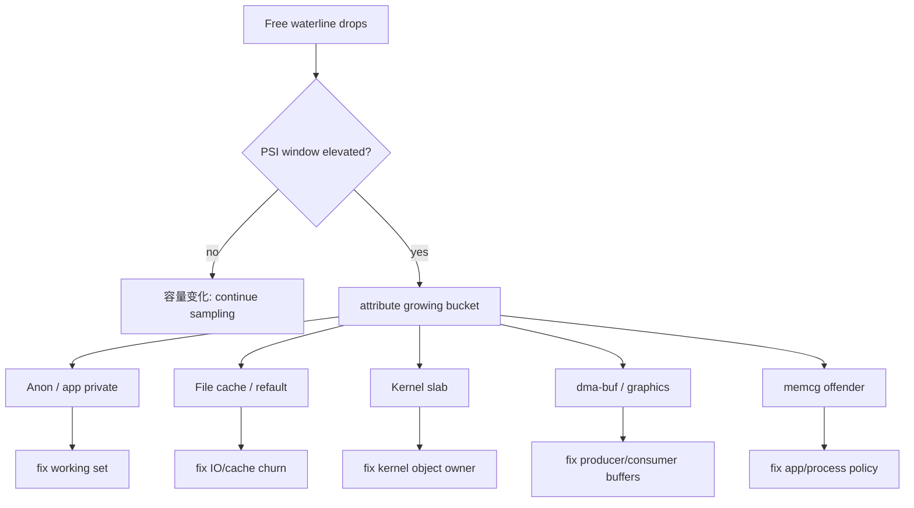
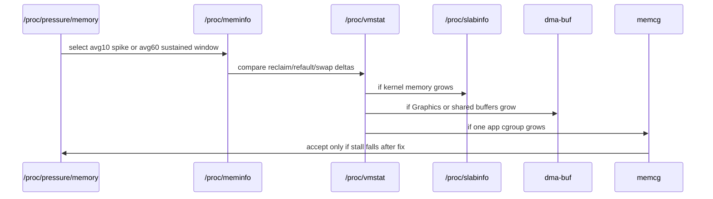
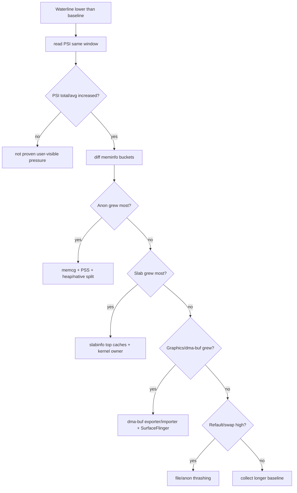

# Day 53: 内存水位增长来源追查：meminfo、vmstat、slab、dma-buf、memcg

> 目标：承接 Day 52 的 PSI 窗口，用 `meminfo / vmstat / slab / dma-buf / memcg` 判断哪个增长桶真的制造了 stall。

---

## 1. 水位增长不是一个字段



| 先看 | 证明什么 | 不能证明什么 |
|---|---|---|
| `/proc/meminfo` | 全局桶是否增长 | 具体进程责任 |
| `/proc/vmstat` | reclaim、refault、swap、slab 压力 | 哪个 Java 对象泄漏 |
| `/proc/slabinfo` | kernel object cache 增长 | 用户态分配栈 |
| dma-buf debugfs | buffer 大小、exporter、importer | Java wrapper 生命周期 |
| memcg | app/cgroup 局部账单 | 全局共享 buffer 全责 |
| PSI | 是否产生 stall | 谁分配了内存 |

---

## 2. 采样窗口

Day 52 的结论不能丢：先用 PSI 找窗口，再在同一窗口看桶增长。



| 窗口 | 用途 | 推荐间隔 |
|---|---|---|
| `avg10` spike | 交互卡顿、启动峰值、相册滑动 | 1s |
| `avg60` elevated | 长流程压力、后台同步、游戏场景 | 5s |
| `avg300` elevated | 慢性泄漏、缓存膨胀、系统老化 | 30s |

---

## 3. 桶归因矩阵

| 现象 | 首要证据 | 次级证据 | 常见责任 |
|---|---|---|---|
| `MemAvailable` 下降，Anon 增 | `AnonPages`、memcg anon | per-process PSS | app heap/native working set |
| file cache 反复涨跌 | `Cached`、`workingset_refault` | `pgscan_kswapd` | IO 读取、预加载、数据库扫描 |
| kernel memory 增 | `Slab`、`SReclaimable`、`SUnreclaim` | slabinfo top cache | inode、dentry、binder、network |
| Graphics 增 | `dumpsys meminfo` Graphics | dma-buf exporter/importer | Surface、HardwareBuffer、camera、GPU |
| swap 压力增 | `SwapFree`、`pswpin/out` | PSI `some/full` | anon 工作集过大 |

---

## 4. 排障决策流



---

## 5. 命令清单

```bash
adb shell cat /proc/pressure/memory > psi.before.txt
adb shell cat /proc/meminfo > meminfo.before.txt
adb shell cat /proc/vmstat > vmstat.before.txt
adb shell cat /proc/slabinfo > slabinfo.before.txt
adb shell dumpsys meminfo > dumpsys-meminfo.before.txt
adb shell dumpsys meminfo <package> > app-meminfo.before.txt
```

```bash
adb shell "for i in $(seq 1 60); do date +%s; cat /proc/pressure/memory; cat /proc/meminfo | egrep 'MemAvailable|AnonPages|Cached|Slab|SReclaimable|SUnreclaim|SwapFree'; sleep 1; done" > waterline-sample.txt
adb shell cat /sys/kernel/debug/dma_buf/bufinfo > dmabuf.txt
adb shell cat /dev/memcg/apps/uid_<uid>/pid_<pid>/memory.stat > memcg.txt
```

| AOSP / kernel 路径 | 看点 |
|---|---|
| `system/memory/lmkd/lmkd.cpp` | pressure 与 kill 决策输入 |
| `kernel/mm/vmscan.c` | reclaim、refault、scan 路径 |
| `kernel/mm/slab_common.c` | slab cache 统计入口 |
| `frameworks/base/services/core/java/com/android/server/am/` | 进程状态与 meminfo 消费 |
| `frameworks/native/libs/ui/GraphicBuffer.cpp` | graphics buffer 生命周期 |

---

## 6. 结论闭环

| 判断 | 最小闭环 |
|---|---|
| 真压力 | PSI 与 `MemAvailable` 下降同窗口 |
| 真来源 | 同窗口最大增长桶有独立证据 |
| 真责任 | bucket 能落到 app、kernel cache、exporter/importer 或 cgroup |
| 真修复 | before/after 同时降低桶增长和 PSI total 增速 |

---

## 今日检查清单

- [ ] 已用 PSI 选定 `avg10/60/300` 分析窗口。
- [ ] 已对同窗口 `meminfo` 做 before/after 差分。
- [ ] 已检查 `vmstat` 的 `workingset_refault`、`pgscan_*`、`pswpin/out`。
- [ ] 已在 slab 增长时定位 `slabinfo` top cache。
- [ ] 已在 Graphics 增长时检查 dma-buf exporter/importer。
- [ ] 已用 memcg 或 per-process meminfo 约束 app 责任。
- [ ] 已用修复后 PSI 和 bucket 差分验证结论。

---

## 7. 今天的结论

| 结论 | 工程含义 |
|---|---|
| PSI 定窗口 | 没有 stall 的水位下降只是容量问题 |
| meminfo 定桶 | 全局桶告诉你先查 anon、file、slab 还是 graphics |
| vmstat 定机制 | refault、scan、swap 解释压力如何发生 |
| slab/dma-buf/memcg 定责任 | 责任必须落到对象 cache、buffer owner 或 cgroup |

Day 54 进入 lmkd：把 PSI/vmpressure 输入、kill strategy 和系统属性连到 victim 选择。
