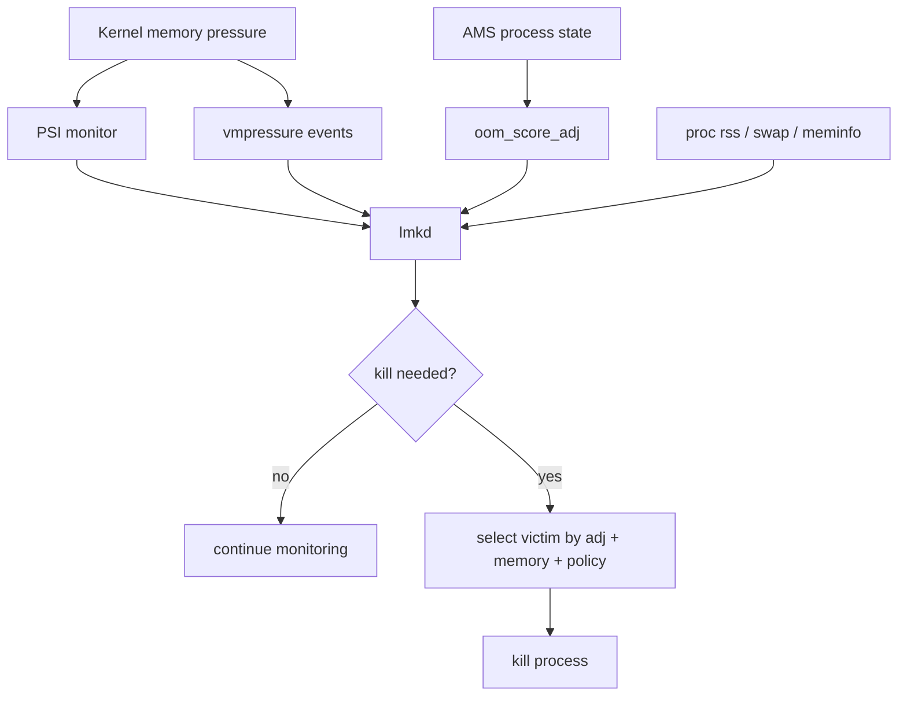
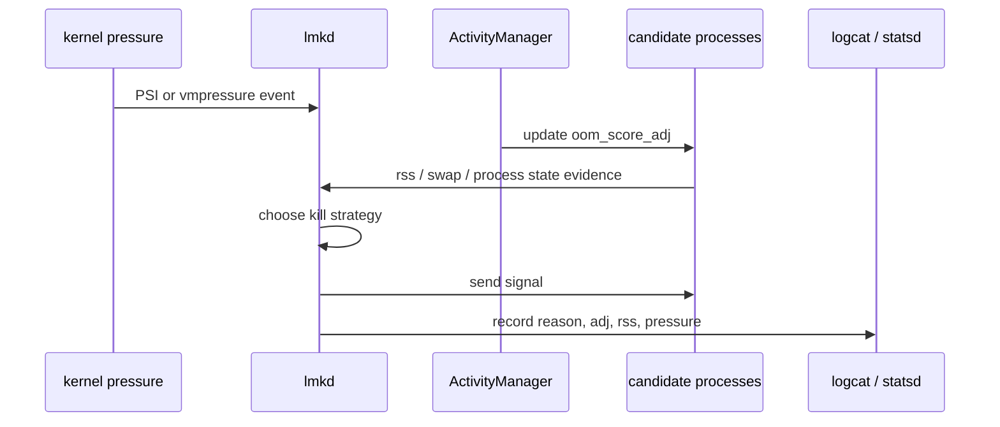
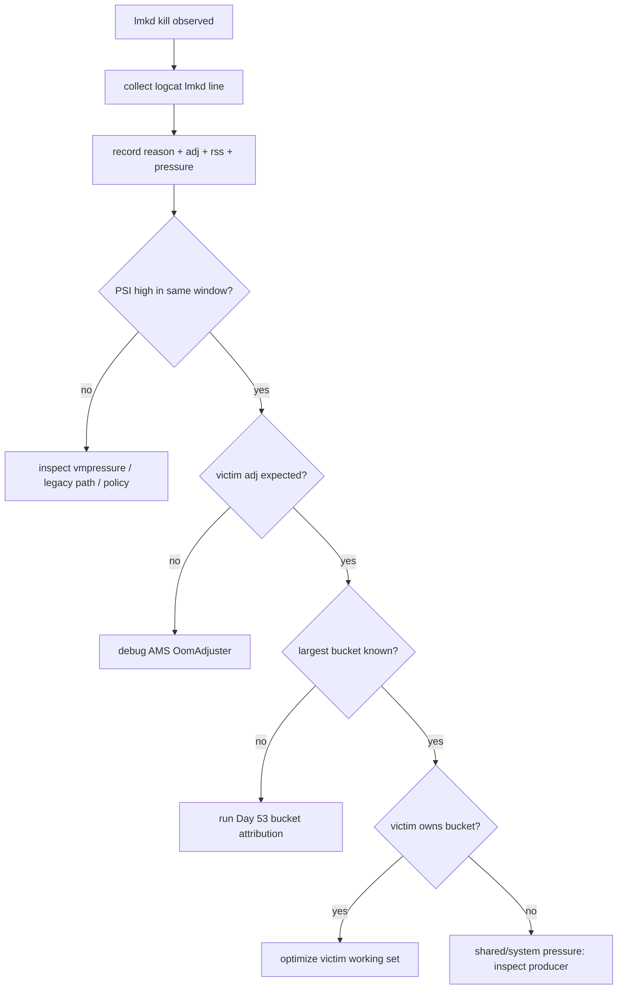
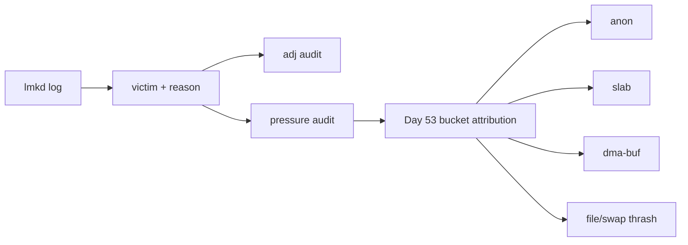

# Day 54: lmkd 架构：PSI/vmpressure、kill strategy 与关键属性

> 目标：承接 Day 53 的 bucket attribution，理解 lmkd 看到什么、杀什么、以及它没法替你证明什么。

---

## 1. lmkd 在链路中的位置



| 输入 | lmkd 用途 | 边界 |
|---|---|---|
| PSI | 判断 stall 压力 | 不说明哪个 bucket 增长 |
| vmpressure | 兼容旧监控路径 | 粒度弱于 PSI |
| `oom_score_adj` | 候选优先级 | 由 AMS 状态链决定 |
| RSS/swap | victim 成本 | 共享内存责任可能被误读 |
| `meminfo` | 全局可用内存 | 需要 Day 53 的桶归因补足 |

---

## 2. 从压力到 kill



| 阶段 | 关键问题 | 证据 |
|---|---|---|
| pressure | 是否真的 stall | `/proc/pressure/memory` |
| threshold | 是否达到 kill 条件 | lmkd props、logs |
| candidate | 谁可被杀 | `/proc/<pid>/oom_score_adj` |
| cost | 杀掉能释放多少 | RSS/PSS/swap/memcg |
| audit | 是否误杀 | logcat + statsd + Day 53 桶证据 |

---

## 3. 属性与策略边界

| 属性/路径 | 作用 | 风险 |
|---|---|---|
| `ro.lmk.use_psi` | 是否优先使用 PSI | vendor 差异大 |
| `ro.lmk.low/medium/critical` | pressure 阈值族 | 过低会晚杀，过高会早杀 |
| `ro.lmk.kill_heaviest_task` | 偏向杀最重进程 | 可能牺牲用户感知更强的缓存 |
| `ro.lmk.swap_free_low_percentage` | swap 紧张判断 | ZRAM 策略不同会偏移 |
| `/dev/memcg/apps/.../memory.stat` | cgroup 账单 | 路径随版本变化 |

---

## 4. 排障决策流



---

## 5. 证据命令

```bash
adb shell getprop | grep -E 'ro.lmk|sys.lmk|ro.config.low_ram'
adb logcat -b all -d | grep -i 'lowmemorykiller\|lmkd'
adb shell cat /proc/pressure/memory
adb shell dumpsys activity processes | grep -E 'ProcessRecord|oom'
adb shell "for p in /proc/[0-9]*; do printf '%s ' $p; cat $p/oom_score_adj 2>/dev/null; done" > oom-adj.txt
```

```bash
adb shell dumpsys meminfo <package>
adb shell cat /proc/<pid>/status
adb shell cat /proc/<pid>/smaps_rollup
adb shell cat /dev/memcg/apps/uid_<uid>/pid_<pid>/memory.stat
adb shell cat /sys/block/zram0/mm_stat
```

| AOSP 路径 | 看点 |
|---|---|
| `system/memory/lmkd/lmkd.cpp` | PSI/vmpressure monitor、kill strategy |
| `frameworks/base/services/core/java/com/android/server/am/OomAdjuster.java` | adj 计算 |
| `frameworks/base/services/core/java/com/android/server/am/ActivityManagerService.java` | process state 输入 |
| `system/core/libprocessgroup/` | cgroup 与进程组操作 |

---

## 6. lmkd 不等于根因报告



| 常见误读 | 正确处理 |
|---|---|
| "谁被杀谁就是根因" | victim 可能只是最可杀、最重或最便宜 |
| "PSI 高就该杀" | 还要看阈值、adj、swap、可回收空间 |
| "RSS 最大就该杀" | 共享 buffer 和 file cache 需要分账 |
| "adj 高就安全" | 状态更新滞后或绑定关系错误会改变 adj |

---

## 今日检查清单

- [ ] 已保存 lmkd logcat 行，包含 reason、adj、rss、pressure。
- [ ] 已记录 `ro.lmk.*`、`ro.config.low_ram` 与 PSI/vmpressure 模式。
- [ ] 已保存 victim 的 `oom_score_adj`、`status`、`smaps_rollup`、memcg。
- [ ] 已用 Day 53 方法确认最大增长桶。
- [ ] 已区分 victim、producer、consumer 与系统共享压力。
- [ ] 已确认 kill 前后 PSI、swap、meminfo 是否改善。

---

## 7. 今天的结论

| 结论 | 工程含义 |
|---|---|
| lmkd 处理压力 | 它不是完整归因器 |
| adj 决定保护级别 | 错误 adj 要回到 AMS/OomAdjuster |
| RSS 影响收益 | 但共享内存需要额外分账 |
| Day 53 仍必须做 | 没有 bucket 归因，kill 分析容易误判根因 |

Day 55 进入 OomAdjuster：解释进程状态如何变成 `oom_score_adj`。
