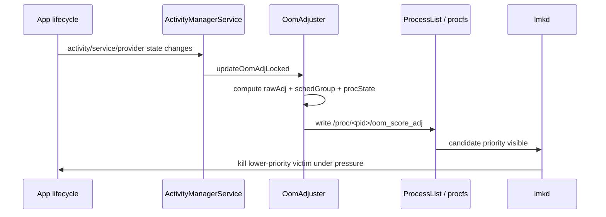
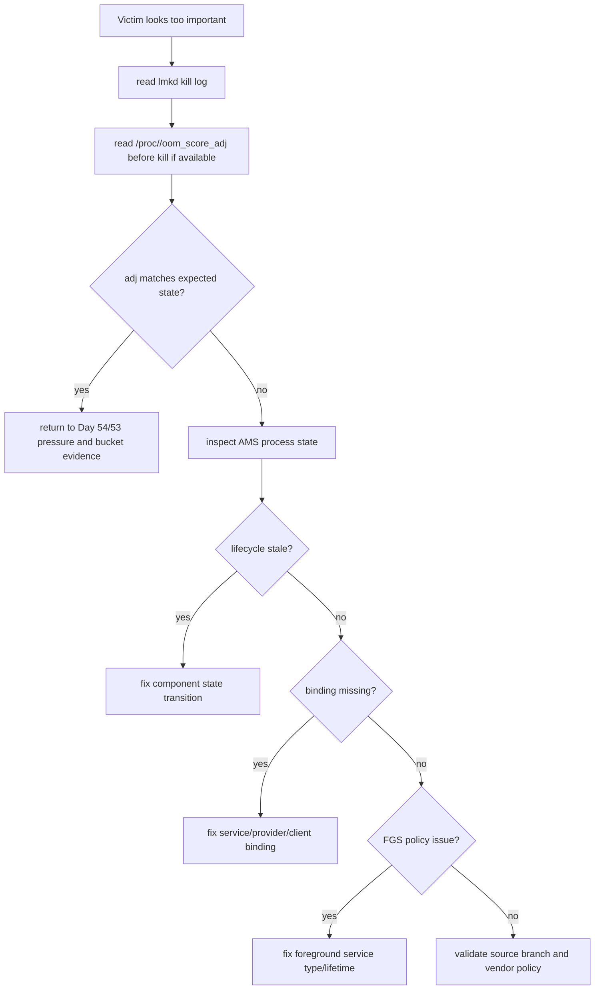

# Day 55: ActivityManager OomAdjuster：进程状态到 oom_score_adj

> 目标：承接 Day 54，解释 lmkd 依赖的 `oom_score_adj` 是如何从 ActivityManager 的进程状态、绑定关系和调度策略计算出来的。

---

## 1. adj 不是单个状态

```mermaid
flowchart TD
    A[ProcessRecord] --> B[activity / service / provider state]
    A --> C[bindings and clients]
    A --> D[foreground service flags]
    A --> E[cached process rank]
    B --> F[OomAdjuster]
    C --> F
    D --> F
    E --> F
    F --> G[set oom_score_adj]
    G --> H[/proc/<pid>/oom_score_adj]
    H --> I[lmkd victim ordering]
```

| 输入 | 典型含义 | 排查关注点 |
|---|---|---|
| visible Activity | 用户可见保护 | 是否 pause/stop 后未及时更新 |
| foreground service | 前台服务保护 | 类型、通知、超时和滥用 |
| bound service | client 保护传递 | client adj 是否正确提升 server |
| content provider | provider/client 关系 | provider 进程是否被错误降级 |
| cached rank | 缓存进程排序 | 最近使用和内存成本 |

---

## 2. 从 AMS 到 procfs



| 输出 | 位置 | 用途 |
|---|---|---|
| `oom_score_adj` | `/proc/<pid>/oom_score_adj` | lmkd 保护级别 |
| process state | `dumpsys activity processes` | AMS 视角 |
| sched group | dumpsys / trace | CPU 调度影响 |
| trim level | callbacks/logs | app 缓存释放机会 |

---

## 3. adj 级别速查

| 类别 | 倾向 | 常见进程 |
|---|---|---|
| persistent/system | 极强保护 | system_server、核心 native daemon |
| foreground | 强保护 | 顶层 Activity、前台交互进程 |
| perceptible/visible | 中强保护 | 可见 UI、音频、重要绑定 |
| service | 中等保护 | 后台 service、短期任务 |
| cached | 弱保护 | 最近退后台的 app |
| empty | 最弱保护 | 无活动组件的保留进程 |

具体数值、分档名和转换路径需要按目标 Android 分支验证，不能把某一版常量当成通用事实。

---

## 4. 排障决策流



---

## 5. 证据命令

```bash
adb shell dumpsys activity processes > activity-processes.txt
adb shell dumpsys activity oom > activity-oom.txt
adb shell "for p in /proc/[0-9]*; do printf '%s ' $p; cat $p/oom_score_adj 2>/dev/null; done" > oom-adj-snapshot.txt
adb shell cat /proc/<pid>/status > proc-status.txt
adb logcat -b events -d | grep -i am_proc
```

```bash
adb shell am start -n <package>/<activity>
adb shell input keyevent HOME
adb shell dumpsys activity processes | grep -A 20 <package>
adb shell cat /proc/$(adb shell pidof <package>)/oom_score_adj
```

| AOSP 路径 | 看点 |
|---|---|
| `frameworks/base/services/core/java/com/android/server/am/OomAdjuster.java` | adj 主计算路径 |
| `frameworks/base/services/core/java/com/android/server/am/ProcessRecord.java` | 进程状态容器 |
| `frameworks/base/services/core/java/com/android/server/am/ProcessList.java` | adj 写入和进程管理 |
| `frameworks/base/services/core/java/com/android/server/am/ActiveServices.java` | service/binding 输入 |
| `frameworks/base/services/core/java/com/android/server/am/ContentProviderRecord.java` | provider 输入 |

---

## 6. lmkd 误判前先查 adj

```mermaid
flowchart LR
    A[User-visible symptom] --> B[AMS state]
    B --> C[OomAdjuster result]
    C --> D[/proc oom_score_adj]
    D --> E[lmkd victim]
    F[Day 53 pressure bucket] --> E
```

| 案例 | adj 审计点 | 根因方向 |
|---|---|---|
| 可见页面被杀 | visible state 是否丢失 | 生命周期或任务栈 |
| 前台服务被杀 | FGS 类型和通知是否有效 | FGS 策略 |
| 被绑定服务被杀 | client 是否仍然重要 | binding 生命周期 |
| cached 进程被杀 | 是否只是用户感知错觉 | 正常策略或恢复体验 |
| 大内存进程被杀 | adj 正确但收益高 | 内存优化而非 adj bug |

---

## 今日检查清单

- [ ] 已同时保存 lmkd kill log 和 victim `oom_score_adj`。
- [ ] 已保存 `dumpsys activity processes` 与 `dumpsys activity oom`。
- [ ] 已确认 Activity、Service、Provider、binding 的状态输入。
- [ ] 已检查前台服务类型、通知和生命周期边界。
- [ ] 已区分 adj 计算错误、状态更新滞后、共享压力和正常 cached kill。
- [ ] 已回到 Day 53 验证最大增长桶，不把 victim 直接等同根因。

---

## 7. 今天的结论

| 结论 | 工程含义 |
|---|---|
| `oom_score_adj` 是 AMS 输出 | lmkd 主要消费它，不负责推导业务重要性 |
| adj 来自多输入 | Activity、Service、Provider、binding 都会影响保护级别 |
| victim 不等于根因 | 仍要结合 Day 53 bucket 和 Day 54 pressure |
| 分支差异必须验证 | adj 常量、状态名和策略会随 Android 版本变化 |

Day 56 进入高优先级进程被杀：把 pressure、adj 和 source bucket 三条线合并审计。
