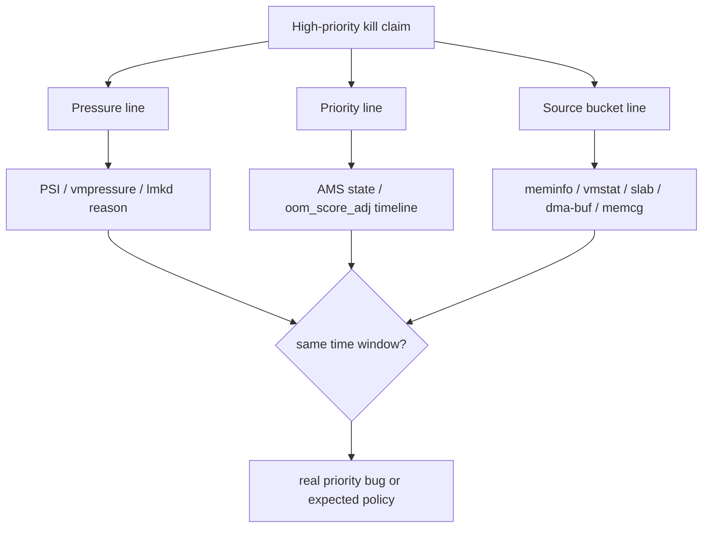
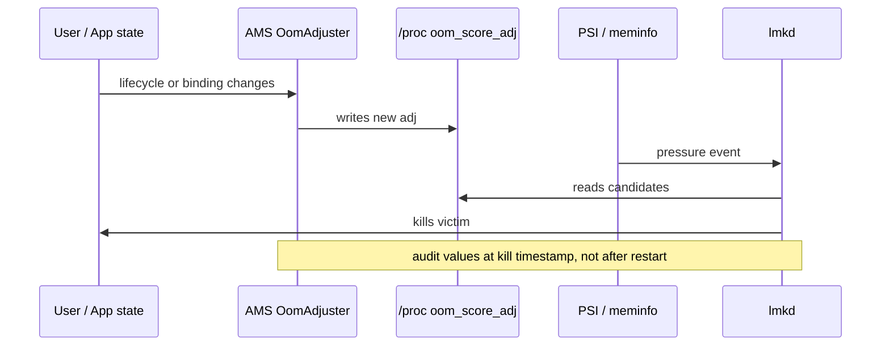
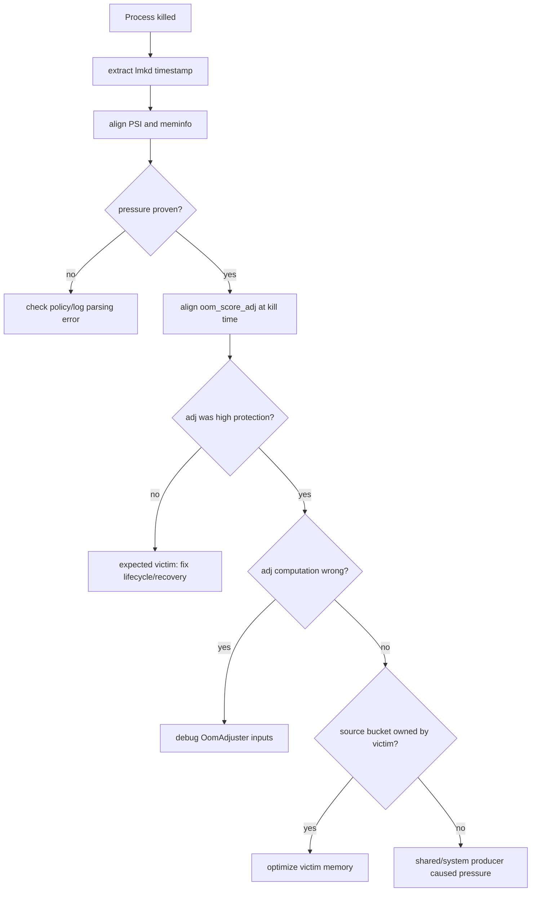
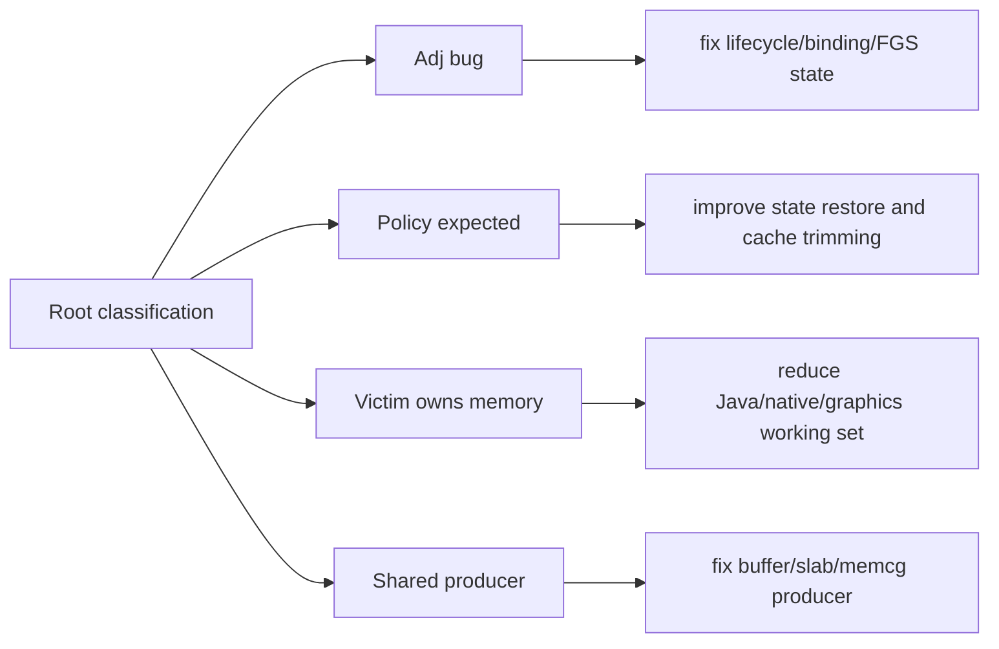

# Day 56: 为什么 lmkd 会杀看似优先级更高的进程：证据链与误判拆解

> 目标：承接 Day 55 的 adj 审计和 Day 53 的 bucket 归因，把“高优先级被杀”拆成可验证的几类情况。

---

## 1. 三条证据线



| 证据线 | 来自 | 回答 |
|---|---|---|
| pressure | Day 54 lmkd + Day 52 PSI | 为什么此刻要杀 |
| priority | Day 55 OomAdjuster | 当时到底是不是高优先级 |
| source bucket | Day 53 attribution | 压力由谁制造 |

---

## 2. 常见误判类型

| 现象 | 真实可能性 | 验证 |
|---|---|---|
| UI 刚切后台就被杀 | 截图显示高优先级，但 kill 时已 cached | adj 时间线 |
| 前台服务被杀 | FGS 未生效或类型/通知不合规 | dumpsys + logcat |
| 被绑定进程被杀 | client 已断开或绑定未提升 | ServiceRecord/ConnectionRecord |
| RSS 大的进程被杀 | 策略选择释放收益最大 | lmkd log + RSS |
| 受害者不产压 | 共享 buffer、slab、其他 cgroup 产压 | Day 53 bucket 归因 |

---

## 3. 时间线对齐



| 时间点 | 必须保存 |
|---|---|
| kill 前 | `oom_score_adj`、AMS state、PSI、meminfo |
| kill 时 | lmkd log reason、victim pid、adj、rss |
| kill 后 | statsd、dropbox、restart reason、pressure recovery |

---

## 4. 决策流



---

## 5. 证据包

```bash
adb logcat -b all -d | grep -i 'lmkd\|lowmemorykiller' > lmkd.txt
adb shell cat /proc/pressure/memory > psi.after.txt
adb shell cat /proc/meminfo > meminfo.after.txt
adb shell cat /proc/vmstat > vmstat.after.txt
adb shell dumpsys activity processes > activity-processes.after.txt
adb shell dumpsys activity oom > activity-oom.after.txt
```

```bash
adb shell "for i in $(seq 1 120); do date +%s; pidof <package>; cat /proc/$(pidof <package>)/oom_score_adj 2>/dev/null; cat /proc/pressure/memory; sleep 1; done" > kill-window-sample.txt
adb shell dumpsys stats --proto > statsd-after.pb
adb shell dumpsys dropbox --print > dropbox-after.txt
```

| Source path | Audit purpose |
|---|---|
| `system/memory/lmkd/lmkd.cpp` | kill reason and victim selection |
| `frameworks/base/services/core/java/com/android/server/am/OomAdjuster.java` | adj computation |
| `frameworks/base/services/core/java/com/android/server/am/ProcessList.java` | procfs adj writes |
| `frameworks/base/services/core/java/com/android/server/am/ActiveServices.java` | service binding protection |
| `frameworks/base/services/core/java/com/android/server/am/ProcessStatsService.java` | process history context |

---

## 6. 修复方向矩阵



| 分类 | 修复 |
|---|---|
| adj 计算或传播错误 | 修生命周期、绑定、FGS 输入 |
| 正常 cached kill | 提升恢复体验，减少后台常驻假设 |
| victim 自身产压 | 降低 PSS/RSS/swap/graphics |
| shared producer 产压 | 查 dma-buf exporter、system slab、其他 cgroup |
| 阈值过激 | 回到 Day 62 做 lmkd/watermark 调参验证 |

---

## 今日检查清单

- [ ] 已以 lmkd kill timestamp 为中心对齐所有证据。
- [ ] 已保存 kill 时 victim adj，而不是只看重启后的状态。
- [ ] 已验证 AMS state、binding、FGS 与 provider 输入。
- [ ] 已证明 PSI/vmpressure 在同窗口确实触发压力。
- [ ] 已用 Day 53 方法确认最大 source bucket。
- [ ] 已区分 adj bug、正常策略、victim 产压和 shared producer 产压。
- [ ] 已用修复后 kill 次数、PSI、bucket 增长和恢复体验验证。

---

## 7. 今天的结论

| 结论 | 工程含义 |
|---|---|
| “看似高优先级”必须时间化 | kill 时的 adj 才是事实 |
| lmkd 杀 victim，不写根因报告 | 仍要做 pressure 与 bucket 归因 |
| 高 RSS 只是收益线索 | 共享内存和 producer 责任要分开 |
| 真误杀需要三线闭环 | pressure、priority、source bucket 必须同窗口解释 |

Day 57 进入 lmkd 日志、statsd 与 victim 分析：把 kill record 解成可复盘字段。
