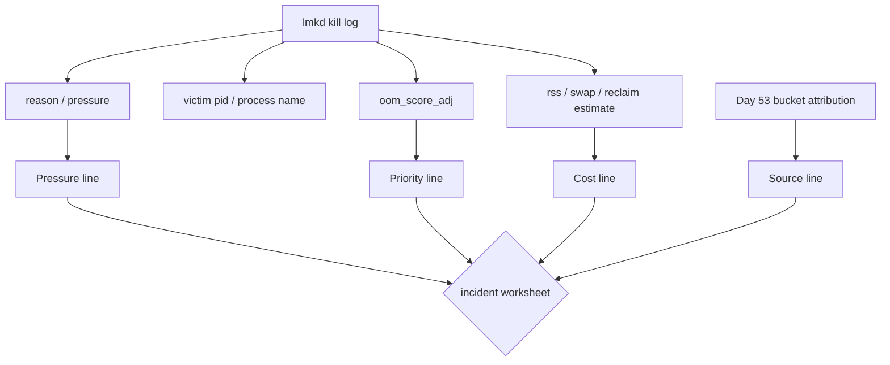
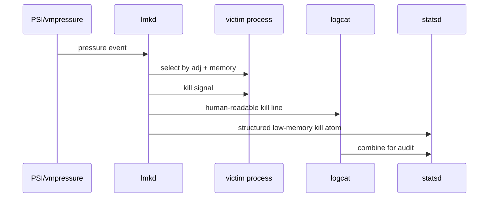
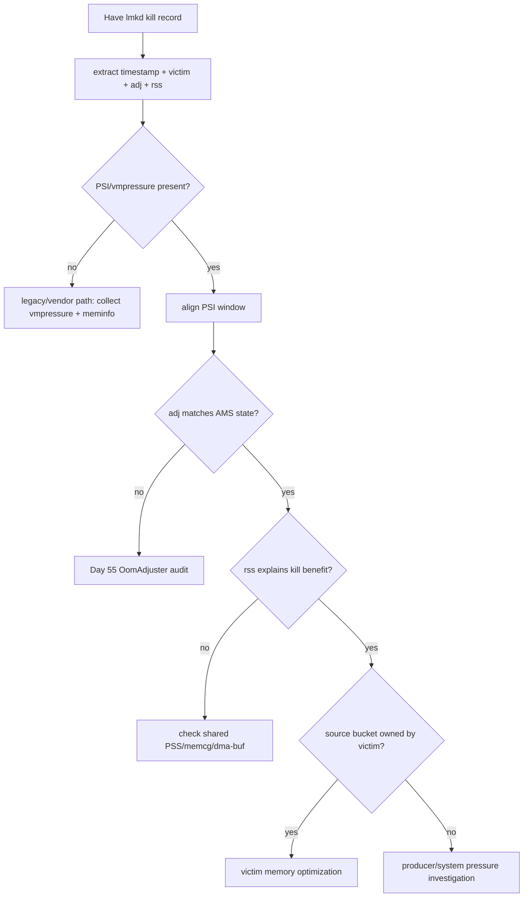
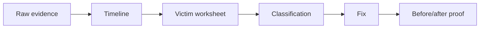

# Day 57: lmkd 日志、statsd 与 victim 分析：从 kill reason 到 adj/RSS

> 目标：承接 Day 56 的 pressure / priority / source bucket 三线模型，把 lmkd kill record 解成可复盘的 victim worksheet。

---

## 1. Kill Record 不是根因



| 字段 | 回答 | 必须补的证据 |
|---|---|---|
| kill reason | 为什么触发 kill | PSI/vmpressure 同窗口 |
| victim pid/name | 谁被杀 | 进程启动/死亡时间线 |
| adj | 当时是否可杀 | AMS/OomAdjuster snapshot |
| rss/swap | 杀掉可能释放多少 | PSS、memcg、shared buffer 分账 |
| pressure state | 系统是否紧张 | meminfo、vmstat、ZRAM |

---

## 2. logcat 到 statsd



| 来源 | 优点 | 缺口 |
|---|---|---|
| logcat | 快速定位时间、pid、reason | 格式随版本和 vendor 变 |
| statsd | 结构化、适合聚合 | 需要 dump/解析和字段映射 |
| dropbox | 保留事故上下文 | 不一定包含完整压力窗口 |
| Perfetto | 时间线对齐强 | 需要提前采集 |

---

## 3. Victim Worksheet

| 栏位 | 填法 |
|---|---|
| kill timestamp | lmkd log 或 statsd atom 时间 |
| process / uid / pid | kill record + `/proc` 快照 |
| adj at kill | record 字段或采样器 |
| proc state | `dumpsys activity processes` |
| pressure proof | PSI `avg10/60` + `total` delta |
| memory cost | RSS/PSS/swap/memcg |
| source bucket | anon/file/slab/dma-buf/memcg |
| classification | adj bug / expected kill / victim owner / shared producer |
| fix proof | kill rate、PSI、bucket delta、restore UX |

---

## 4. 排障决策流



---

## 5. 采集命令

```bash
adb logcat -b all -d | grep -i 'lmkd\|lowmemorykiller' > lmkd.log
adb shell dumpsys stats --proto > statsd.pb
adb shell dumpsys dropbox --print > dropbox.txt
adb shell dumpsys activity processes > activity-processes.txt
adb shell dumpsys activity oom > activity-oom.txt
```

```bash
adb shell cat /proc/pressure/memory > psi.txt
adb shell cat /proc/meminfo > meminfo.txt
adb shell cat /proc/vmstat > vmstat.txt
adb shell cat /sys/block/zram0/mm_stat > zram-mm_stat.txt
adb shell dumpsys meminfo --oom > meminfo-oom.txt
```

| AOSP 路径 | 目的 |
|---|---|
| `system/memory/lmkd/lmkd.cpp` | log 字段、kill reason、statsd 写入 |
| `frameworks/base/cmds/statsd/` | statsd atom 管道 |
| `frameworks/base/core/proto/android/os/` | stats proto 定义入口 |
| `frameworks/base/services/core/java/com/android/server/am/OomAdjuster.java` | adj 解释 |
| `frameworks/base/services/core/java/com/android/server/am/ProcessList.java` | procfs adj 与 kill 配合 |

---

## 6. 报告模板



| 结论类型 | 必要证据 |
|---|---|
| 正常 cached kill | adj 低保护 + pressure 高 + restore 正常 |
| adj 异常 | AMS state 与 `/proc` adj 不一致 |
| victim 自身产压 | victim PSS/memcg/anon 或 graphics 同窗口增长 |
| shared producer 产压 | dma-buf/slab/file cache 增长不归 victim |
| 策略过激 | 多次轻压力 kill + 属性阈值偏紧 + before/after 改善 |

---

## 今日检查清单

- [ ] 已解析 lmkd log 的 timestamp、reason、victim、adj、rss。
- [ ] 已导出 statsd/dropbox，确认是否有结构化 kill 记录。
- [ ] 已把 kill timestamp 对齐 PSI、meminfo、vmstat、ZRAM。
- [ ] 已用 Day 55 检查 AMS state 与 kill-time adj。
- [ ] 已用 Day 53 检查 source bucket，不把 victim 直接当 root cause。
- [ ] 已填写 victim worksheet 并给出分类。
- [ ] 已用 before/after 证明 kill rate、PSI 或 bucket 增长下降。

---

## 7. 今天的结论

| 结论 | 工程含义 |
|---|---|
| lmkd log 是入口 | 不是完整事故报告 |
| statsd 适合聚合 | 但仍要回到时间线和 bucket |
| victim worksheet 防止误判 | pressure、priority、cost、source 必须同窗口 |
| Day 58 接上 swap | RSS 被杀收益常受 ZRAM/swap 状态影响 |
