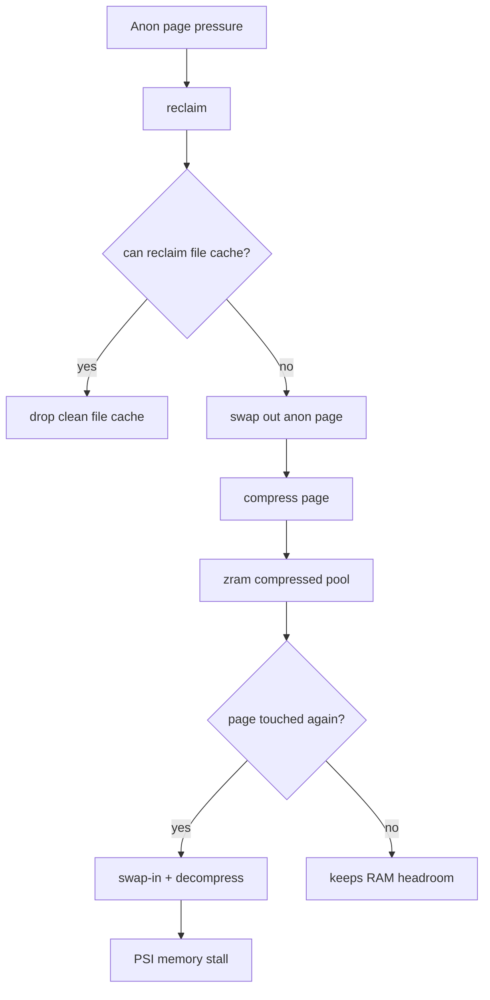
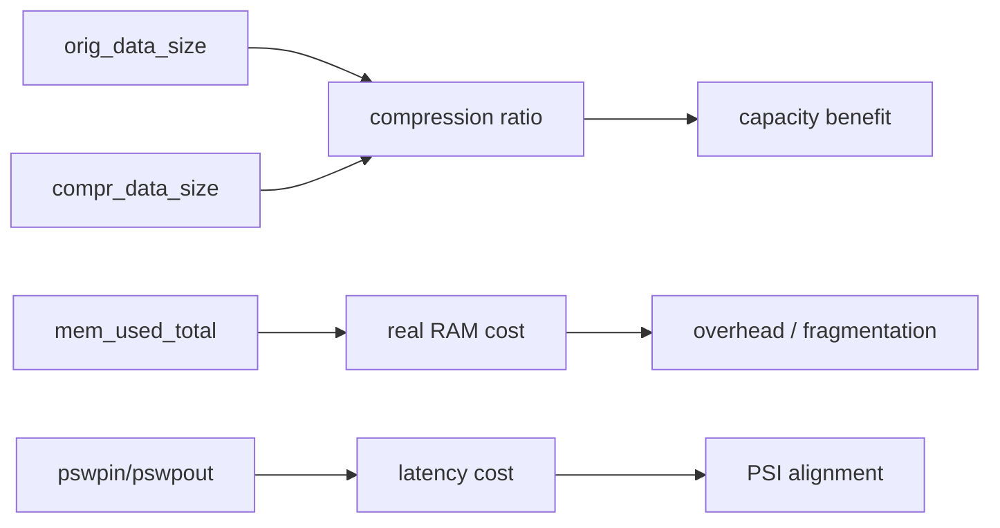
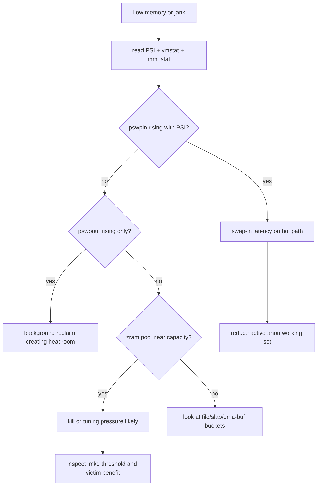
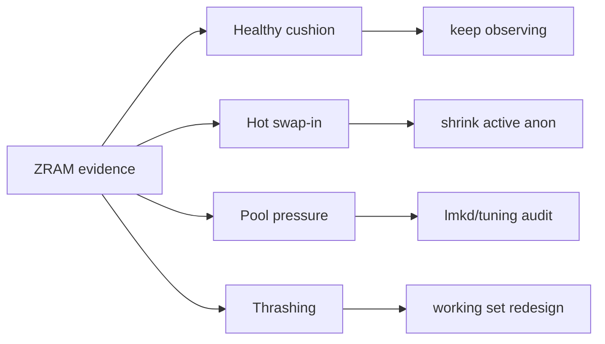

# Day 58: ZRAM 与 swap 路径：压缩、换入换出、mm_stat 与延迟代价

> 目标：承接 Day 57 的 victim worksheet，解释 ZRAM/swap 指标如何影响 kill 收益、stall 判断和低内存优化方向。

---

## 1. ZRAM 路径



| 指标 | 位置 | 含义 |
|---|---|---|
| `SwapTotal/SwapFree` | `/proc/meminfo` | swap 容量与剩余 |
| `pswpin/pswpout` | `/proc/vmstat` | 换入/换出次数 |
| `mm_stat` | `/sys/block/zram0/mm_stat` | 压缩池和原始数据量 |
| PSI `some/full` | `/proc/pressure/memory` | swap/reclaim 是否造成 stall |
| `workingset_refault` | `/proc/vmstat` | 工作集是否反复被赶出 |

---

## 2. mm_stat 读法



| 字段类型 | 排查问题 |
|---|---|
| 原始数据量 | 多少匿名页被压缩保存 |
| 压缩后数据量 | 压缩是否有效 |
| 实际占用 | 元数据、碎片和 allocator 成本 |
| 换入次数 | 用户路径是否频繁触碰冷页 |
| 换出次数 | 系统是否持续把 anon 推入 ZRAM |

具体 `mm_stat` 列名和顺序需要按 kernel 文档、设备节点输出和 Android vendor 分支确认，不能只背固定列序。

---

## 3. 与 lmkd victim 的关系

| Day 57 worksheet 字段 | ZRAM 补强 |
|---|---|
| memory cost | RSS 大但大量已 swap，实际立即释放收益可能不同 |
| pressure proof | PSI 高 + `pswpin` 高说明 swap-in 正在制造 stall |
| kill benefit | kill 后 `SwapFree`、PSI、`pswpin` 是否改善 |
| source bucket | anon 工作集过大比 file cache 更容易进入 ZRAM |
| fix proof | 降低工作集后换入/换出与 PSI 同时下降 |

---

## 4. 排障决策流



---

## 5. 采集命令

```bash
adb shell cat /proc/meminfo | grep -E 'Swap|MemAvailable|AnonPages'
adb shell cat /proc/vmstat | grep -E 'pswpin|pswpout|pgfault|pgmajfault|workingset_refault|pgscan'
adb shell cat /sys/block/zram0/mm_stat
adb shell cat /proc/pressure/memory
adb shell dumpsys meminfo --oom
```

```bash
adb shell "for i in $(seq 1 60); do date +%s; cat /proc/pressure/memory; cat /proc/vmstat | grep -E 'pswpin|pswpout|pgmajfault|workingset_refault'; cat /sys/block/zram0/mm_stat; sleep 1; done" > zram-window.txt
```

| 路径 | 看点 |
|---|---|
| `kernel/mm/vmscan.c` | reclaim 和 swap-out 决策 |
| `kernel/mm/page_io.c` | swap IO 路径 |
| `drivers/block/zram/` | ZRAM 压缩设备 |
| `system/memory/lmkd/lmkd.cpp` | swap 相关 kill 条件 |
| `system/memory/mmd/` | 厂商/平台内存扩展相关路径，需按分支验证 |

---

## 6. 结论矩阵



| 模式 | 证据 | 修复 |
|---|---|---|
| 健康缓冲 | `pswpout` 有，PSI 低 | 保持 |
| 热路径换入 | `pswpin` + PSI `avg10` 高 | 降低活跃 anon |
| 容量紧张 | ZRAM 接近满 + `SwapFree` 低 | 降 cache、优化 victim、审 lmkd |
| thrashing | `pswpin/out` 都高 + refault + PSI | 缩工作集，减少冷热反复 |
| 非 swap 根因 | PSI 高但 swap 不动 | 查 slab/dma-buf/file/direct reclaim |

---

## 今日检查清单

- [ ] 已同步保存 PSI、`meminfo`、`vmstat`、`mm_stat`。
- [ ] 已确认 `pswpin` 是否与 jank/kill 同窗口上升。
- [ ] 已区分健康 swap-out 和热路径 swap-in。
- [ ] 已估算 ZRAM 压缩收益与实际 RAM 成本。
- [ ] 已把 ZRAM 指标填回 Day 57 victim worksheet。
- [ ] 已用 before/after 验证 PSI、`pswpin/out`、`SwapFree` 和恢复体验。

---

## 7. 今天的结论

| 结论 | 工程含义 |
|---|---|
| ZRAM 是缓冲也是代价 | 它延后 kill，但可能把延迟转成 swap-in stall |
| `pswpin` 比 `pswpout` 更接近用户卡顿 | 换入通常发生在页面再次被触碰时 |
| `mm_stat` 要和 PSI 一起读 | 容量指标不等于用户可见压力 |
| Day 59 接着看扩展机制 | writeback/recompression/mmd 会改变 ZRAM 成本模型 |
