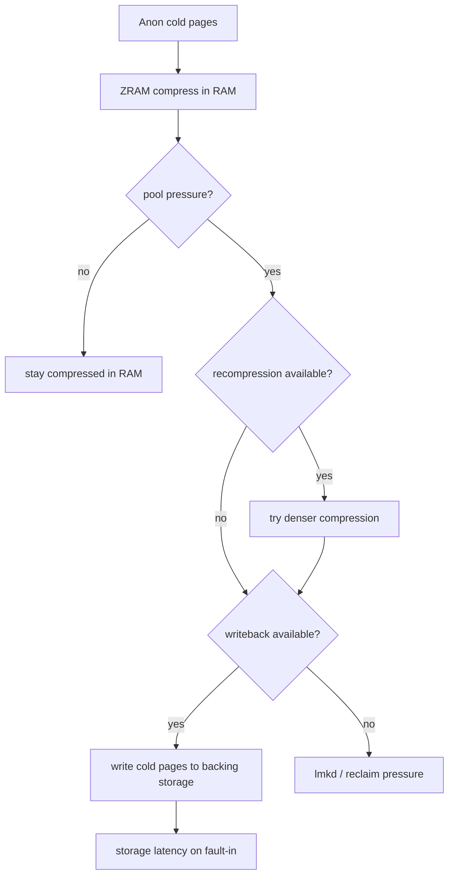
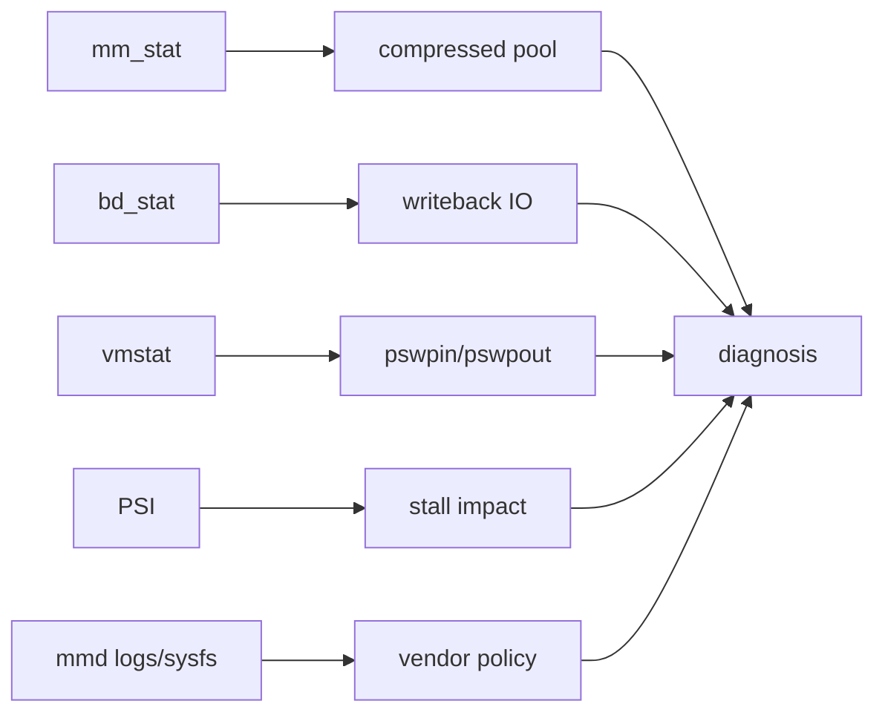
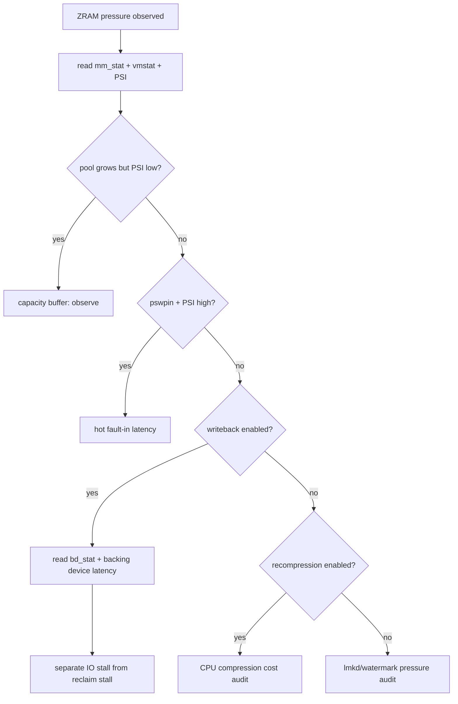
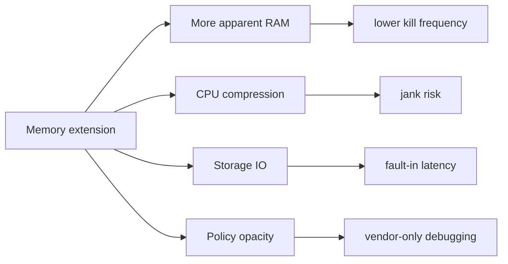

# Day 59: mmd、ZRAM writeback/recompression 与厂商内存拓展

> 目标：承接 Day 58 的 ZRAM 成本模型，区分 RAM 内压缩、recompression、writeback 和厂商内存拓展的证据边界。

---

## 1. 四层模型



| 层 | 目标 | 主要代价 |
|---|---|---|
| ZRAM compression | 用 CPU 换 RAM | 压缩/解压 CPU |
| recompression | 降低压缩池占用 | 更多 CPU 和策略复杂度 |
| writeback | 把冷压缩页移到存储 | IO 延迟和闪存寿命 |
| mmd/厂商扩展 | 统一调度内存扩展策略 | ROM 差异、黑盒策略 |

---

## 2. 证据边界



| 证据 | 能证明 | 不能证明 |
|---|---|---|
| `mm_stat` | ZRAM 池大小、压缩效果 | 是否写回存储 |
| `bd_stat` | backing device 写回量 | 哪个 app 触发 |
| `pswpin/out` | 换入换出活跃度 | 页是否来自 writeback |
| PSI | 是否产生 stall | 具体策略责任 |
| mmd 日志 | 厂商策略动作 | AOSP 通用行为 |

节点和字段在不同 kernel/vendor 上差异明显，必须以设备实际 `/sys/block/zram0/` 输出为准。

---

## 3. 与 Day 58 的差异

| 场景 | Day 58 解释 | Day 59 补充 |
|---|---|---|
| pool 占用高 | 压缩池吃 RAM | recompression 可能降低占用 |
| SwapFree 低 | swap 容量紧 | writeback 可能释放 ZRAM backing |
| swap-in 慢 | 解压成本 | writeback 还可能叠加 IO |
| kill 后改善小 | 工作集仍热 | 冷页策略或 producer 没改 |
| 厂商内存扩展 | 不等于普通 ZRAM | 需要 mmd/ROM 证据 |

---

## 4. 排障决策流



---

## 5. 采集命令

```bash
adb shell ls -la /sys/block/zram0/
adb shell cat /sys/block/zram0/mm_stat
adb shell cat /sys/block/zram0/bd_stat 2>/dev/null
adb shell cat /sys/block/zram0/backing_dev 2>/dev/null
adb shell cat /proc/vmstat | grep -E 'pswpin|pswpout|pgmajfault|workingset_refault'
adb shell cat /proc/pressure/memory
```

```bash
adb logcat -b all -d | grep -i 'mmd\|zram\|recompress\|writeback\|swap'
adb shell getprop | grep -Ei 'mmd|zram|swap|memory'
adb shell "for i in $(seq 1 60); do date +%s; cat /sys/block/zram0/mm_stat; cat /sys/block/zram0/bd_stat 2>/dev/null; cat /proc/pressure/memory; sleep 1; done" > mmd-zram-window.txt
```

| 路径 | 看点 |
|---|---|
| `drivers/block/zram/` | writeback、recompression、stats |
| `kernel/mm/swapfile.c` | swap 管理 |
| `kernel/mm/page_io.c` | swap IO |
| `system/memory/mmd/` | mmd 策略，按分支确认 |
| `system/memory/lmkd/lmkd.cpp` | swap/free 条件与 kill 关联 |

---

## 6. 风险矩阵



| 优化 | 可能收益 | 风险 |
|---|---|---|
| 更大 ZRAM | 减少早杀 | swap-in stall 增多 |
| recompression | 提高压缩密度 | CPU 抖动 |
| writeback | 释放 RAM 中压缩池 | IO 延迟和存储磨损 |
| mmd 策略 | 动态平衡 | 黑盒、版本差异 |

---

## 今日检查清单

- [ ] 已列出 `/sys/block/zram0/` 节点，确认是否支持 `bd_stat`/writeback。
- [ ] 已采集 `mm_stat`、`bd_stat`、`vmstat`、PSI 同窗口样本。
- [ ] 已区分 RAM 内压缩、recompression 和 writeback。
- [ ] 已检查 mmd 或厂商内存扩展日志/属性，未把它当成 AOSP 通用机制。
- [ ] 已确认 swap-in stall 是否叠加存储 IO 延迟。
- [ ] 已用 before/after 验证 kill、PSI、ZRAM 池和用户恢复体验。

---

## 7. 今天的结论

| 结论 | 工程含义 |
|---|---|
| 内存拓展不是免费 RAM | 它把压力转成 CPU、IO 和策略复杂度 |
| writeback 改变延迟模型 | fault-in 可能从解压变成解压加 IO |
| mmd 必须按 ROM 取证 | 不要用 AOSP 通用结论覆盖厂商策略 |
| Day 60 接 App Compaction | 系统回收前，cached app 自身也有压缩/trim 机会 |
