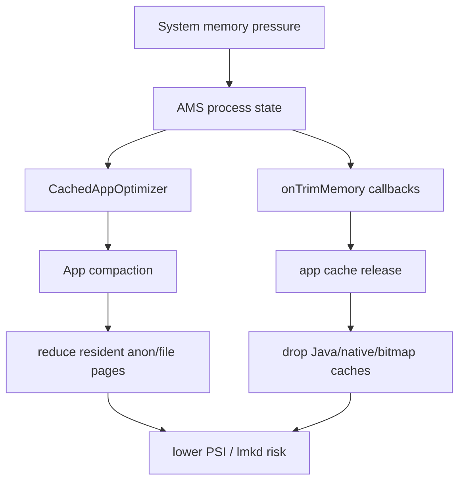
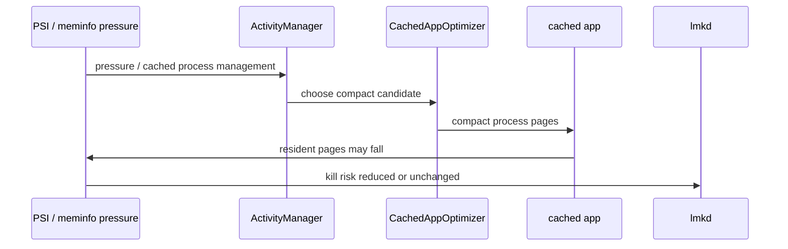
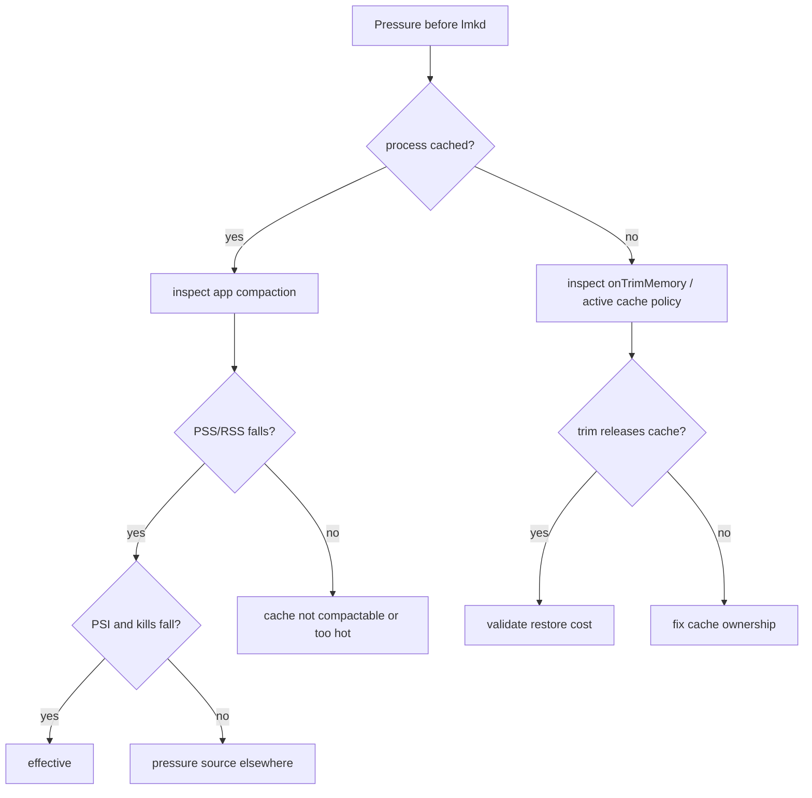
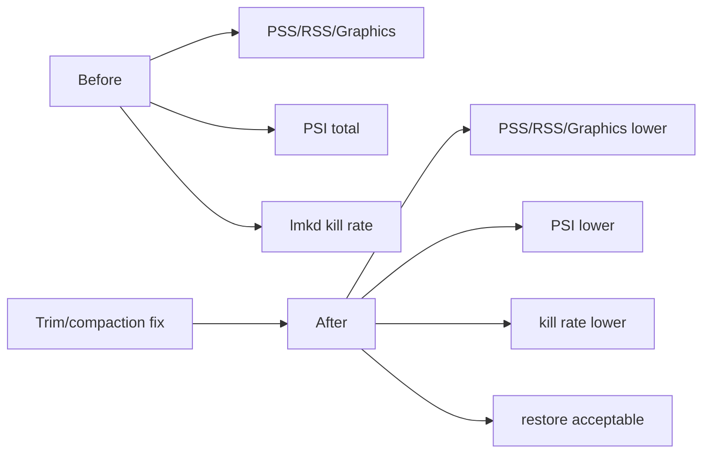

# Day 60: App Compaction、CachedAppOptimizer、onTrimMemory 与缓存释放

> 目标：承接 Day 59 的系统压力模型，说明 lmkd kill 前 app 侧还有哪些 compaction 与 trim 机会。

---

## 1. 系统压力到 app 回收



| 机制 | 触发侧 | 目标 | 边界 |
|---|---|---|---|
| App Compaction | system_server | cached app resident pages | 不等于 Java GC |
| CachedAppOptimizer | AMS | 管理 cached app compaction/freezer | 策略随版本变化 |
| `onTrimMemory` | framework callback | app 主动释放缓存 | app 必须实现 |
| lmkd kill | native daemon | 最后释放进程资源 | 代价最大 |

---

## 2. Compaction 路径



| 观察 | 说明 |
|---|---|
| PSS/RSS 下降 | compaction 或 cache release 可能有效 |
| swap/ZRAM 上升 | 可能只是把 anon 推到压缩池 |
| PSI 下降 | 用户可见压力改善 |
| lmkd kill 减少 | 最终策略收益 |
| app 恢复变慢 | 过度回收可能牺牲体验 |

---

## 3. onTrimMemory 分级

| 回调级别 | app 应对 | 验证 |
|---|---|---|
| UI hidden | 释放 UI-only bitmap/view cache | 返回前后 PSS/Graphics |
| running moderate/low/critical | 降低活跃缓存和预加载 | PSI 与帧稳定性 |
| background/moderate/complete | 清理可重建缓存 | 恢复耗时和命中率 |

不要把 `onTrimMemory` 写成“收到就清空所有缓存”。正确目标是释放可重建、低命中、非当前交互需要的内存。

---

## 4. 排障决策流



---

## 5. 采集命令

```bash
adb shell dumpsys activity processes > activity-processes.txt
adb shell dumpsys activity settings | grep -i compact
adb shell dumpsys meminfo <package> > app-meminfo.before.txt
adb shell cat /proc/pressure/memory > psi.before.txt
adb logcat -d | grep -i 'trim\|compact\|CachedAppOptimizer\|lmkd'
```

```bash
adb shell am send-trim-memory <package> RUNNING_LOW
adb shell am send-trim-memory <package> BACKGROUND
adb shell dumpsys meminfo <package> > app-meminfo.after.txt
adb shell cat /proc/pressure/memory > psi.after.txt
```

| AOSP / app 路径 | 看点 |
|---|---|
| `frameworks/base/services/core/java/com/android/server/am/CachedAppOptimizer.java` | app compaction 策略 |
| `frameworks/base/services/core/java/com/android/server/am/ActivityManagerService.java` | trim 与进程状态 |
| `frameworks/base/core/java/android/content/ComponentCallbacks2.java` | `onTrimMemory` 级别 |
| app image/cache modules | Bitmap、Glide、LruCache、native buffer 释放 |
| `system/memory/lmkd/lmkd.cpp` | kill 是否仍发生 |

---

## 6. Before/After 验证



| 修复 | 必看副作用 |
|---|---|
| 缩小内存缓存 | 命中率下降、IO 增加 |
| trim 释放 bitmap | 返回页面重新解码峰值 |
| native buffer 释放 | 重建成本、线程安全 |
| cached app compaction | 恢复 latency、ZRAM 增长 |
| 降低预加载 | 首屏或滚动体验 |

---

## 今日检查清单

- [ ] 已确认目标进程状态：foreground、service、cached 或 empty。
- [ ] 已保存 compaction/trim 前后的 PSS、RSS、Graphics、ZRAM。
- [ ] 已确认 `onTrimMemory` 是否释放可重建缓存。
- [ ] 已区分 Java GC、cache release、process compaction 和 lmkd kill。
- [ ] 已对齐 PSI，确认回收是否降低用户可见压力。
- [ ] 已验证恢复耗时，避免把内存问题转成体验问题。
- [ ] 已记录版本/vendor 对 CachedAppOptimizer 策略的差异边界。

---

## 7. 今天的结论

| 结论 | 工程含义 |
|---|---|
| kill 前还有 app 侧机会 | trim 和 compaction 可以降低压力 |
| compaction 不等于释放对象 | 它主要改变 resident pages |
| trim 必须有策略 | 释放可重建缓存，而不是盲目清空 |
| 验证看四件事 | 内存桶、PSI、kill 率、恢复体验 |

Day 61 进入低内存复现实验室：把 stress、trace、logcat 和采样脚本组合成可重复场景。
