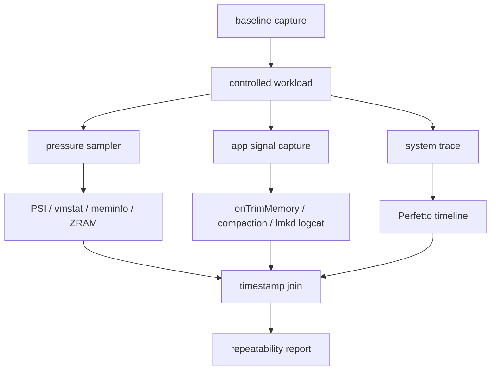
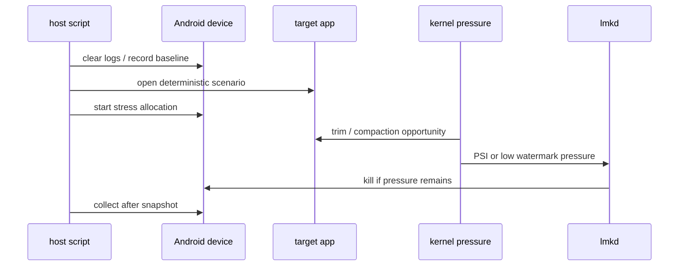
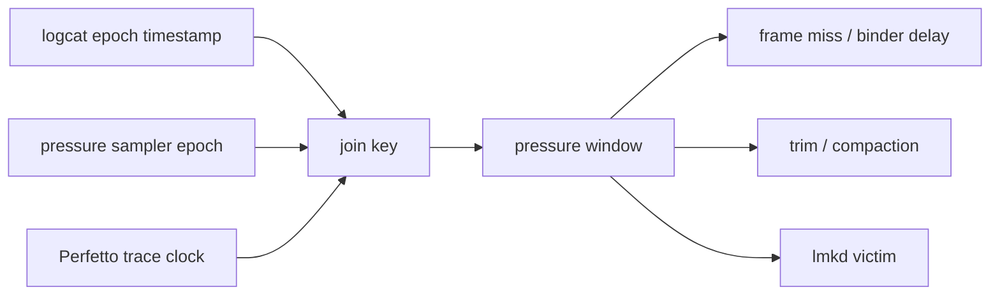
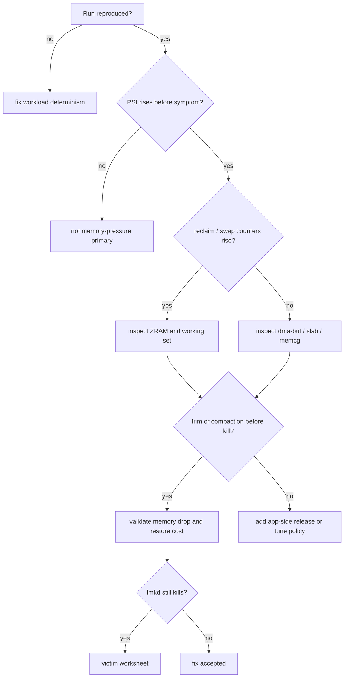
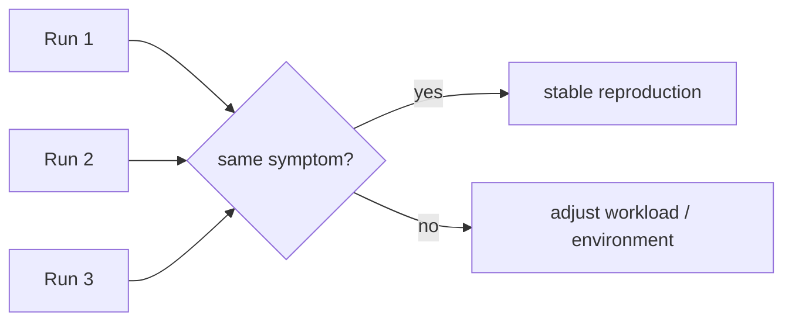

# Day 61: 低内存复现实验室：stress、trace、logcat 与可重复场景

> 目标：承接 Day 60 的缺口，把 trim、compaction、ZRAM、PSI、vmstat、lmkd 和 Perfetto 放进同一个可复现实验。

---

## 1. 实验室总图



| 层 | 采集对象 | 成功标准 |
|---|---|---|
| workload | app 场景、stress-ng、图片/列表/Native 分配 | 每轮触发相同压力 |
| kernel | PSI、vmstat、ZRAM、watermark | 压力窗口可定位 |
| framework | trim、compaction、AMS state | kill 前动作可证明 |
| daemon | lmkd reason、victim、adj、RSS | victim 选择可解释 |
| trace | Perfetto slices、sched、memory counters | 与 logcat 时间对齐 |

---

## 2. 可重复负载设计



| 变量 | 固定方式 | 不固定会怎样 |
|---|---|---|
| app 入口 | `am start` 到同一 Activity | 路径不同导致缓存不同 |
| 数据集 | 固定图片、列表条数、DB 大小 | 峰值不可比较 |
| 后台进程 | `am force-stop` 非目标干扰项 | victim 选择漂移 |
| 压力强度 | 分级增长，不一次打满 | 无法知道阈值 |
| 采样间隔 | 1s 或 2s 固定 | PSI 与日志难对齐 |

---

## 3. 采集脚本骨架

```bash
#!/usr/bin/env bash
set -euo pipefail

PKG="${1:?package}"
OUT="lowmem-$(date +%Y%m%d-%H%M%S)"
mkdir -p "$OUT"

adb shell logcat -c
adb shell dumpsys meminfo "$PKG" > "$OUT/meminfo.before.txt"
adb shell cat /proc/pressure/memory > "$OUT/psi.before.txt"
adb shell cat /proc/vmstat > "$OUT/vmstat.before.txt"
adb shell cat /sys/block/zram0/mm_stat > "$OUT/zram-mm_stat.before.txt" 2>/dev/null || true

adb shell "while true; do date +%s%3N; cat /proc/pressure/memory; cat /proc/vmstat | grep -E 'pswpin|pswpout|pgscan|pgsteal|allocstall|compact'; sleep 1; done" \
  > "$OUT/pressure.tsv" &
SAMPLER=$!

adb logcat -v epoch ActivityManager:I lmkd:I CachedAppOptimizer:I '*:S' > "$OUT/logcat.txt" &
LOGCAT=$!

adb shell am start -n "$PKG/.MainActivity"
# Replace with a deterministic workload or test runner.
adb shell am instrument -w "$PKG.test/androidx.test.runner.AndroidJUnitRunner" || true

sleep 60
kill "$SAMPLER" "$LOGCAT" || true

adb shell dumpsys meminfo "$PKG" > "$OUT/meminfo.after.txt"
adb shell cat /proc/pressure/memory > "$OUT/psi.after.txt"
adb shell cat /proc/vmstat > "$OUT/vmstat.after.txt"
adb shell cat /sys/block/zram0/mm_stat > "$OUT/zram-mm_stat.after.txt" 2>/dev/null || true
```

| 文件 | 判断问题 |
|---|---|
| `pressure.tsv` | PSI 与 reclaim/swap/compaction 是否同步升高 |
| `logcat.txt` | trim、compaction、lmkd 是否发生在同一窗口 |
| `meminfo.before/after` | app PSS/RSS/Graphics/Native 是否变化 |
| `zram-mm_stat.*` | 是否把问题转成压缩池或 writeback 压力 |
| Perfetto trace | UI、RenderThread、binder、sched 是否被 stall 影响 |

---

## 4. Perfetto 对齐



最小 Perfetto 配置要包含 sched、memory、lmkd/ActivityManager 相关 atrace tag，以及应用进程。没有 Perfetto 时，先用 epoch logcat 和 1s sampler 建立粗粒度时间线。

| 时间点 | 必填证据 |
|---|---|
| T0 baseline | `MemAvailable`、PSI、ZRAM、目标 app PSS |
| T1 pressure starts | `pgscan/pgsteal`、`pswpout`、PSI some |
| T2 user-visible stall | frame miss、binder delay、main thread block |
| T3 mitigation | trim callback、compaction、cache release |
| T4 kill | victim、adj、RSS、kill reason |
| T5 recovery | PSI 是否下降、场景是否恢复 |

---

## 5. 排障决策流



| 结论 | 需要看到 |
|---|---|
| 实验不稳定 | 同一脚本三轮压力曲线不同 |
| app cache 过大 | trim 后 app PSS/Graphics 明显下降 |
| ZRAM 热换入 | `pswpin` 与 PSI/full、帧掉帧同窗 |
| kernel/system bucket | app PSS 不涨但 slab/dma-buf/memcg 涨 |
| lmkd 策略问题 | pressure、adj、victim、可释放量同窗成立 |

---

## 6. 三轮重复性表

| Run | T1 PSI some | T2 symptom | T3 trim/compact | T4 kill | 结论 |
|---|---:|---|---|---|---|
| 1 | 记录 avg10/total | 卡顿或无 | 有/无 | victim/无 | baseline |
| 2 | 对比 Run 1 | 是否同窗 | 是否同类 | 是否同类 | 验证稳定 |
| 3 | 对比 Run 2 | 是否同窗 | 是否同类 | 是否同类 | 可提交结论 |



---

## 今日检查清单

- [ ] 已清理 logcat，并保存 baseline meminfo、PSI、vmstat、ZRAM。
- [ ] 已固定 app 入口、数据集、后台进程和压力强度。
- [ ] 已在同一时间窗口采集 PSI、vmstat、ZRAM、logcat 和 Perfetto。
- [ ] 已记录 `onTrimMemory`、CachedAppOptimizer、app compaction 和 lmkd 顺序。
- [ ] 已至少重复三轮，确认症状和压力曲线稳定。
- [ ] 已把 Day 60 的 trim/compaction 证据放进 kill 前检查。
- [ ] 已记录无法采集的权限、ROM 或工具边界。

---

## 7. 今天的结论

| 结论 | 工程含义 |
|---|---|
| 复现先于调参 | 不稳定场景不能支持 watermark 或 lmkd 结论 |
| 时间线比单点截图重要 | PSI、vmstat、logcat、Perfetto 必须同窗 |
| trim/compaction 是 kill 前证据 | 先证明 app 侧机会，再讨论 lmkd |
| 三轮重复才可信 | 一次 kill 只能算线索，不能算根因 |

Day 62 进入水位与 lmkd 调参：只有在这个实验室能稳定复现后，`min_free_kbytes`、`watermark_scale_factor` 和 lmkd 属性才有讨论价值。
