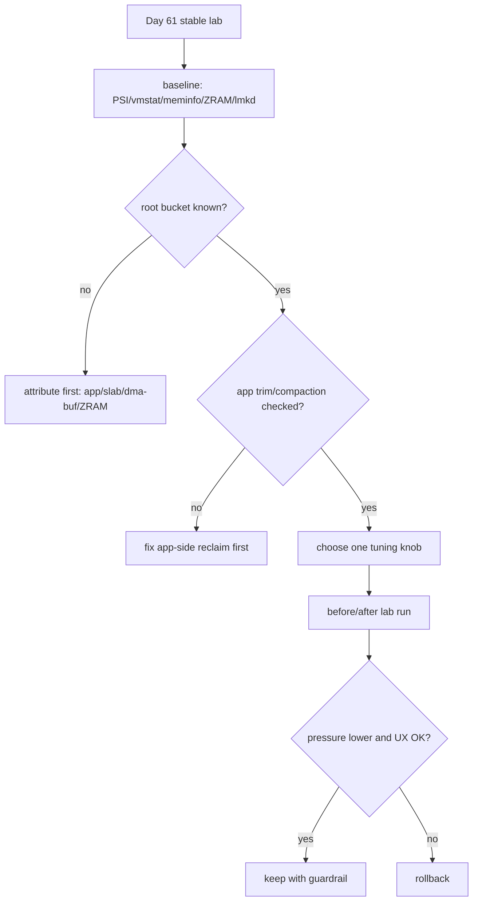
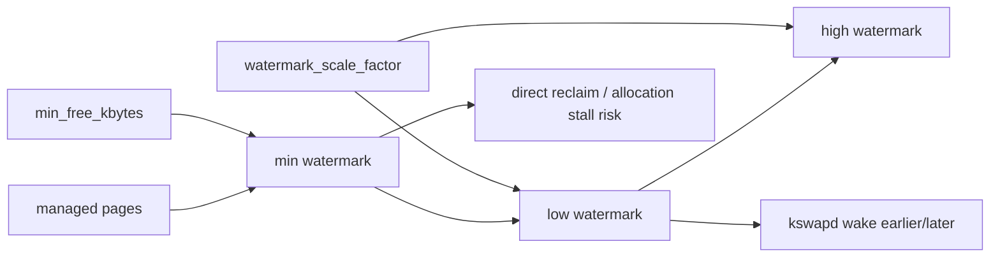
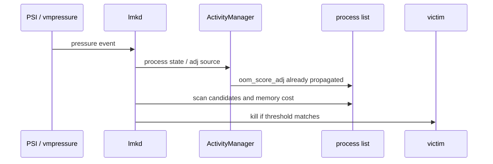
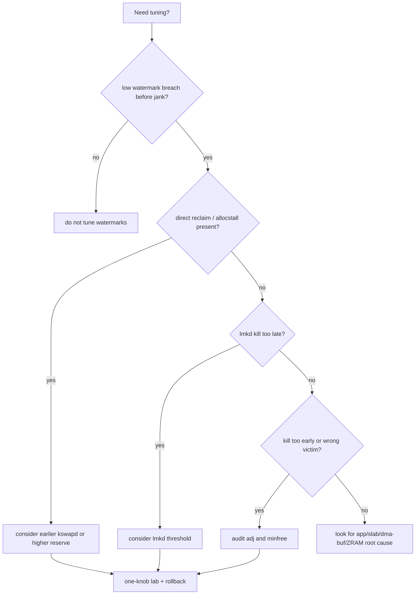
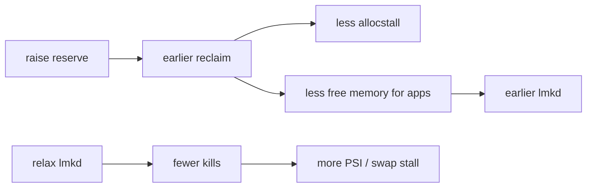

# Day 62: 水位与 lmkd 调参：min_free_kbytes、watermark_scale_factor、lmkd 属性与风险

> 目标：承接 Day 61 的复现实验室，只在稳定复现、同窗采集、可回滚的前提下讨论水位与 lmkd 调参。

---

## 1. 调参不是第一步



| 前置条件 | 为什么必须有 |
|---|---|
| 三轮稳定复现 | 避免把随机 kill 当策略问题 |
| 同窗 PSI/vmstat/ZRAM/logcat | 证明调参影响的是同一压力窗口 |
| root bucket 归因 | 水位不能解决 dma-buf 泄漏或 app cache 失控 |
| trim/compaction 证据 | kill 前先确认低成本回收机会 |
| 回滚脚本 | 内存策略错误会放大卡顿或误杀 |

---

## 2. 水位旋钮结构



| 旋钮 | 主要影响 | 常见误解 | 风险 |
|---|---|---|---|
| `vm.min_free_kbytes` | 提高 zone 保留水位 | 越大越不容易卡 | 可用内存变少，kill 提前 |
| `vm.watermark_scale_factor` | 扩大 low/high 间距 | 只影响后台回收 | 可能让 kswapd 更积极 |
| `vm.watermark_boost_factor` | 碎片/高阶分配后临时 boost | 能修所有卡顿 | 可能增加 reclaim 背景噪声 |
| lmkd minfree/adj | pressure 下 victim 门槛 | 调大就安全 | 可能误杀或牺牲后台体验 |

---

## 3. lmkd 属性边界



| 属性类别 | 观察重点 | 不能证明 |
|---|---|---|
| pressure threshold | lmkd 是否太早/太晚响应 | 根因内存桶 |
| kill timeout | 是否连续查杀 | victim 是否正确 |
| minfree/adj | 哪些 adj 档位进入候选 | app 是否真的可杀 |
| thrashing limit | refault/swap 压力敏感度 | ZRAM 是否健康 |
| kill heuristic | kill 后 PSI 是否恢复 | 用户体验是否可接受 |

---

## 4. 单旋钮实验模板

```bash
# 1. baseline
./lowmem-lab.sh com.example.app baseline

# 2. change exactly one knob
adb shell su -c 'sysctl -w vm.watermark_scale_factor=20'

# 3. rerun the same workload three times
./lowmem-lab.sh com.example.app wm-scale-20-run1
./lowmem-lab.sh com.example.app wm-scale-20-run2
./lowmem-lab.sh com.example.app wm-scale-20-run3

# 4. rollback
adb shell su -c 'sysctl -w vm.watermark_scale_factor=<baseline>'
```

| 对比项 | 接受条件 | 回滚条件 |
|---|---|---|
| PSI some/full | avg10 与 total 峰值下降 | full 上升或 stall 更长 |
| vmstat | direct reclaim/allocstall 下降 | kswapd CPU 长时间升高 |
| ZRAM | pswpin 不上升 | hot swap-in 增加 |
| lmkd | kill 率下降且 victim 合理 | 前台/关键进程风险增加 |
| UX | 帧掉帧、启动、恢复可接受 | 卡顿从内存转移到 IO/CPU |

---

## 5. 排障决策流



| 症状 | 优先看 | 可能动作 |
|---|---|---|
| UI 卡在 allocation | `allocstall`, direct reclaim, PSI full | 提前回收或降低峰值 |
| 后台被过早杀 | lmkd minfree、adj、cached rank | 调整 kill 门槛前先查 app cache |
| swap-in 卡顿 | `pswpin`, ZRAM, refault, PSI | 不用水位掩盖热工作集过大 |
| slab/dma-buf 增长 | `/proc/meminfo`, debugfs, memcg | 找 owner，不先调 lmkd |
| 调后 kill 少但更卡 | PSI/Perfetto/IO latency | 回滚或降低 aggressive policy |

---

## 6. 风险矩阵



| 目标 | 好结果 | 坏结果 |
|---|---|---|
| 提高水位 | direct reclaim 减少 | cached app 更早被杀 |
| 降低水位 | 后台存活变多 | 前台 allocation stall 增加 |
| lmkd 更积极 | PSI 快速恢复 | 用户认为“误杀” |
| lmkd 更宽松 | 后台体验改善 | 卡顿、swap storm、system_server 风险 |

---

## 今日检查清单

- [ ] 已用 Day 61 lab 三轮稳定复现同一症状。
- [ ] 已记录原始 `min_free_kbytes`、`watermark_scale_factor`、lmkd 属性。
- [ ] 已证明低水位、direct reclaim、PSI 或 kill 时机确实同窗出现。
- [ ] 每次只改一个旋钮，并保存 before/after 证据。
- [ ] 已检查 ZRAM、trim、compaction、app cache、slab、dma-buf 副作用。
- [ ] 已定义接受条件和回滚条件。
- [ ] 已记录 vendor/Android 版本差异，不把属性当通用真理。

---

## 7. 今天的结论

| 结论 | 工程含义 |
|---|---|
| 调参必须跟实验绑定 | 没有 Day 61 证据就不能改策略 |
| 水位解决的是时机 | 不能替代内存桶归因 |
| lmkd 解决的是取舍 | 不能证明 root cause |
| 副作用必须同等重要 | kill 少了但 PSI 更高不是优化 |

Day 63 进入关键进程保护：在保护 adj 和绑定关系之前，先确认保护不是绕开内存治理的借口。
