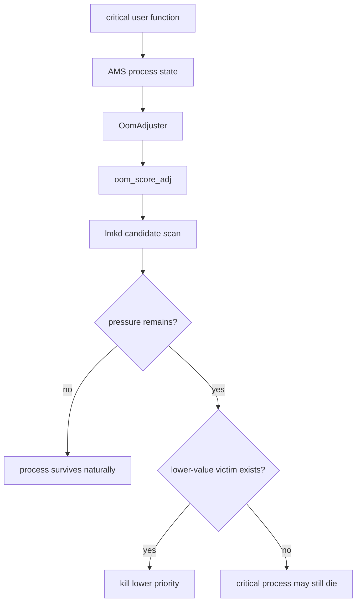
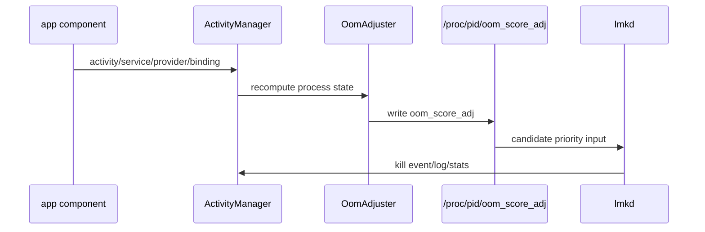
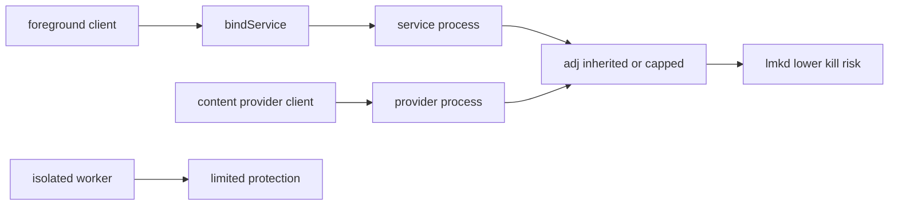
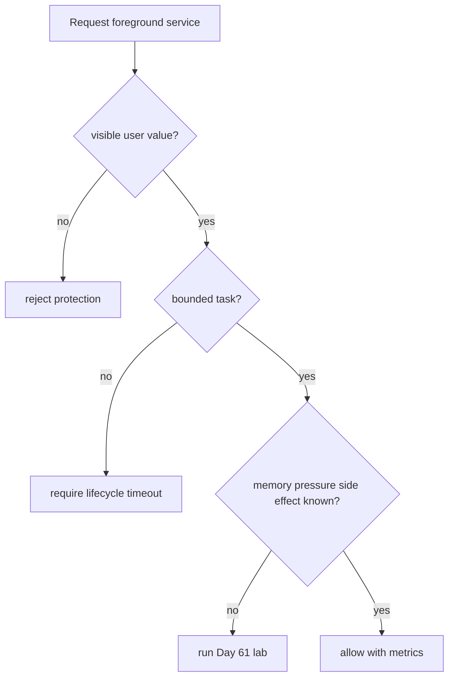
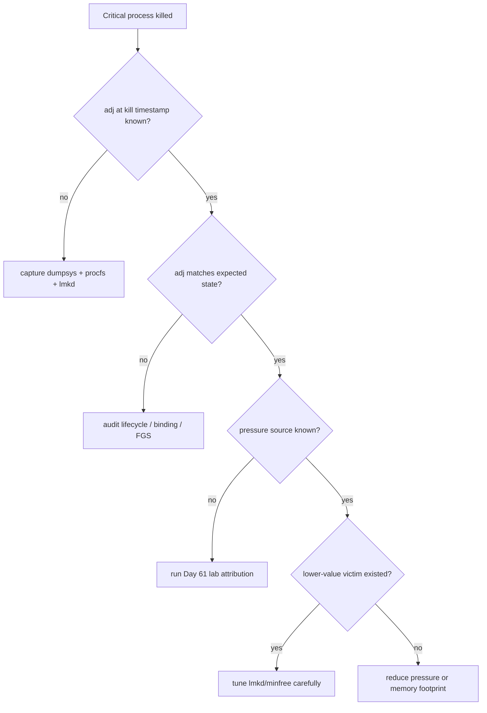
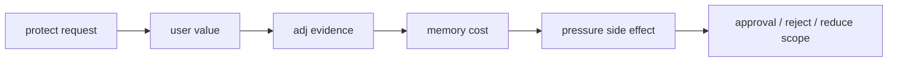

# Day 63: 关键进程保护：adj 设计、绑定关系、前台服务与滥用边界

> 目标：承接 Day 62 的风险模型，说明关键进程为什么、怎样、以及在什么边界内可以被保护。

---

## 1. 保护不是免死金牌

| 保护目标 | 合理理由 | 不合理理由 |
|---|---|---|
| 电话、闹钟、导航 | 用户当前依赖、丢失代价高 | 只是想常驻后台 |
| 音频播放 | 明确 foreground user value | 用空通知逃避回收 |
| 输入法、辅助功能 | 系统交互路径依赖 | 扩展到无关服务 |
| 厂商核心服务 | 设备基本能力 | 把所有预装服务都抬高 |

---

## 2. adj 证据链

| 证据 | 命令 | 看点 |
|---|---|---|
| process state | `adb shell dumpsys activity processes` | `procState`, services, cached rank |
| adj value | `adb shell cat /proc/<pid>/oom_score_adj` | 是否与 dumpsys 同步 |
| reason | `adb logcat -d | grep -i oom_adj` | 为什么被提升或下降 |
| lmkd kill | `adb logcat -d | grep -i lmkd` | victim、adj、RSS、reason |
| statsd | `cmd stats print-logs` 或平台采集 | 长周期 kill pattern |

---

## 3. 绑定关系如何抬高优先级

| 关系 | 保护效果 | 审计问题 |
|---|---|---|
| visible Activity -> service | service 可被抬高 | Activity 退出后是否释放 |
| foreground service | adj 提升且用户可见 | 通知是否对应真实任务 |
| provider in use | provider 临时受保护 | 客户端是否长期持有 |
| persistent/system uid | 更强保护 | 是否真的属于系统关键路径 |
| isolated process | 通常边界更窄 | 是否误以为主进程受保护 |

---

## 4. 前台服务滥用边界

| 滥用信号 | 后果 | 修正 |
|---|---|---|
| 空通知保活 | 挤压真正关键进程 | 降级为 WorkManager/job |
| 长期绑定不解绑 | provider/service adj 被错误抬高 | 生命周期解绑 |
| 多进程全部保护 | PSS 总账增加 | 只保护交互链路 |
| 大缓存伴随高 adj | lmkd 缺少低价值 victim | trim/cache cap |
| 无恢复指标 | 看不到保护收益 | 加入 kill 后恢复体验指标 |

---

## 5. 排障决策流

| 结论 | 必备证据 |
|---|---|
| adj 计算错误 | dumpsys state 与 `/proc` 不一致 |
| 生命周期错误 | Activity/Service 退出后绑定仍在 |
| lmkd 策略问题 | 同窗存在更低价值 victim |
| 保护滥用 | 高 adj 进程持有大量可释放缓存 |
| 压力不可承受 | 没有合理 victim，必须降峰值 |

---

## 6. 保护策略评审表

| 字段 | 需要填写 |
|---|---|
| 用户场景 | 保护失败会破坏什么体验 |
| 组件链路 | Activity、service、provider、binding |
| adj 目标 | 期望 `oom_score_adj` 与持续时间 |
| 内存成本 | PSS/RSS/Graphics/Native/ZRAM |
| 替代方案 | trim、拆进程、懒加载、任务降级 |
| 退出条件 | 任务结束、屏幕关闭、网络完成、超时 |
| 监控 | kill 率、PSI、恢复时延、误杀投诉 |

---

## 今日检查清单

- [ ] 已确认保护对应真实、当前、用户可见或系统关键价值。
- [ ] 已保存 kill 时间点的 dumpsys、`oom_score_adj`、lmkd log 和 PSI。
- [ ] 已审计 binding、provider、foreground service 生命周期。
- [ ] 已确认高 adj 进程没有持有可释放大缓存。
- [ ] 已用 Day 61 lab 验证保护后的 PSI、kill 率和用户体验副作用。
- [ ] 已定义保护退出条件，避免永久抬高。
- [ ] 已记录哪些场景不能用前台服务或绑定关系绕过内存治理。

---

## 7. 今天的结论

| 结论 | 工程含义 |
|---|---|
| 保护是业务取舍 | 不是内存优化本身 |
| adj 必须可审计 | dumpsys、procfs、lmkd 要同窗 |
| FGS 有滥用边界 | 用户价值和生命周期必须成立 |
| 没有 victim 就降峰值 | 保护不能创造可用内存 |

Day 64 进入案例复盘：用 Day 61 的实验时间线和 Day 62 的单旋钮原则，复盘低端机水位过低导致卡顿。
