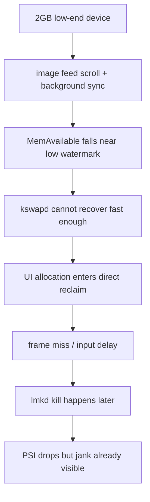
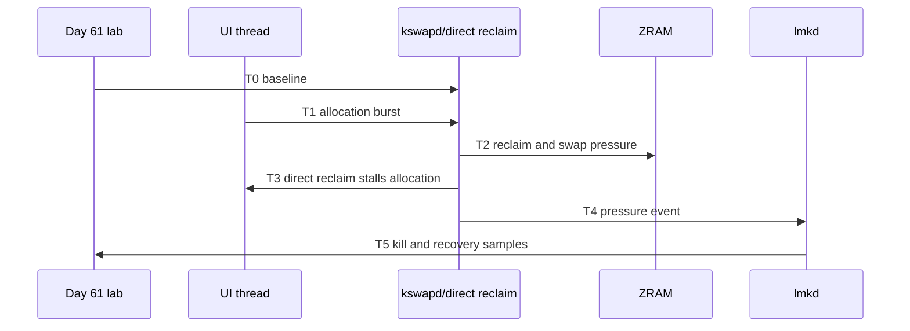
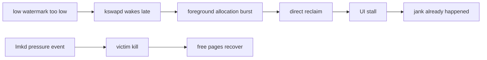
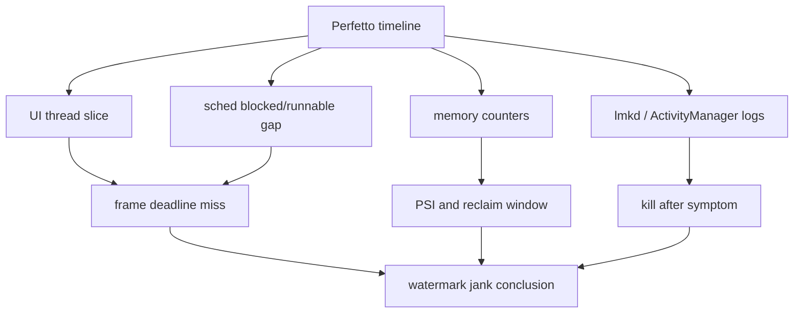
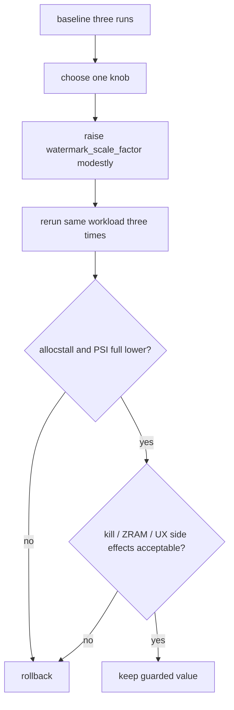
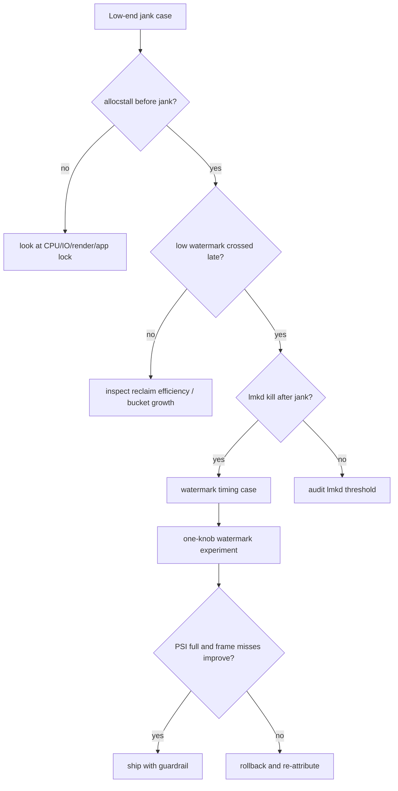
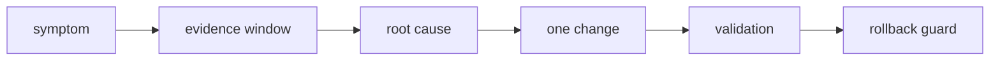

# Day 64: 案例复盘：低端机内存水位过低导致卡顿

> 目标：承接 Day 61 的 T0-T5 实验时间线和 Day 62 的单旋钮原则，复盘一次“低水位先卡顿、lmkd 后响应”的问题。

---

## 1. 案例摘要

| 项 | 观察 |
|---|---|
| 设备 | 2GB RAM，ZRAM 开启，低端 CPU |
| 场景 | 图片流滑动，同时后台同步和解码 |
| 症状 | 掉帧、触摸延迟、偶发后台 kill |
| 初始误判 | “lmkd 杀晚了” |
| 复盘结论 | 水位太低导致 direct reclaim 提前伤害前台线程 |

---

## 2. T0-T5 证据时间线

| 时间点 | 关键证据 | 解释 |
|---|---|---|
| T0 baseline | `MemAvailable` 接近但高于 low | 空闲余量小 |
| T1 pressure starts | `pgscan_kswapd` 上升 | 后台回收启动 |
| T2 reclaim lag | `pgsteal/pgscan` 比例低 | 回收效率不足 |
| T3 jank | `allocstall`、PSI full、Perfetto frame miss | 前台分配被 direct reclaim 阻塞 |
| T4 lmkd | kill log 出现在掉帧后 | kill 是后置缓解，不是首因 |
| T5 recovery | PSI 降低但帧已错过 | 用户已感知卡顿 |

---

## 3. 为什么不是单纯 lmkd 问题

| 现象 | 如果是 lmkd 问题 | 本案证据 |
|---|---|---|
| kill 时间 | kill 前 PSI 长时间高但无 direct reclaim | direct reclaim 先于 kill |
| victim | 错杀高 adj 或低收益进程 | victim 合理但来得晚 |
| recovery | kill 后立即避免症状 | kill 后恢复，但掉帧已发生 |
| root bucket | 某进程持续泄漏 | 场景峰值 + 水位余量不足 |

---

## 4. Perfetto 定位图

| Trace 信号 | 判断 |
|---|---|
| UI thread allocation 后长 blocked | 可能 direct reclaim |
| RenderThread frame deadline miss | 用户可见掉帧 |
| kswapd 活跃但 recover 慢 | 后台回收启动太晚或效率差 |
| lmkd slice/log 在掉帧后 | kill 不是第一触发点 |
| `pswpin` 同窗上升 | ZRAM 热工作集参与卡顿 |

---

## 5. 单旋钮修复实验

| 项 | Baseline | Candidate | 接受标准 |
|---|---:|---:|---|
| PSI full avg10 | 高 | 更低 | 掉帧窗口下降 |
| `allocstall` | 上升 | 下降 | 前台分配少进 direct reclaim |
| `pgscan_kswapd` | 晚且陡 | 更早更平 | kswapd 提前摊平压力 |
| `pswpin` | 不可升高 | 持平或下降 | 不把问题转成 swap-in |
| lmkd kill | 偶发 | 可持平 | 不能明显增加误杀 |
| app recovery | 可接受 | 不变差 | 缓存恢复不显著变慢 |

只改一个旋钮。若同时改 `min_free_kbytes`、`watermark_scale_factor` 和 lmkd 属性，复盘会失去因果关系。

---

## 6. 排障决策流

| 分支 | 下一步 |
|---|---|
| 无 `allocstall` | 不要把所有掉帧都归到内存水位 |
| low 未被突破 | 查 app 主线程、IO、GPU、锁等待 |
| reclaim 效率低 | 查 file/anon、refault、ZRAM、dirty pages |
| kill 先于卡顿 | 查 lmkd aggressive 或 victim 选择 |
| 调参后副作用大 | 回滚并降应用峰值 |

---

## 7. 案例报告模板

| 段落 | 必填内容 |
|---|---|
| 症状 | 机型、RAM、场景、用户影响 |
| 证据 | T0-T5 时间线，命令和 trace |
| 根因 | 为什么是水位时机，不是 lmkd 或 app 泄漏 |
| 修改 | 只改哪个旋钮，原值和候选值 |
| 验证 | 三轮 before/after 数据 |
| 风险 | kill、ZRAM、恢复时延、后台存活 |
| 回滚 | 触发条件和命令 |

---

## 今日检查清单

- [ ] 已用 Day 61 lab 复现三轮低端机场景。
- [ ] 已证明 `allocstall`、PSI full、Perfetto frame miss 先于 lmkd kill。
- [ ] 已排除明显 app 泄漏、dma-buf/slab 异常增长和高 adj 保护滥用。
- [ ] 已按 Day 62 原则只修改一个水位旋钮。
- [ ] 已验证 `pswpin`、kill 率、恢复时延没有变差。
- [ ] 已写明为什么 lmkd 是后置缓解而不是首因。
- [ ] 已准备回滚条件和原始值。

---

## 8. 今天的结论

| 结论 | 工程含义 |
|---|---|
| 低水位会先制造卡顿 | direct reclaim 可能比 lmkd 更早伤害前台 |
| kill 后恢复不代表 kill 是根因 | 要看掉帧前的 PSI 和 allocstall |
| 单旋钮才有因果 | 多项同时调参无法复盘 |
| 水位优化要看副作用 | ZRAM、kill、恢复时延都要守住 |

Day 65 进入 lmkd 查杀高优先级进程案例：把 adj 审计、victim worksheet 和压力时间线合在一起。
