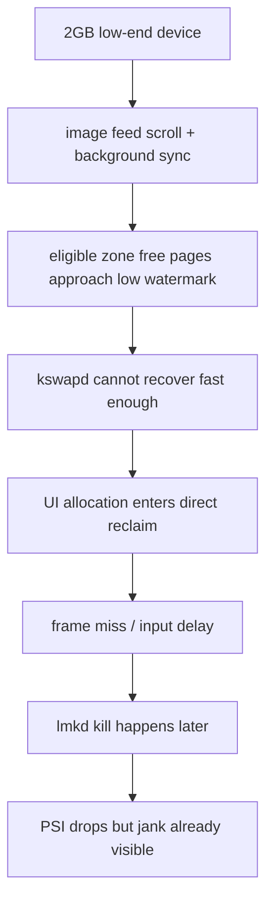
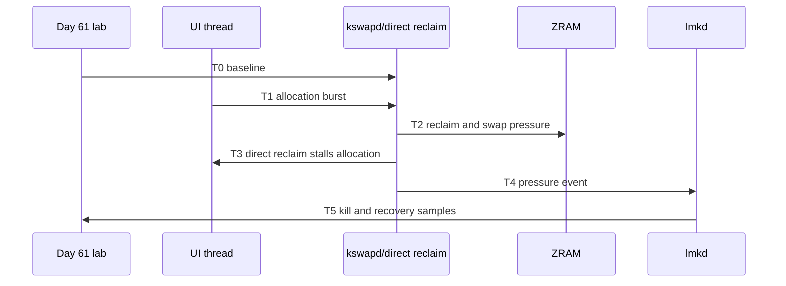
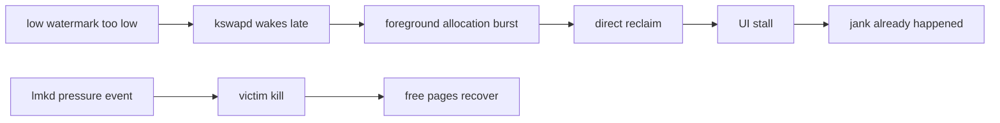
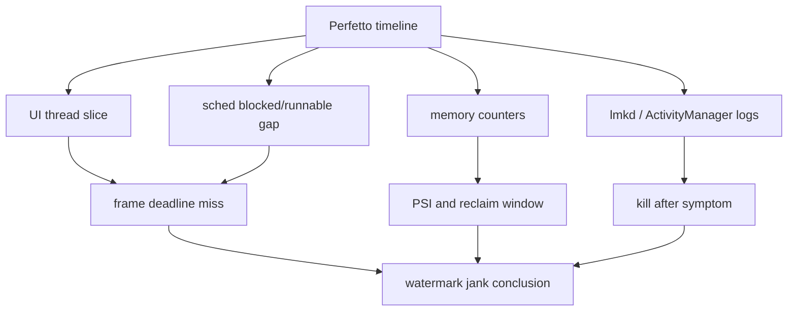
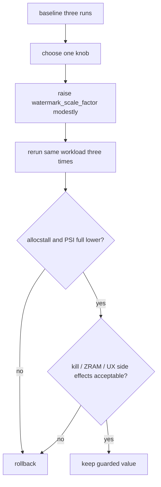
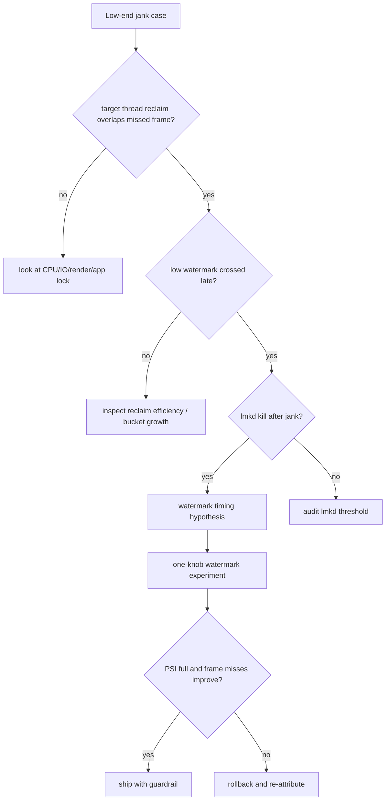
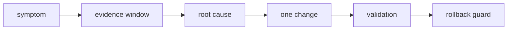

# Day 64: 教学案例推演：低端机内存水位过低导致卡顿

> 目标：承接 Day 61 的 T0-T5 实验时间线和 Day 62 的单旋钮原则，推演如何验证“回收余量不足先卡顿、lmkd 后响应”的假设。

> 证据状态：以下 2GB 设备、工作负载、时间线和结果方向均为教学设定，未附实机 trace、原始日志或定量 before/after 数据。表格是待验证的假设与验收目标，不能作为调参成功或已定位根因的证据。

---

## 1. 案例摘要



| 项 | 教学设定 / 待验证假设 |
|---|---|
| 设备 | 2GB RAM，ZRAM 开启，低端 CPU |
| 场景 | 图片流滑动，同时后台同步和解码 |
| 症状 | 掉帧、触摸延迟、偶发后台 kill |
| 初始误判 | “lmkd 杀晚了” |
| 待验证假设 | zone 回收余量不足使前台关键线程进入 direct reclaim；还需排除碎片、回收效率、锁与 IO 等原因 |

---

## 2. T0-T5 证据时间线



| 时间点 | 关键证据 | 解释 |
|---|---|---|
| T0 baseline | 目标 zone 的 free 与 low 接近（同为页数）；另记全局 `MemAvailable` | 空闲余量小 |
| T1 pressure starts | `pgscan_kswapd` 上升 | 后台回收启动 |
| T2 reclaim lag | 同窗口、同回收类别的 Δpgsteal/Δpgscan 偏低（分母非零） | 回收效率不足 |
| T3 jank | 全局 Δallocstall、PSI 增量与 frame miss 同窗 | 仅支持相关性；需目标 TID 的 direct reclaim begin/end 或内核栈证明关键线程受阻 |
| T4 lmkd | kill log 出现在掉帧后 | 此次 kill 晚于症状；不能据此排除策略响应时机问题 |
| T5 recovery | PSI 降低但帧已错过 | 用户已感知卡顿 |

---

## 3. 如何区分水位、回收效率与 lmkd 响应问题



| 待区分因素 | 所需证据 | 不能单独推出 |
|---|---|---|
| 回收时机 | zone free、水位、分配约束与 kswapd 唤醒时序 | MemAvailable 低就说明 low 配置低 |
| 回收效率 | 同窗扫描/回收增量、refault、脏页与 swap 状态 | kswapd 活跃就说明唤醒太晚 |
| lmkd 响应 | 压力触发、阈值、kill reason 与候选状态 | direct reclaim 先发生就排除了 lmkd 问题 |
| victim 选择 | 被杀进程与合格候选的 adj 数值、状态、收益 | 低 adj 数值进程被杀必然是 bug |

---

`MemAvailable` 是全系统可用内存估算，包含可回收页等因素；zone 的 min/low/high 是页数阈值，不能直接比较。即使统一单位，也不能把全局估算代替目标 zone 的水位检查。还需核对分配 order、GFP、保留页与内核分支。

采集前记录 build fingerprint、内核版本、页大小以及权限；可在宿主 Bash 中执行：

```bash
adb shell getprop ro.build.fingerprint > build.txt
adb shell uname -a > kernel.txt
adb shell getconf PAGESIZE > page-size.txt
adb shell cat /proc/zoneinfo > zoneinfo.txt
adb shell cat /proc/meminfo > meminfo.txt
```

Perfetto 的 `linux.ftrace` 配置应按设备可用事件加入 `vmscan/mm_vmscan_direct_reclaim_begin`、`vmscan/mm_vmscan_direct_reclaim_end` 和调度事件，再关联 PID/TID 与帧时间线。需检查事件是否可用、权限和丢失事件；无法取得线程级证据时，只能报告“内存压力与卡顿相关”，不能确认主线程 direct reclaim。1 秒 procfs 采样只能补充粗粒度趋势。

参考：[Linux MemAvailable 定义](https://docs.kernel.org/filesystems/proc.html)、[watermark_scale_factor 与回收余量](https://docs.kernel.org/admin-guide/sysctl/vm.html)、[Perfetto Android 采集配置](https://perfetto.dev/docs/learning-more/android)。

## 4. Perfetto 定位图



| Trace 信号 | 判断 |
|---|---|
| UI thread allocation 后长 blocked | 待排查 IO、锁和回收；必须补目标 TID 的回收事件或内核栈 |
| RenderThread frame deadline miss | 用户可见掉帧 |
| kswapd 活跃但 recover 慢 | 后台回收启动太晚或效率差 |
| lmkd slice/log 在掉帧后 | kill 不是第一触发点 |
| `pswpin` 同窗上升 | 存在换入活动；需确认 swap 后端与目标线程延迟后再归因 |

---

## 5. 单旋钮修复实验



以下是验收方向，不是实测数值。实际报告需填原始参数、采样时长、各轮数值及变异情况。

| 项 | Baseline | Candidate | 接受标准 |
|---|---:|---:|---|
| PSI full avg10 | 高 | 更低 | 掉帧窗口下降 |
| `allocstall` | 上升 | 下降 | 前台分配少进 direct reclaim |
| `pgscan_kswapd` | 晚且陡 | 更早更平 | kswapd 提前摊平压力 |
| `pswpin` | 不可升高 | 持平或下降 | 不把问题转成 swap-in |
| lmkd kill | 偶发 | 可持平 | 不能明显增加误杀 |
| app recovery | 可接受 | 不变差 | 缓存恢复不显著变慢 |

只改一个旋钮。若同时改 `min_free_kbytes`、`watermark_scale_factor` 和 lmkd 属性，复盘会失去因果关系。

---

## 6. 排障决策流



| 分支 | 下一步 |
|---|---|
| 无 `allocstall` | 不要把所有掉帧都归到内存水位 |
| 采样未见 low 被突破 | 检查采样是否漏掉瞬时事件、分配 order/GFP/zone 与 memcg 约束，再查 IO、GPU、锁等待 |
| reclaim 效率低 | 查 file/anon、refault、ZRAM、dirty pages |
| kill 先于卡顿 | 查 lmkd aggressive 或 victim 选择 |
| 调参后副作用大 | 回滚并降应用峰值 |

---

## 7. 案例报告模板



| 段落 | 必填内容 |
|---|---|
| 症状 | 机型、RAM、场景、用户影响 |
| 证据 | T0-T5 时间线，命令和 trace |
| 根因 | 为什么是水位时机，不是 lmkd 或 app 泄漏 |
| 修改 | 只改哪个旋钮，原值和候选值 |
| 验证 | 三轮 before/after 数据 |
| 风险 | kill、ZRAM、恢复时延、后台存活 |
| 回滚 | 触发条件和命令 |

---

## 今日检查清单

- [ ] 已用 Day 61 lab 复现三轮低端机场景。
- [ ] 已记录目标 TID 的回收事件与 missed frame 重叠，并对齐 zone、PSI、全局计数和 kill 时间。
- [ ] 已排除明显 app 泄漏、dma-buf/slab 异常增长和低 adj 数值对应的强保护滥用。
- [ ] 已按 Day 62 原则只修改一个水位旋钮。
- [ ] 已验证 `pswpin`、kill 率、恢复时延没有变差。
- [ ] 已写明为什么 lmkd 是后置缓解而不是首因。
- [ ] 已准备回滚条件和原始值。

---

## 8. 今天的结论

| 结论 | 工程含义 |
|---|---|
| 低水位会先制造卡顿 | direct reclaim 可能比 lmkd 更早伤害前台 |
| kill 后恢复不代表 kill 是根因 | 要看掉帧前的 PSI 和 allocstall |
| 单变量有助于归因 | 仍需控制负载、冷热状态与运行顺序，并比较重复实验；三轮不是因果保证 |
| 水位优化要看副作用 | ZRAM、kill、恢复时延都要守住 |

Day 65 进入 lmkd 查杀高优先级进程案例：把 adj 审计、victim worksheet 和压力时间线合在一起。
