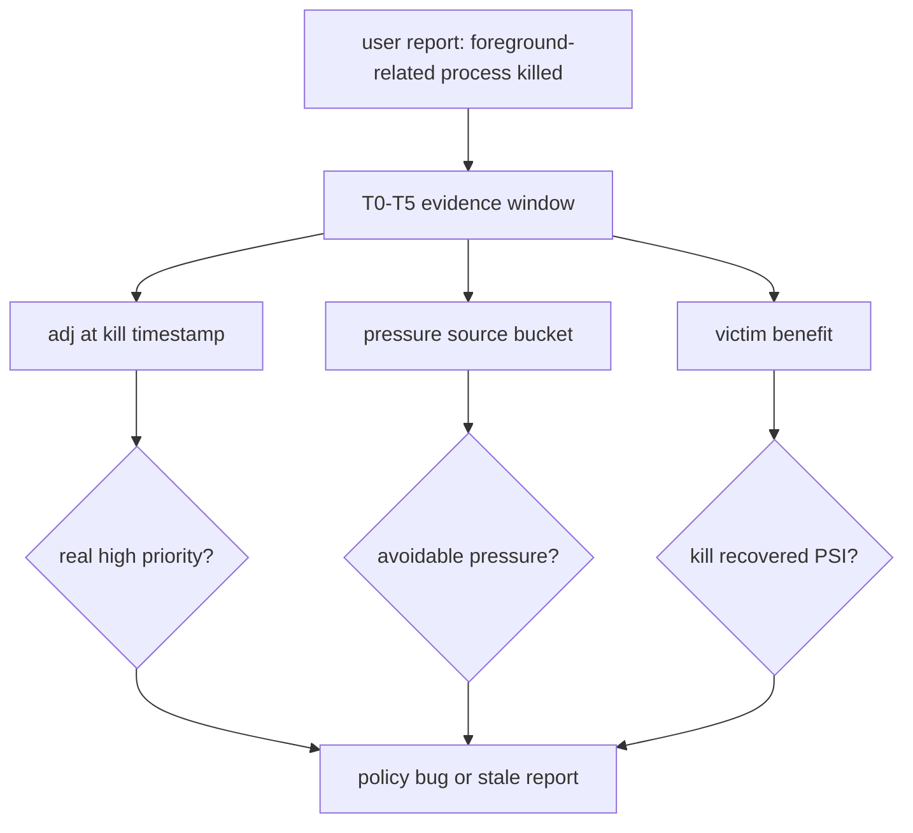
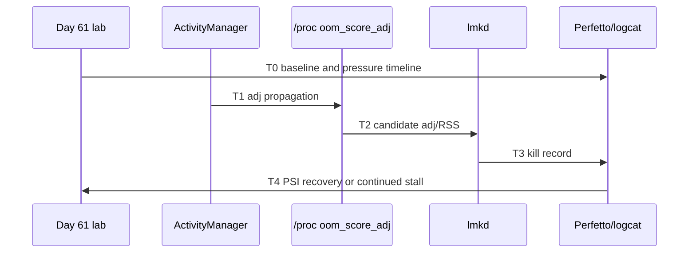
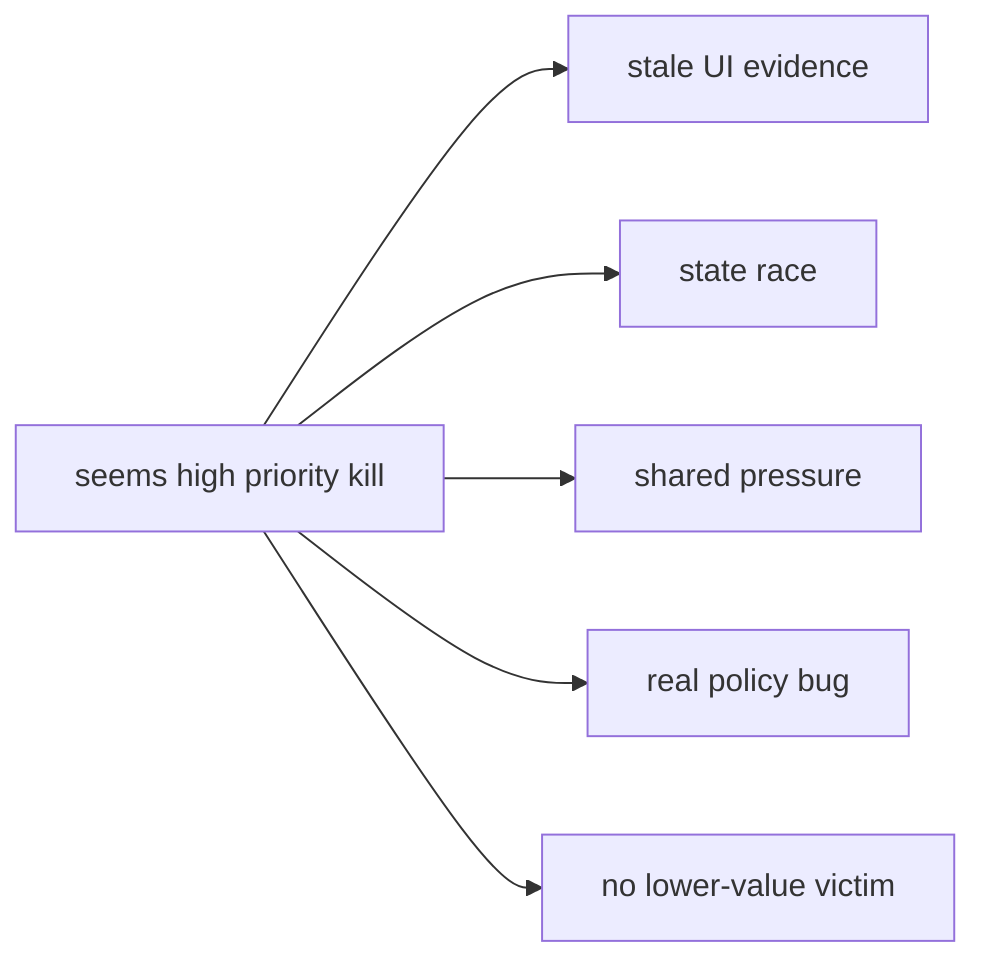
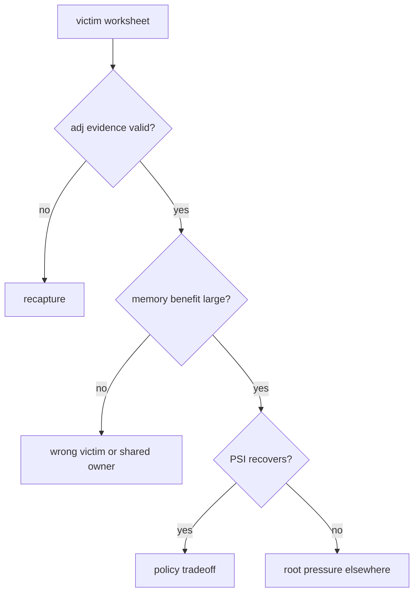
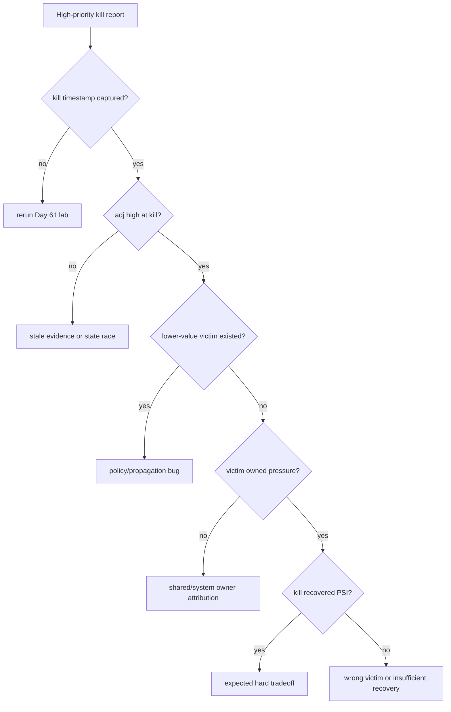
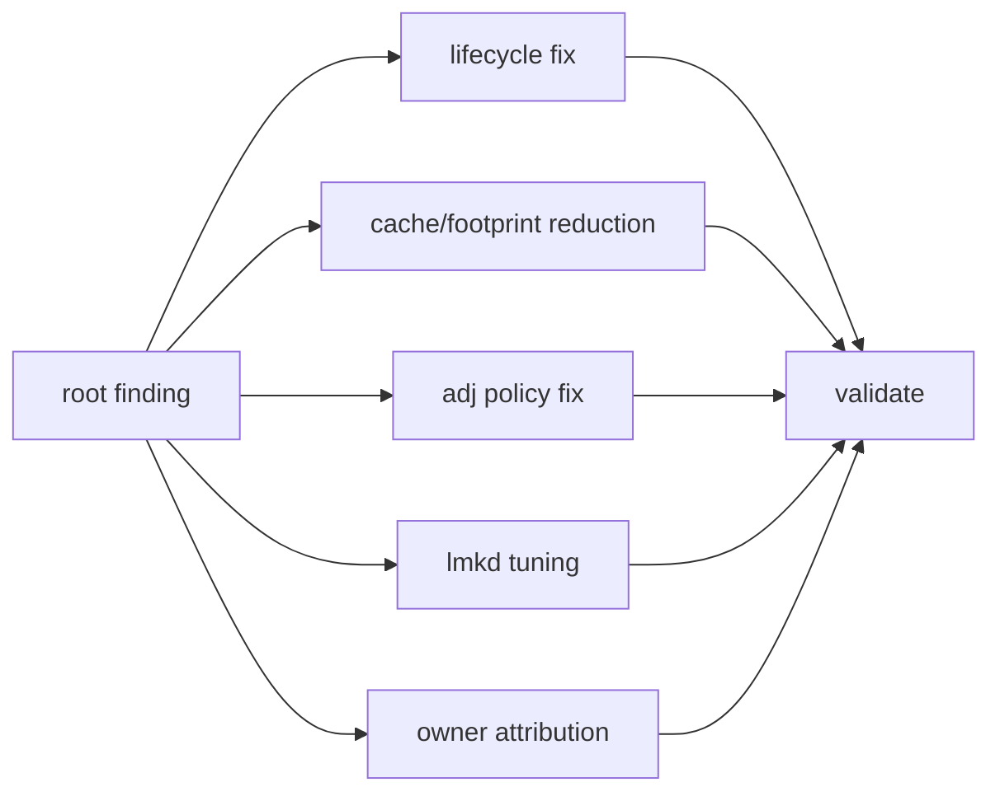

# Day 65: 案例复盘：lmkd 查杀高优先级进程的根因定位

> 目标：承接 Day 63 的 adj 审计和 Day 64 的时间线纪律，拆开“看起来高优先级”与“kill 时间点真实优先级”。

---

## 1. 案例总览



| 误判来源 | 正确问题 |
|---|---|
| 用户看到“刚才还在前台” | kill 时刻是否仍是前台/可见/服务 |
| 截图显示通知存在 | foreground service 是否仍有效 |
| 进程名像系统关键服务 | `oom_score_adj` 和 uid/state 才是证据 |
| kill 后体验坏 | 是否存在更低价值 victim |
| RSS 很大 | PSS、swap、shared buffer、memcg 才能评估收益 |

---

## 2. Kill 时间点四线证据



| 线 | 必备字段 | 解释 |
|---|---|---|
| pressure | PSI、vmstat、ZRAM、watermark | kill 是否由真实压力触发 |
| priority | dumpsys state、`oom_score_adj`、binding | victim 当时是否高优先级 |
| source | meminfo、slab、dma-buf、memcg | 压力来自哪里 |
| benefit | victim PSS/RSS/swap、kill 后 PSI | kill 是否释放有效资源 |

---

## 3. 常见真相分型



| 分型 | 证据 | 处理 |
|---|---|---|
| stale UI evidence | kill 时 `oom_score_adj` 已下降 | 改报告方式，不改 lmkd |
| state race | Activity stop/service unbind 与 kill 同窗 | 修生命周期或延迟降级 |
| shared pressure | victim 不拥有 dma-buf/slab 根因 | 找 owner，不责怪 victim |
| real policy bug | 更低 adj victim 存在却未杀 | 审 lmkd/AMS 传播 |
| no lower-value victim | 所有候选都重要且压力仍高 | 降峰值、扩回收、调策略 |

---

## 4. Victim Worksheet

| 字段 | 示例判断 |
|---|---|
| kill timestamp | 与 PSI/full、allocstall、logcat 同窗 |
| pid/process | 是否多进程组件 |
| `oom_score_adj` | kill 时真实值，不用事后截图 |
| procState | foreground、service、cached、empty |
| PSS/RSS/swap | 实际释放收益 |
| shared buffers | dma-buf/ashmem 是否由别的进程主导 |
| pre-kill mitigation | trim、compaction、ZRAM 是否已发生 |
| post-kill recovery | PSI、MemAvailable、帧稳定性是否改善 |



---

## 5. 命令包

```bash
adb shell cat /proc/pressure/memory > psi.kill-window.txt
adb shell cat /proc/vmstat > vmstat.kill-window.txt
adb shell dumpsys activity processes > activity-processes.kill-window.txt
adb shell cat /proc/<pid>/oom_score_adj > oom_score_adj.kill-window.txt
adb shell dumpsys meminfo <pid_or_package> > meminfo.victim.txt
adb logcat -d -v epoch | grep -i 'lmkd\|am_kill\|oom_adj\|lowmemorykiller'
```

| AOSP 路径 | 看点 |
|---|---|
| `frameworks/base/services/core/java/com/android/server/am/OomAdjuster.java` | adj 计算和传播 |
| `frameworks/base/services/core/java/com/android/server/am/ProcessList.java` | adj 档位和进程列表 |
| `system/memory/lmkd/lmkd.cpp` | 候选扫描、kill reason、thrashing |
| `frameworks/proto_logging/stats/atoms.proto` | kill 统计字段 |
| kernel PSI/vmpressure paths | pressure 触发来源 |

---

## 6. 排障决策流



---

## 7. 修复选择矩阵



| 根因 | 首选修复 | 禁忌 |
|---|---|---|
| stale state | 修生命周期、延迟释放、补监控 | 盲目抬高 adj |
| FGS 滥用 | 缩短任务、降级调度、释放缓存 | 永久保活 |
| lmkd 候选错误 | 修 adj 传播或 minfree 策略 | 同时改多个阈值 |
| shared dma-buf | 找 producer/consumer owner | 杀 consumer 当优化 |
| no victim | 降低峰值、提前回收 | 让所有关键进程不可杀 |

---

## 今日检查清单

- [ ] 已保存 kill 时间点的 PSI、vmstat、ZRAM、dumpsys、procfs 和 lmkd log。
- [ ] 已确认 `oom_score_adj` 是 kill 时刻值，不是事后截图。
- [ ] 已用 Day 63 方法审计 Activity、service、provider、binding 和 FGS 生命周期。
- [ ] 已用 Day 64 时间线判断 kill 发生在卡顿前还是卡顿后。
- [ ] 已填写 victim worksheet，包含 PSS/RSS/swap/shared buffer 和 post-kill PSI。
- [ ] 已区分 stale evidence、state race、shared pressure、policy bug 和 expected tradeoff。
- [ ] 已定义修复后的三轮复现实验和回滚条件。

---

## 8. 今天的结论

| 结论 | 工程含义 |
|---|---|
| 高优先级要看 kill 时刻 | 报告截图不能替代 procfs/dumpsys |
| victim 大不等于收益大 | shared buffer、swap、PSS 要一起看 |
| lmkd 可能没错 | 压力过高且无低价值 victim 时只能取舍 |
| 修复要按分型做 | 生命周期、归因、策略、峰值各有边界 |

Day 66 进入共享内存与 IPC 账单：重点拆 ashmem、memfd、Binder、dma-buf 为什么让 victim 归因变复杂。
