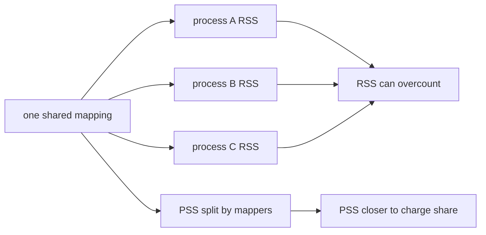
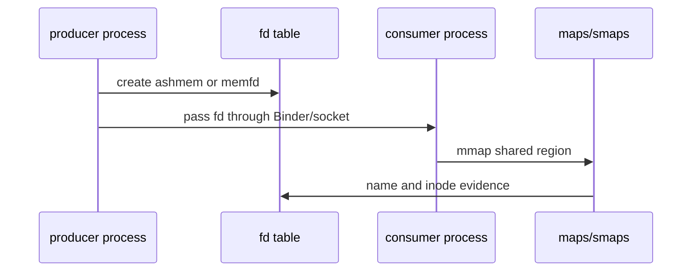
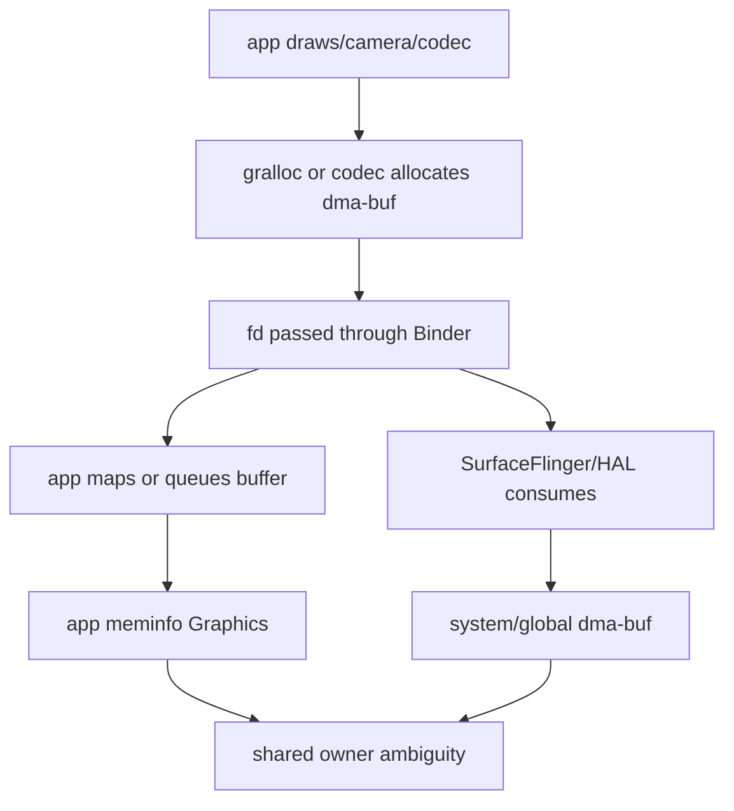
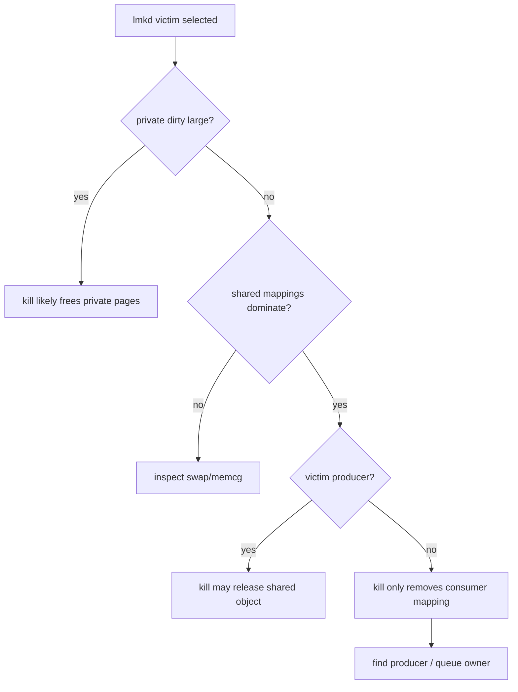
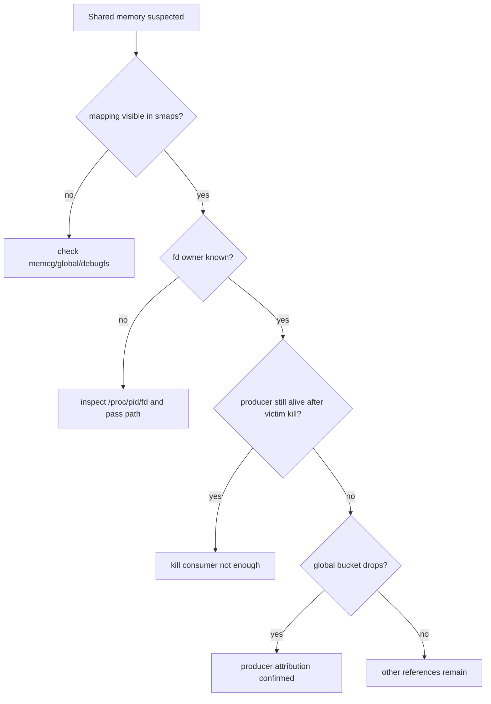
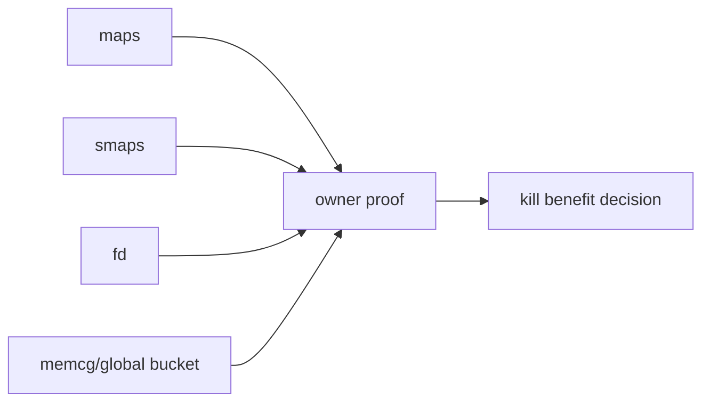

# Day 66: 共享内存与 IPC 内存账单：ashmem、memfd、Binder、dma-buf

> 目标：承接 Day 65 的 victim ownership 模糊问题，建立共享内存的 producer、consumer、fd、mapping、PSS 与 memcg 证据链。

---

## 1. 共享账单总图

```mermaid
flowchart TD
    A[producer allocates shared object] --> B[fd or handle]
    B --> C[consumer maps / receives]
    C --> D[/proc/pid/maps and smaps]
    C --> E[PSS shared accounting]
    A --> F[memcg / global bucket]
    B --> G[/proc/pid/fd]
    D --> H[owner proof]
    E --> H
    F --> H
    G --> H
```

| 类型 | 常见 owner | 常见 consumer | 误判点 |
|---|---|---|---|
| ashmem | app/framework | 多进程 app、system_server | RSS 重复计算 |
| memfd | app/native/service | renderer、codec、utility process | 名字不等于责任方 |
| Binder buffer | kernel binder driver | client/server IPC 双方 | 小但可能阻塞链路 |
| dma-buf | gralloc/camera/codec/GPU | SurfaceFlinger、app、HAL | 杀 consumer 未必释放 producer buffer |

---

## 2. PSS/RSS/Shared Dirty



| 字段 | 适合回答 | 不适合回答 |
|---|---|---|
| RSS | 这个进程映射了多少页 | 系统总释放收益 |
| PSS | 多进程均摊后的成本 | 谁最初分配 |
| Shared Dirty | 可写共享页压力 | fd owner |
| Private Dirty | 杀进程大概率释放 | shared producer 归因 |
| SwapPss | 换出后的均摊成本 | 当前热工作集全部大小 |

---

## 3. ashmem 与 memfd 证据



| 命令 | 看点 |
|---|---|
| `adb shell ls -l /proc/<pid>/fd` | fd 指向 ashmem/memfd/dmabuf |
| `adb shell cat /proc/<pid>/maps` | mapping 名字、权限、范围 |
| `adb shell cat /proc/<pid>/smaps` | PSS、Shared Dirty、Private Dirty、SwapPss |
| `adb shell dumpsys meminfo <pid>` | App Summary 与 Graphics/Native |
| `adb shell lsof -p <pid>` | 可用时快速看 fd 名称 |

名字只能提供线索。owner 需要 fd 来源、映射者列表、生命周期和 kill 后变化共同证明。

---

## 4. Binder 与 dma-buf



| 对象 | 关键证据 | 常见结论 |
|---|---|---|
| Binder transaction buffer | binder stats、trace、log | IPC 压力或阻塞，不通常是大 PSS 主因 |
| gralloc dma-buf | fd、dumpsys SurfaceFlinger、meminfo Graphics | 图形 buffer 需要 producer/queue 分析 |
| camera buffer | camera HAL logs、dma-buf exporter | app kill 未必立刻释放 HAL 持有 |
| codec buffer | media.codec logs、fd、dmabuf stats | 解码 pipeline 峰值 |
| Surface queue | layer dump、buffer count | consumer 持有导致释放延迟 |

---

## 5. Victim 归因检查



| 场景 | 杀 victim 后预期 |
|---|---|
| victim 持有大量 Private Dirty | MemAvailable/PSS 明显恢复 |
| victim 只是 dma-buf consumer | RSS 降，但全局 dma-buf 未必降 |
| victim 是 producer 且无其他引用 | shared bucket 下降 |
| 多 consumer 仍映射 | PSS 重新分摊，不等于释放全部 |
| fd 泄漏在 system_server/HAL | app kill 收益有限 |

---

## 6. 排障决策流



---

## 7. 证据矩阵

| 目标 | 最小证据 |
|---|---|
| 证明共享页存在 | `maps/smaps` 里 shared mapping + PSS |
| 证明 fd 持有 | `/proc/<pid>/fd` 指向 ashmem/memfd/dma-buf |
| 证明 producer | 创建日志、fd 传递路径、kill 后 bucket 下降 |
| 证明 consumer | 映射存在但 producer kill 才释放 |
| 证明 lmkd 收益 | victim kill 后 PSI、MemAvailable、global bucket 同窗改善 |



---

## 今日检查清单

- [ ] 已区分 RSS、PSS、Private Dirty、Shared Dirty 和 SwapPss。
- [ ] 已保存 victim 与 suspected producer 的 `/proc/<pid>/fd`、`maps`、`smaps`。
- [ ] 已确认 ashmem/memfd/dma-buf 名字只是线索，不直接当 owner。
- [ ] 已检查 SurfaceFlinger、camera、codec、HAL 或 system_server 是否仍持有引用。
- [ ] 已用 kill 后全局 bucket 变化验证 producer/consumer 判断。
- [ ] 已把共享账单结果回填到 Day 65 victim worksheet。
- [ ] 已记录 ROM 权限限制，例如 debugfs、dmabuf stats 或 memcg 不可读。

---

## 8. 今天的结论

| 结论 | 工程含义 |
|---|---|
| RSS 容易重复算共享页 | victim 大不等于释放收益大 |
| PSS 更适合成本分摊 | 但仍不能证明 producer |
| fd 和生命周期决定 owner | 名字只是线索 |
| dma-buf 要看队列和 exporter | 杀 consumer 常常释放不彻底 |

Day 67 进入 memcg 与 cgroup：把每个 App、service、system bucket 放进隔离视图里解释。
