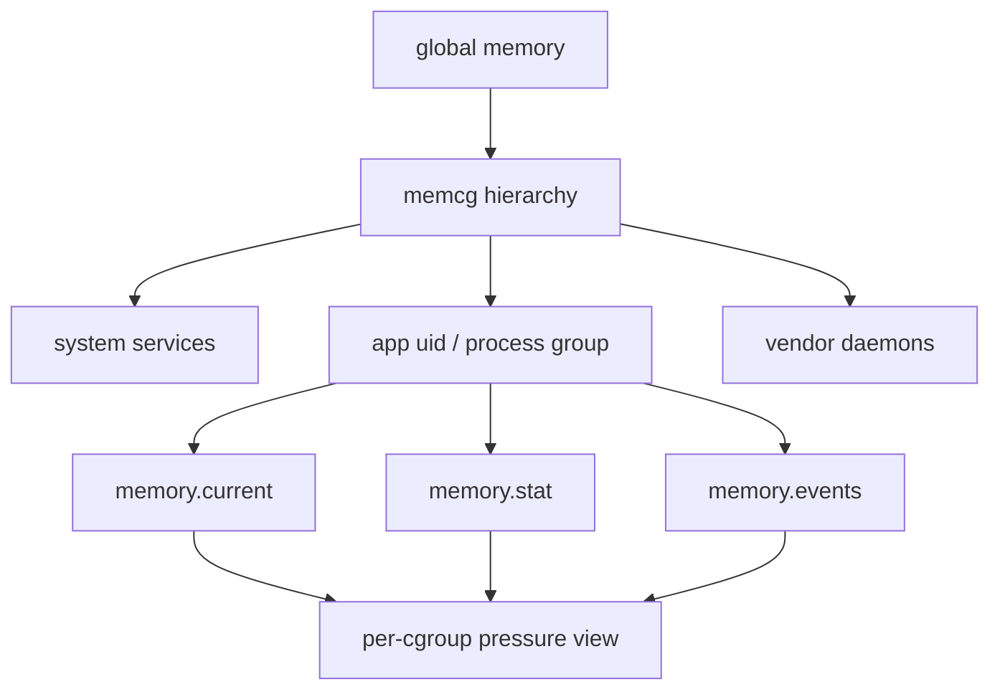
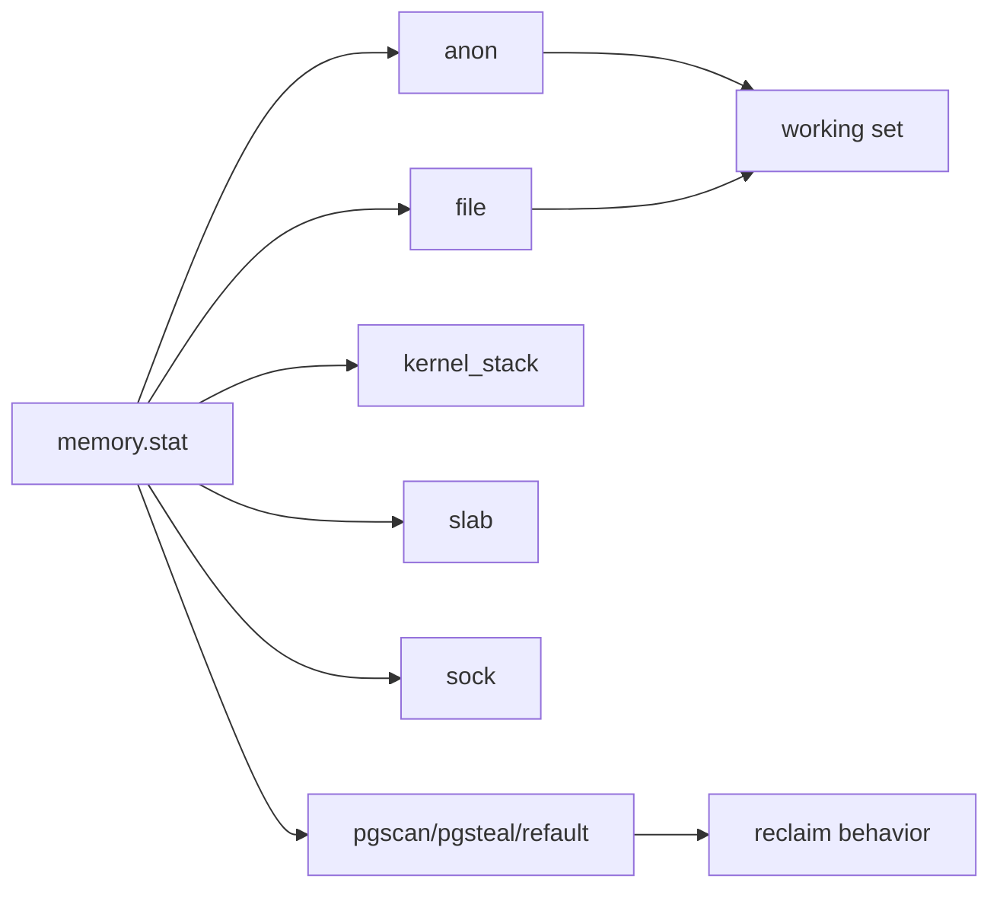
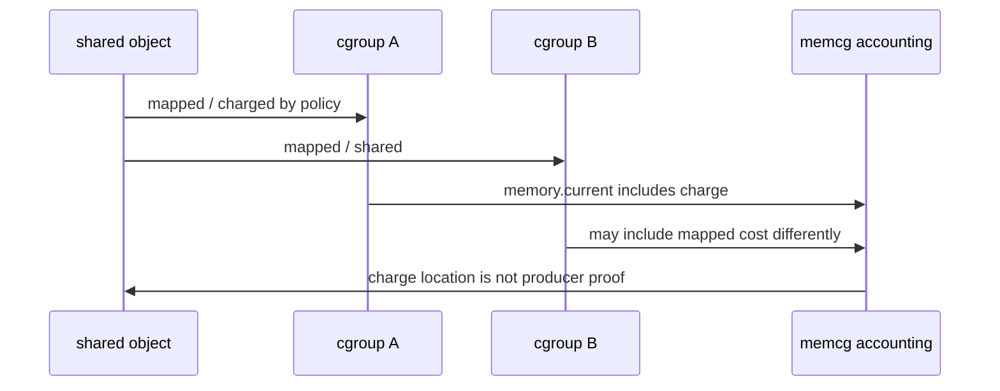
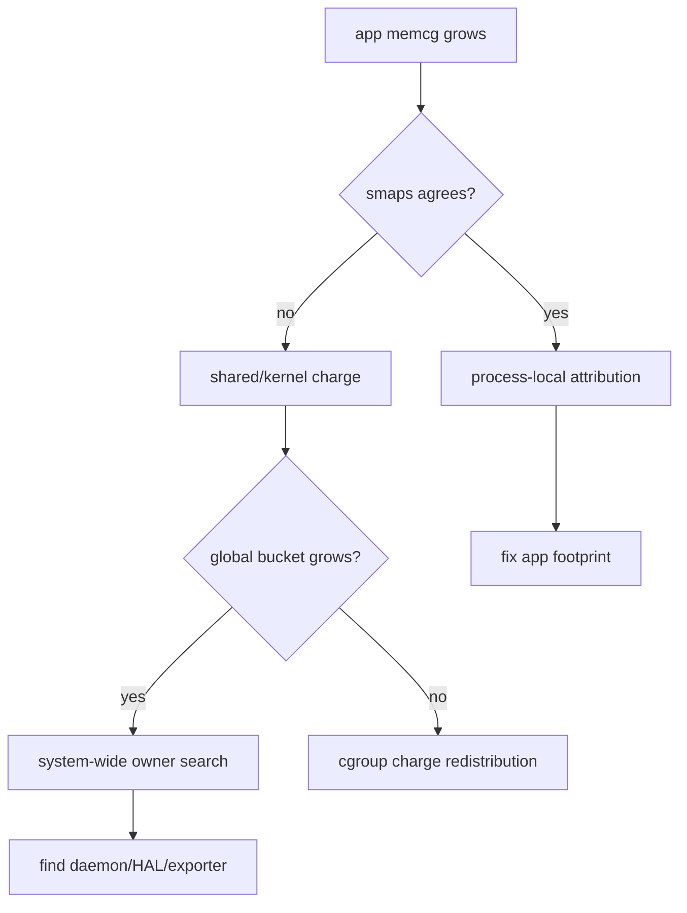
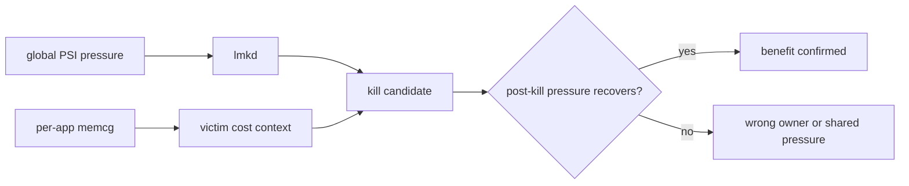
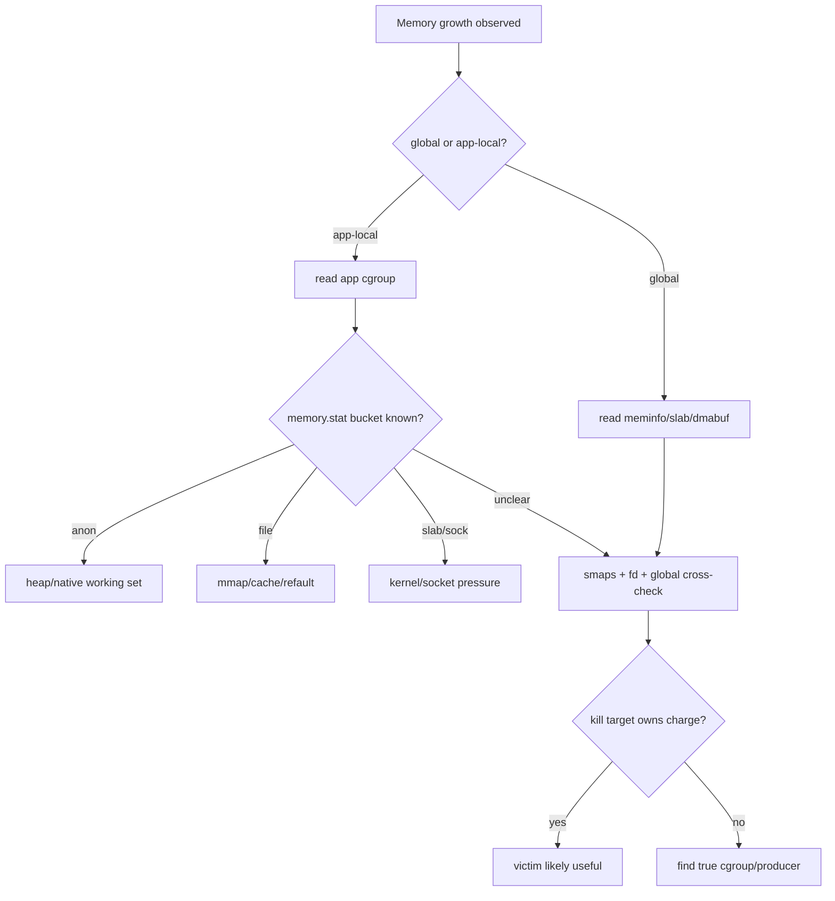
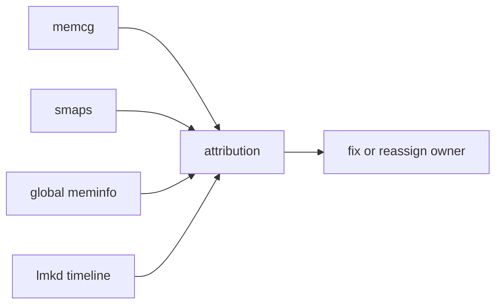

# Day 67: memcg 与 cgroup：每个 App 的内存隔离和系统视图

> 目标：承接 Day 66 的共享账单边界，说明 memcg/cgroup 能看到什么、不能证明什么，以及如何与全局内存视图交叉验证。

---

## 1. cgroup 视图



| 视图 | 回答的问题 | 盲区 |
|---|---|---|
| global meminfo | 系统总水位和 bucket | 哪个 app 负责 |
| memcg | 某个 cgroup 被 charge 多少 | shared object producer |
| smaps/PSS | 某进程映射成本 | cgroup 级限额和事件 |
| lmkd | pressure 下杀谁 | root bucket 不完整 |
| Perfetto | 时间线和线程影响 | 权限/数据源依赖 |

---

## 2. memory.stat 怎么读



| 字段族 | 工程含义 |
|---|---|
| `anon` | Java/native anonymous working set |
| `file` | page cache、mmap file、dex/oat 映射 |
| `slab` | 该 cgroup 关联的内核对象，视内核配置而定 |
| `sock` | socket buffer 压力 |
| `pgscan/pgsteal` | cgroup 内 reclaim 活动 |
| `workingset_refault` | file cache 抖动和热工作集不足 |

不同 Android 版本可能是 cgroup v1、v2 或混合布局。先记录路径和字段，再解释数据。

---

## 3. Shared Page Charging



| 情况 | memcg 能说明 | 不能说明 |
|---|---|---|
| shared page charged to A | A 当前承担账单 | A 一定是 producer |
| B 映射同一对象 | B 有使用关系 | 杀 B 一定释放对象 |
| charge migration | 账单可能变化 | 生命周期全部原因 |
| tmpfs/memfd | 可能进入 file/shmem | 业务 owner |
| dma-buf | 可能不完整进入 app memcg | exporter/queue owner |

---

## 4. App 与 System 双视图



| 对比 | 结论 |
|---|---|
| memcg ↑ + app PSS ↑ | app working set 增长可信 |
| memcg ↑ + app PSS 平 | shared/kernel charge 或统计差异 |
| global dma-buf ↑ + app memcg 平 | app 可能只是 consumer |
| memcg events high | cgroup 内 reclaim/limit 压力 |
| global PSI high + target memcg 平 | 压力可能来自别的 cgroup |

---

## 5. 命令包

```bash
adb shell cat /proc/cgroups
adb shell mount | grep cgroup
adb shell find /sys/fs/cgroup -maxdepth 4 -name memory.current -o -name memory.stat
adb shell cat /sys/fs/cgroup/<path>/memory.current
adb shell cat /sys/fs/cgroup/<path>/memory.stat
adb shell cat /sys/fs/cgroup/<path>/memory.events 2>/dev/null || true
adb shell dumpsys meminfo <package>
adb shell cat /proc/<pid>/smaps_rollup
```

| 文件 | 用法 |
|---|---|
| `memory.current` | cgroup 当前总 charge |
| `memory.peak` | 峰值，若内核支持 |
| `memory.stat` | anon/file/slab/sock/reclaim |
| `memory.events` | low/high/max/oom/oom_kill 事件 |
| `cgroup.procs` | 属于该 cgroup 的 pid |
| `proc/<pid>/cgroup` | 进程到 cgroup 路径映射 |

---

## 6. lmkd 与 memcg



memcg 可以增强 victim worksheet，但不能替代 Day 65 的 kill-time adj 审计。lmkd 查杀仍然要看 pressure、priority、source、benefit 四条线。

---

## 7. 排障决策流



---

## 8. 证据表

| 问题 | 需要同时看 |
|---|---|
| app 是否超预算 | `memory.current`、PSS、procState、业务场景 |
| 增长来自哪里 | `memory.stat` bucket + smaps category |
| 是否 shared ambiguity | fd/maps/smaps + memcg charge + global bucket |
| 是否 cgroup 内抖动 | `memory.events` + `pgscan/pgsteal/refault` |
| kill 是否有效 | kill 后 memcg/global/PSI 同窗变化 |



---

## 今日检查清单

- [ ] 已确认设备使用 cgroup v1、v2 或混合布局。
- [ ] 已找到目标 pid 对应的 cgroup 路径和 `cgroup.procs`。
- [ ] 已保存 `memory.current/stat/events` 与 `dumpsys meminfo`、`smaps_rollup`。
- [ ] 已区分 anon、file、slab、sock、refault 与 reclaim 事件。
- [ ] 已把 Day 66 的 shared object fd/maps 证据与 memcg charge 对齐。
- [ ] 已用 kill 后 memcg/global/PSI 变化验证 victim benefit。
- [ ] 已记录无法读取 cgroup、events、peak 或 vendor 节点的权限边界。

---

## 9. 今天的结论

| 结论 | 工程含义 |
|---|---|
| memcg 是隔离账单 | 比单进程 PSS 更接近 app 组成本 |
| charge 不等于 producer | 共享对象仍要 fd 和生命周期证明 |
| global 与 per-app 要交叉看 | 单一视图容易错判 owner |
| lmkd 分析仍需四条线 | pressure、priority、source、benefit 缺一不可 |

Day 68 进入 Native/System 内存归因：把 smaps、showmap、heapprofd 和 memcg 合成一套交叉验证方法。
