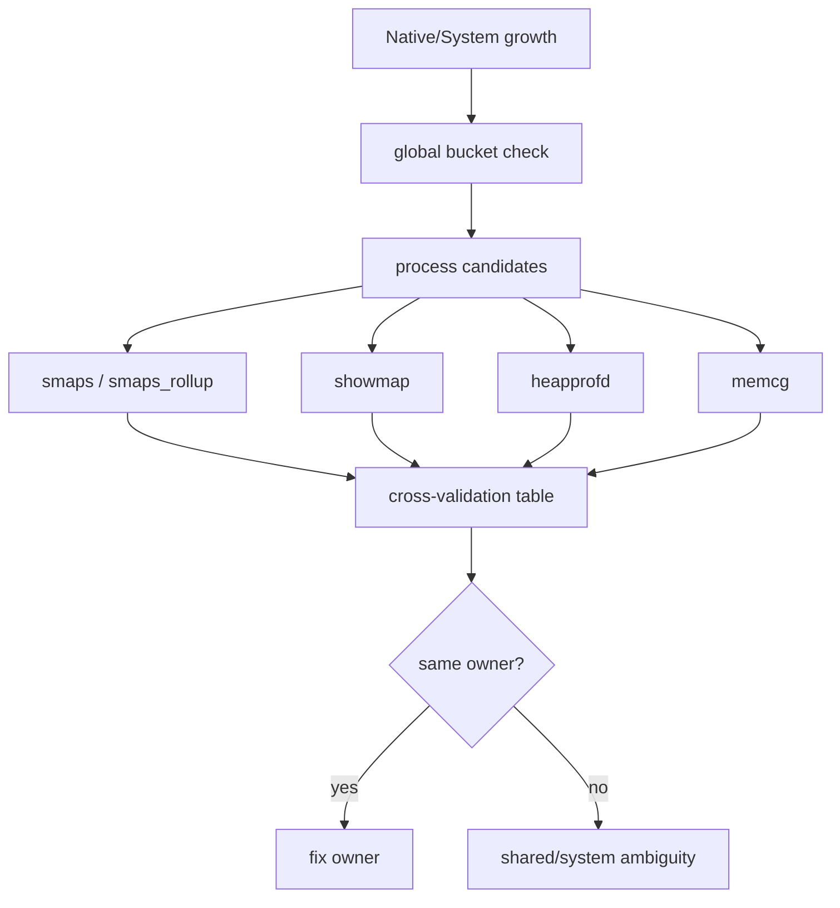
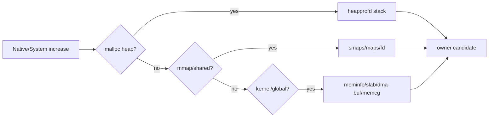
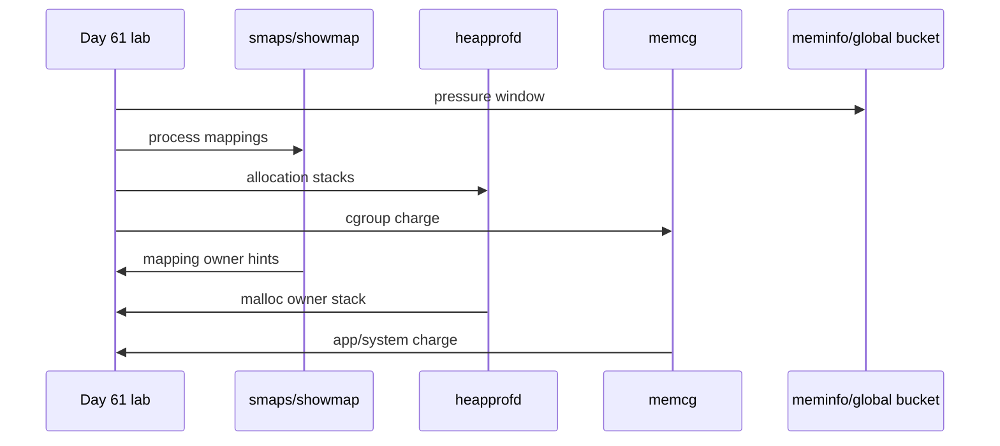
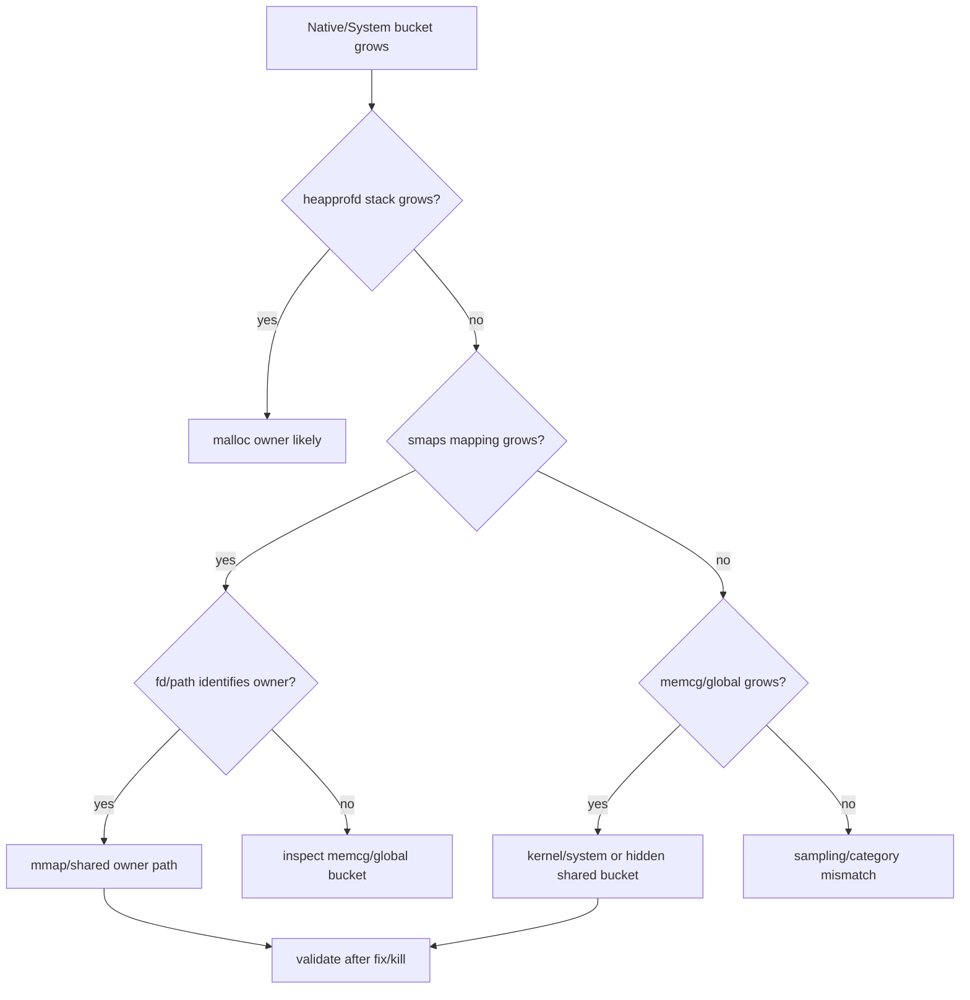
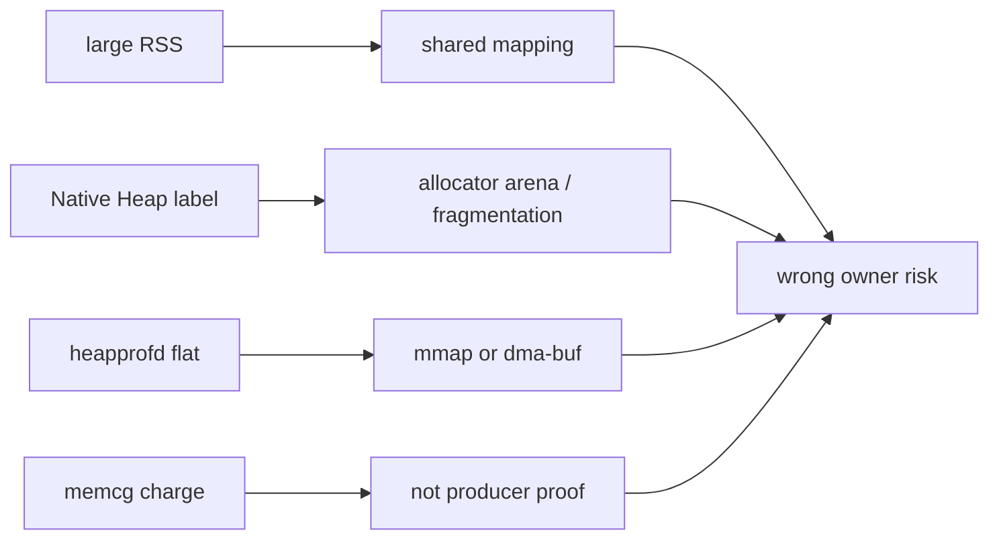
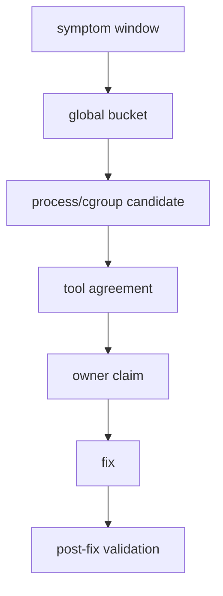

# Day 68: Native/System 内存归因：smaps、showmap、heapprofd、memcg 交叉验证

> 目标：承接 Day 67 的 global/per-cgroup 边界和 Day 66 的 shared owner proof，建立 Native/System 内存归因的交叉验证工作流。

---

## 1. 归因总流程



| 工具 | 最擅长 | 盲区 |
|---|---|---|
| `smaps` | mapping 粒度 PSS/RSS/dirty/swap | stack owner 不直接清楚 |
| `showmap` | 快速聚合 mapping 类别 | 细节少于 smaps |
| heapprofd | Native allocation stack | mmap/dma-buf/file cache 不完整 |
| memcg | cgroup charge 与事件 | producer proof 不充分 |
| meminfo | 系统 bucket 和进程摘要 | 分类可能被 shared 映射混淆 |

---

## 2. Native Heap 与 Mapping



| 增长类型 | 首选证据 | 解释 |
|---|---|---|
| malloc leak | heapprofd + Native Heap PSS | 分配栈可信 |
| anonymous mmap | maps/smaps + fd 缺失 | 可能是 arena、JIT、runtime |
| file mmap | path + PSS/Private Dirty | dex/oat/so/cache |
| dma-buf | fd + global dmabuf + SurfaceFlinger/HAL | app meminfo 不够 |
| slab/system | `/proc/meminfo` + slab info + memcg | 进程视图可能看不到 |

---

## 3. 四工具对照表



| 现象 | smaps/showmap | heapprofd | memcg | 结论 |
|---|---|---|---|---|
| Native Heap ↑ + stack ↑ | heap mapping ↑ | 同 owner stack ↑ | cgroup anon ↑ | malloc leak |
| PSS ↑ + stack 平 | mmap 类别 ↑ | 无明显 stack | file/anon ↑ | 非 malloc mapping |
| Graphics ↑ | dma-buf/fd 线索 | 无 | 可能不完整 | 图形/codec owner |
| global slab ↑ | 进程无明显涨 | 无 | system cgroup/slab ↑ | kernel/system |
| memcg ↑ + smaps 平 | 不一致 | 不一致 | charge ↑ | shared charge/统计边界 |

---

## 4. 命令包

```bash
PID=$(adb shell pidof com.example.app | tr -d '\r')
adb shell dumpsys meminfo com.example.app > meminfo.txt
adb shell cat /proc/$PID/smaps_rollup > smaps_rollup.txt
adb shell cat /proc/$PID/smaps > smaps.txt
adb shell showmap -a $PID > showmap.txt
adb shell cat /proc/$PID/maps > maps.txt
adb shell ls -l /proc/$PID/fd > fd.txt
adb shell cat /proc/$PID/cgroup > cgroup.txt
```

```bash
# heapprofd needs device/version/setup support.
adb shell setprop persist.heapprofd.enable true
adb shell perfetto -c heapprofd.pbtx -o /data/misc/perfetto-traces/native.pb
adb pull /data/misc/perfetto-traces/native.pb .
```

| 输出 | 第一眼看什么 |
|---|---|
| `smaps_rollup` | 总 PSS、Private Dirty、SwapPss |
| `smaps` | 哪类 mapping 增长 |
| `showmap -a` | 汇总类别是否匹配 smaps |
| `fd` | ashmem/memfd/dma-buf owner 线索 |
| heapprofd trace | 分配栈、进程、时间窗口 |
| memcg files | cgroup charge 是否同向变化 |

---

## 5. 排障决策流



---

## 6. False Positive Traps



| 陷阱 | 防错证据 |
|---|---|
| 把 RSS 当释放收益 | PSS + Private Dirty + kill 后变化 |
| 把 Native Heap 全算 leak | heapprofd stack + before/after allocation |
| heapprofd 没涨就排除 Native | mmap、arena、dma-buf 可能不在 malloc stack |
| memcg charge 当 producer | fd、maps、lifecycle、global bucket |
| 杀 app 后系统 bucket 未降 | producer/HAL/system_server 仍持有 |

---

## 7. 归因报告模板



| 段落 | 必填 |
|---|---|
| 症状窗口 | PSI、vmstat、lmkd、Perfetto 时间 |
| 全局 bucket | meminfo、dma-buf、slab、ZRAM |
| 候选进程 | PSS/RSS、cgroup、procState |
| 工具一致性 | smaps/showmap/heapprofd/memcg 是否同向 |
| owner 结论 | producer、consumer、allocator stack 或 system bucket |
| 修复 | 释放、降峰值、生命周期、buffer queue、策略 |
| 验证 | bucket、PSI、kill、体验是否改善 |

---

## 今日检查清单

- [ ] 已锁定同一压力窗口，避免不同时间点截图混用。
- [ ] 已同时保存 meminfo、smaps、showmap、fd、memcg 和 heapprofd 可用输出。
- [ ] 已区分 malloc heap、anonymous mmap、file mmap、dma-buf、slab/system。
- [ ] 已检查 heapprofd stack 与 smaps mapping 是否同向。
- [ ] 已用 Day 66 shared owner proof 判断 producer/consumer。
- [ ] 已用 Day 67 memcg 边界判断 charge 是否等于 owner。
- [ ] 已通过 fix/kill 后 bucket、PSI、lmkd 和体验变化验证结论。

---

## 8. 今天的结论

| 结论 | 工程含义 |
|---|---|
| 没有单一万能工具 | smaps、showmap、heapprofd、memcg 要交叉验证 |
| heapprofd 只覆盖一类 Native | mmap/dma-buf/system bucket 仍需别的证据 |
| memcg 是 charge 视图 | 不能单独证明 producer |
| 归因必须有后验验证 | 修复后 bucket 和 PSI 不动，owner 多半错了 |

Day 69 进入启动阶段内存控制：从冷启动峰值、预加载和缓存时机减少早期 Native/System 压力。
