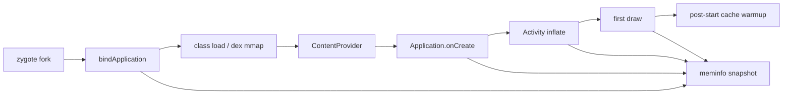
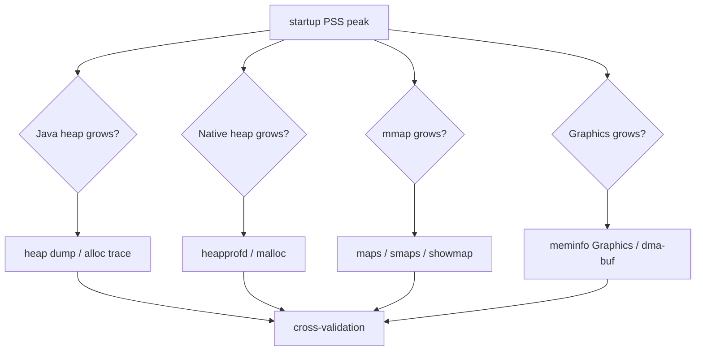
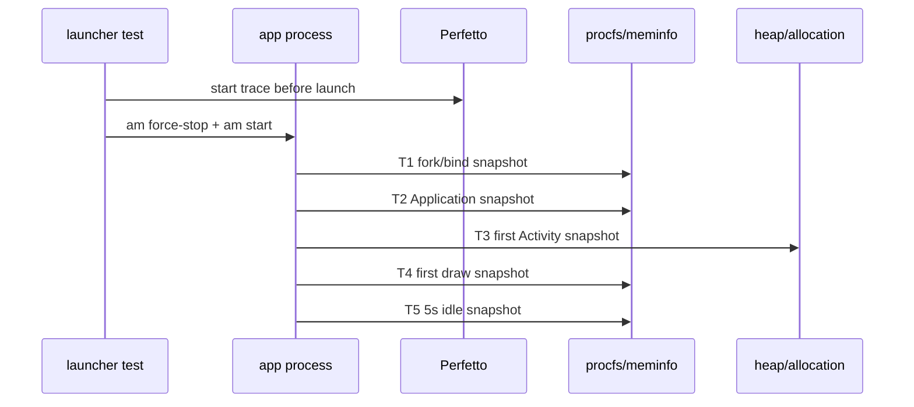
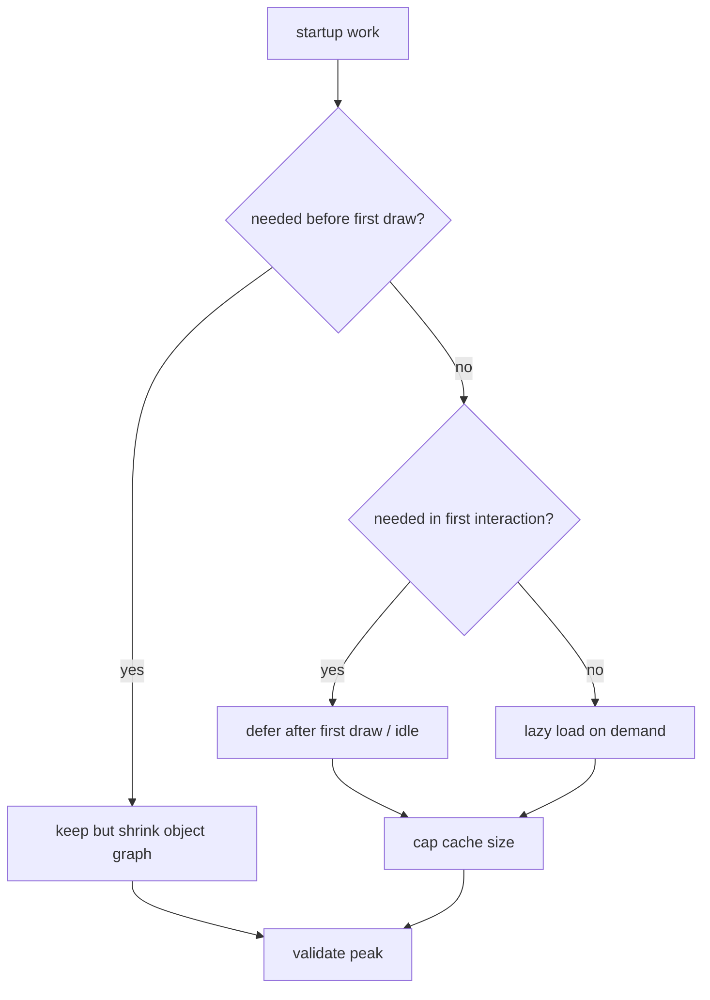
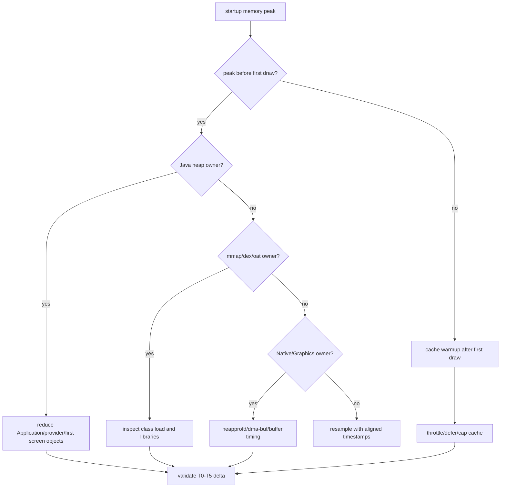

# Day 69: 启动阶段内存控制：冷启动峰值、预加载与缓存时机

> 目标：承接 Day 68 的交叉验证方法，把启动期增长拆成 Java heap、Native heap、mmap、dex/oat、bitmap 与 graphics，而不是只看一个 PSS 峰值。

---

## 1. 冷启动峰值地图



| 阶段 | 常见增长 | 首选证据 | 风险 |
|---|---|---|---|
| fork 后 | zygote 共享页 PSS 分摊 | `dumpsys meminfo`, `smaps` | 把共享页误判成私有增长 |
| class load | dex/oat/vdex mmap | `/proc/<pid>/maps`, `showmap` | 误当 Java heap |
| provider | 初始化单例、DB、SDK | allocation trace, heap dump | 过早创建全局缓存 |
| inflate | View、Drawable、Bitmap | heap dump, meminfo Graphics | 布局首屏外对象过多 |
| first draw | RenderThread、buffer、GPU | meminfo Graphics, dma-buf | 图形峰值晚于 Java 峰值 |
| warmup | image/cache/pool | allocation, cache stats | 与首帧竞争内存 |

---

## 2. 启动内存账单拆分



| Bucket | 不能只看 | 必须补的证据 |
|---|---|---|
| Java heap | Heap Size | Alloc class、retained owner、GC 后是否回落 |
| Native heap | Native Heap PSS | heapprofd stack、arena/fragmentation 边界 |
| dex/oat mmap | PSS 增长 | maps 路径、Private Dirty、是否 zygote 共享 |
| Bitmap | Java object 数 | pixel/native/graphics bucket 同步 |
| Graphics | app PSS | dma-buf exporter、SurfaceFlinger/HAL 是否持有 |

---

## 3. 采样时间线



| 时间点 | 目的 | 命令 |
|---|---|---|
| T0 | 启动前基线 | `adb shell dumpsys meminfo` |
| T1 | fork 后共享账单 | `pidof`, `smaps_rollup` |
| T2 | Application 后 | `dumpsys meminfo <pkg>` |
| T3 | 首 Activity 创建后 | allocation recording / heap dump |
| T4 | first draw | Perfetto frame + meminfo |
| T5 | idle 后 | 峰值是否释放 |

---

## 4. 命令包

```bash
PKG=com.example.app
adb shell am force-stop $PKG
adb shell perfetto -c startup-memory.pbtx -o /data/misc/perfetto-traces/startup.pb &
adb shell am start -W $PKG/.MainActivity
PID=$(adb shell pidof $PKG | tr -d '\r')
adb shell dumpsys meminfo $PKG > meminfo-startup.txt
adb shell cat /proc/$PID/smaps_rollup > smaps-rollup-startup.txt
adb shell showmap -a $PID > showmap-startup.txt
adb shell cat /proc/$PID/maps > maps-startup.txt
adb shell ls -l /proc/$PID/fd > fd-startup.txt
```

```bash
# Java / Native attribution
adb shell am dumpheap $PKG /data/local/tmp/startup.hprof
adb pull /data/local/tmp/startup.hprof .
adb shell perfetto -c heapprofd-startup.pbtx -o /data/misc/perfetto-traces/heapprofd-startup.pb
```

---

## 5. 预加载与缓存时机



| 工作 | 放在首帧前的条件 | 推荐处理 |
|---|---|---|
| SDK init | 首屏强依赖 | 分阶段 init，关闭非首屏模块 |
| image cache | 首屏立即显示 | 只加载首屏尺寸和数量 |
| DB open | 首屏查询必须 | 延迟 migration、索引检查 |
| network prefetch | 首屏无本地数据 | 限制并发和响应缓存 |
| View pool | 首屏列表复用 | 首屏后 warmup，设置上限 |
| native library | 必须调用 native | 按 feature lazy load |

---

## 6. 排障决策流



---

## 7. 验收矩阵

| 修复 | 成功信号 | 失败信号 |
|---|---|---|
| 延迟 SDK init | T2/T3 PSS 下降，首屏功能正常 | T5 反弹且交互卡顿 |
| 缩小首屏图片 | Java/Graphics 同降 | 图片模糊或 decode 次数增加 |
| 懒加载 native lib | maps/showmap 首帧前减少 | 首次点击卡顿明显 |
| 限制 cache warmup | T4 峰值下降 | 后续滚动频繁 miss |
| 拆分 provider 初始化 | bindApplication 下降 | provider 首次访问超时 |

---

## 今日检查清单

- [ ] T0-T5 采样点对齐到同一次启动。
- [ ] 已区分 Java heap、Native heap、mmap、dex/oat、bitmap、graphics。
- [ ] 已检查 zygote 共享页，避免把共享 PSS 当私有成本。
- [ ] 已把首帧前必需工作和首帧后 warmup 分开。
- [ ] 已用 Day 68 的 smaps/showmap/heapprofd/memcg 交叉验证确认 owner。
- [ ] 已验证峰值下降没有换成首交互卡顿。

---

## 8. 今天的结论

| 结论 | 工程含义 |
|---|---|
| 启动峰值不是一个 bucket | 必须按阶段和来源拆账 |
| 预加载只适合首帧必需路径 | 其他初始化应延迟、限流、设上限 |
| zygote 共享页会干扰判断 | PSS、Private Dirty、maps 要一起看 |
| 降峰值要看后续体验 | 不能把内存峰值转移成首次交互卡顿 |

Day 70 进入 RecyclerView 内存优化：把启动期峰值控制思路迁移到列表滚动、预取、复用池与图片 decode。
