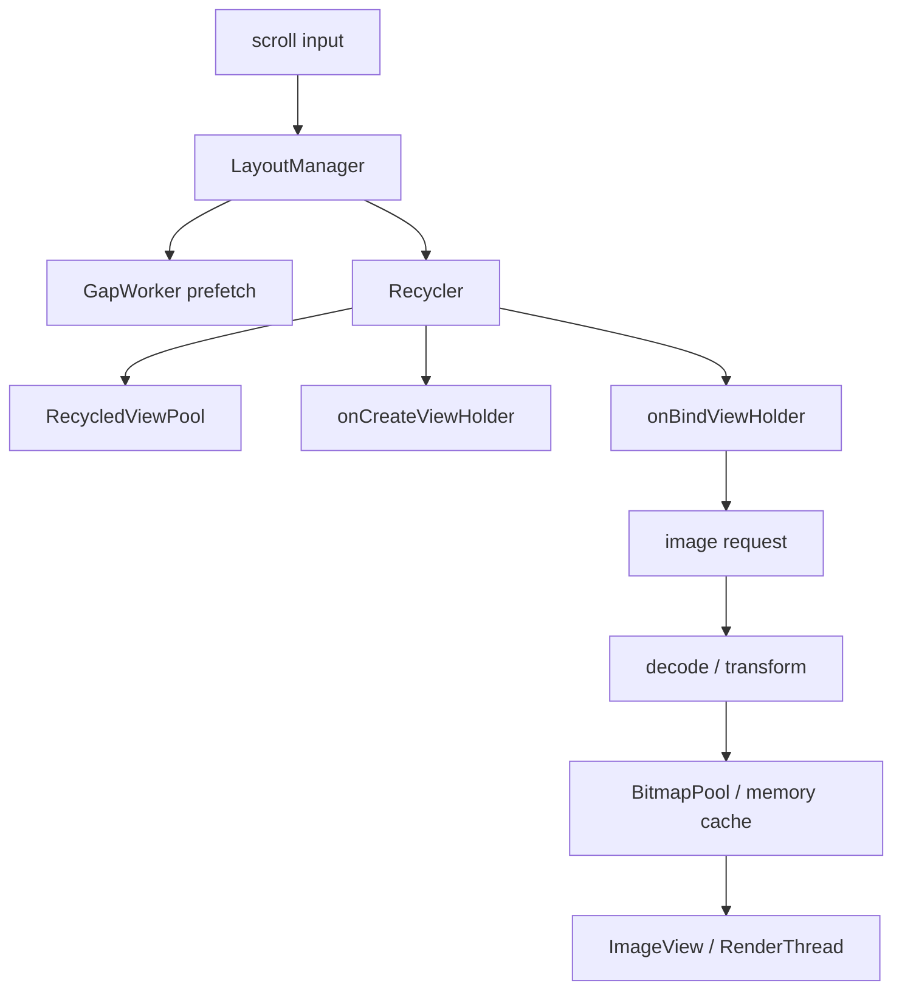
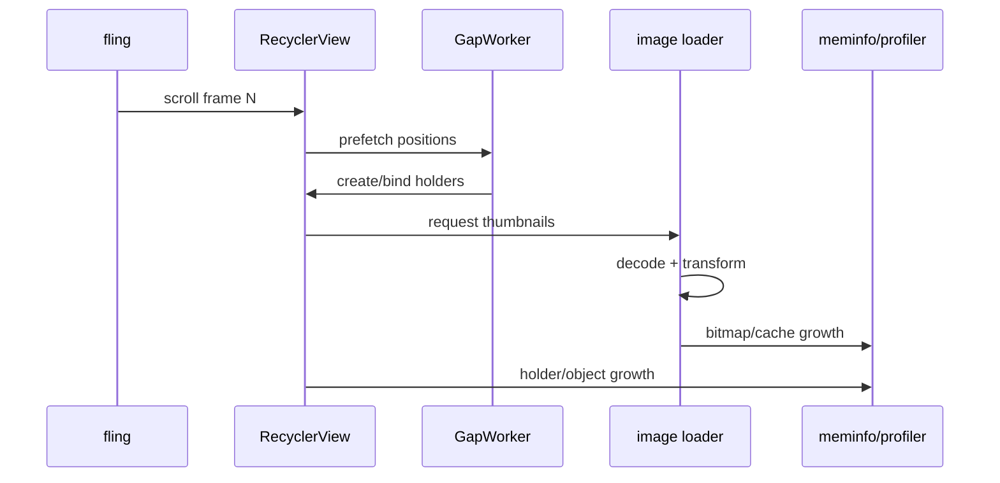
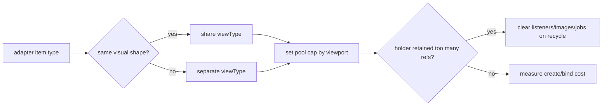
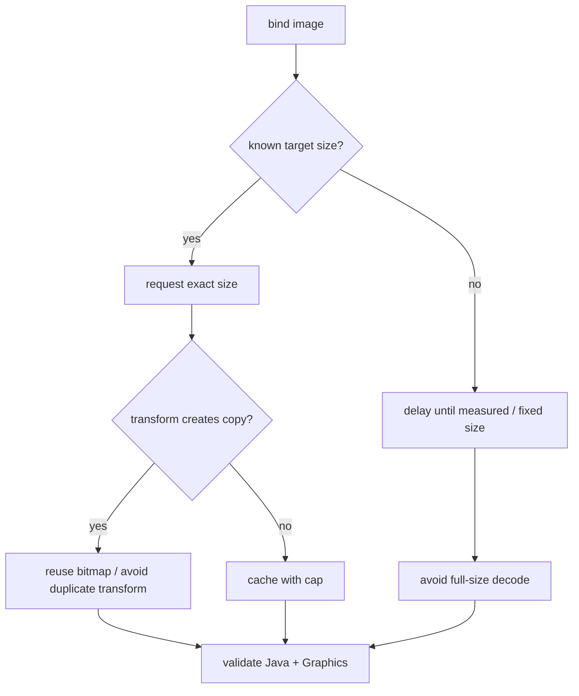
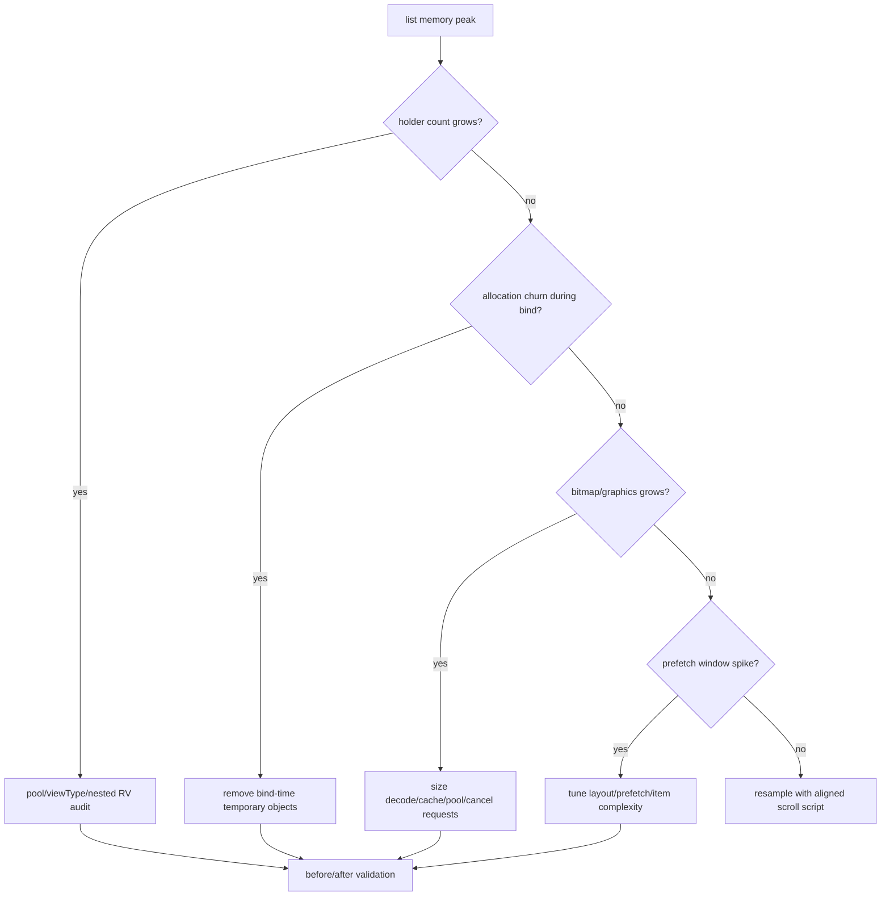

# Day 70: RecyclerView 内存优化：ViewHolder、Prefetch、Pool 与图片峰值

> 目标：承接 Day 69 的峰值时间线，把列表滚动的内存峰值拆成 ViewHolder、预取、复用池、图片 decode、bitmap cache 与 graphics buffer。

---

## 1. 列表内存路径



| 环节 | 内存对象 | 观测信号 | 常见问题 |
|---|---|---|---|
| create holder | View tree、binding | allocation trace | item 过重、嵌套层级深 |
| bind holder | text/span/listener | Java heap diff | 每次 bind 创建临时对象 |
| prefetch | offscreen holders | Perfetto slices | 预取窗口过大 |
| image decode | Bitmap/native pixels | meminfo, profiler | 尺寸未按 view 限制 |
| pool/cache | holder、bitmap | cache stats | 上限过大或无回收策略 |
| render | layer/buffer | Graphics/dma-buf | 大图、硬件层、动画 |

---

## 2. 峰值窗口拆分



| 窗口 | 问题要问 | 证据 |
|---|---|---|
| 静止首屏 | baseline 是否已经过高 | T0 meminfo + heap histogram |
| 慢滚 | bind 是否产生垃圾 | allocation count + GC log |
| fling | prefetch 是否放大峰值 | Perfetto + GapWorker trace |
| 图片进入 | decode 是否过大 | bitmap size + meminfo Graphics |
| 回到静止 | pool/cache 是否回落 | T5 heap/cache stats |

---

## 3. ViewHolder 与 Pool



| 决策 | 推荐规则 | 验证 |
|---|---|---|
| `viewType` | 视觉结构相同才复用 | bind 分支少、holder 数稳定 |
| pool cap | 约等于可见数 + 小缓冲 | fling 后对象数回落 |
| nested RV | 外层按业务分池 | 子列表 holder 不无限增长 |
| recycle cleanup | 清图片、取消 job、解绑 listener | LeakCanary/heap path 不保留旧 item |
| stable ids | 只在真实稳定身份时启用 | diff 动画与 holder 复用正常 |

---

## 4. 图片峰值控制



| 控制点 | 作用 | 失败表现 |
|---|---|---|
| fixed item image size | 限制 decode 尺寸 | 原图尺寸进入内存 |
| thumbnail request | 降低像素峰值 | 清晰度不足或重复请求 |
| bitmap pool | 复用像素内存 | pool 本身过大 |
| cache cap | 控制驻留 | 回滚后内存不降 |
| cancel on recycle | 防止错图和旧请求 | 旧 item 被请求链保留 |

---

## 5. 命令包

```bash
PKG=com.example.app
PID=$(adb shell pidof $PKG | tr -d '\r')
adb shell dumpsys meminfo $PKG > rv-meminfo-before.txt
adb shell am profile start --sampling 1 $PKG /data/local/tmp/rv.trace
# run scripted scroll / fling
adb shell dumpsys meminfo $PKG > rv-meminfo-after.txt
adb shell cat /proc/$PID/smaps_rollup > rv-smaps-rollup.txt
adb shell logcat -d | grep -E "GC|RecyclerView|Choreographer" > rv-logcat.txt
```

```bash
# AndroidX source reading entry points
rg "class RecyclerView" frameworks/support/recyclerview
rg "GapWorker|RecycledViewPool|tryGetViewHolderForPositionByDeadline" frameworks/support/recyclerview
rg "onViewRecycled|onFailedToRecycleView" app/src/main
```

---

## 6. 排障决策流



---

## 7. 验收矩阵

| 优化 | 通过条件 | 回滚条件 |
|---|---|---|
| 降低 pool cap | 对象数下降，create cost 可接受 | 滚动频繁 inflate 卡顿 |
| 精确图片尺寸 | Bitmap/Graphics 降低 | 首屏图片明显模糊 |
| 推迟预取 | fling 峰值降低 | 快速滚动出现空白 |
| bind 对象复用 | GC 次数下降 | 状态污染旧 item |
| recycle 取消请求 | 旧 item 不被保留 | 图片闪烁或重载过多 |

---

## 今日检查清单

- [ ] 已固定一次可复现滚动脚本，避免人工滑动误差。
- [ ] 已分别记录静止、慢滚、fling、图片进入、回到静止的内存。
- [ ] 已检查 ViewHolder 数量、viewType、pool cap、nested RecyclerView。
- [ ] 已检查 bind-time allocation、listener/job/image request 清理。
- [ ] 已把图片像素、Java Bitmap 对象、Graphics/dma-buf 分开看。
- [ ] 已沿用 Day 69 的峰值窗口验证，避免把峰值推迟成滚动卡顿。

---

## 8. 今天的结论

| 结论 | 工程含义 |
|---|---|
| RecyclerView 优化先定窗口 | 静止、慢滚、fling、回落要分开采样 |
| Pool 不是越大越好 | 上限必须绑定 viewport 和复用收益 |
| 图片通常是最大峰值 | 按 view 尺寸 decode，回收时取消请求 |
| 降内存必须守住帧率 | 峰值下降但滚动 jank 上升不是成功 |

Day 71 进入多进程架构：把列表和启动期的 per-process 成本放进 memcg、PSS、lmkd 风险模型里。
