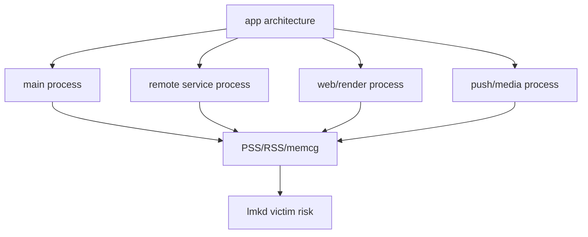
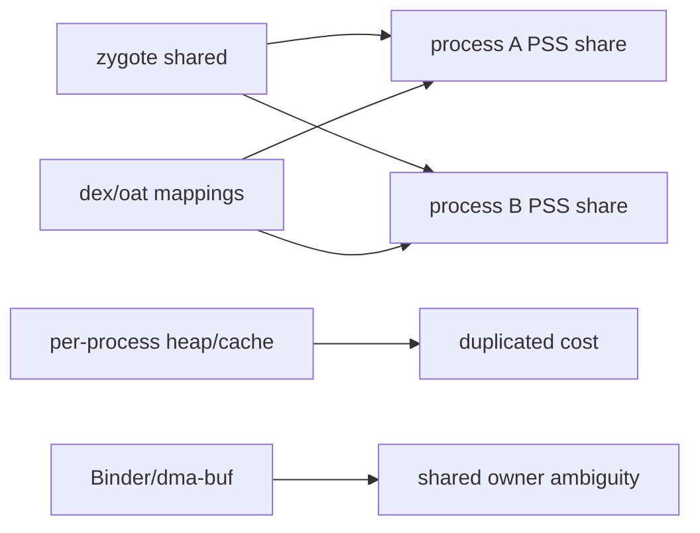
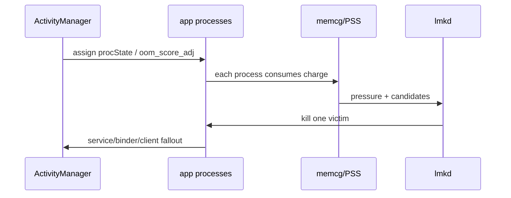
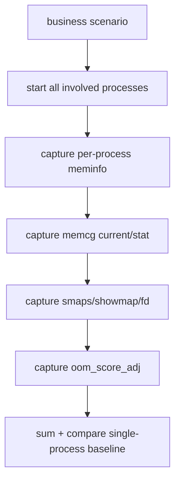
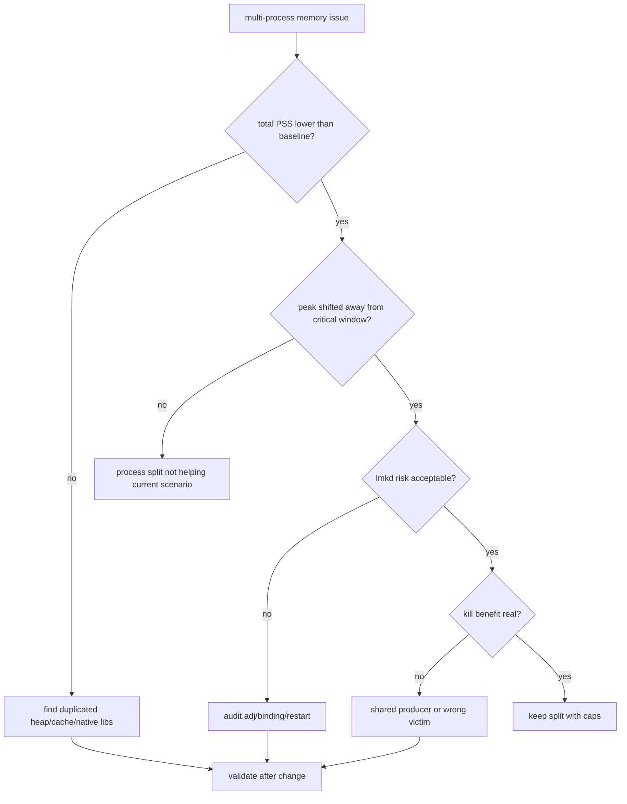

# Day 71: 多进程架构的内存收益、账单代价与 lmkd 风险

> 目标：承接 Day 70 的分窗口峰值模型和 Day 67 的 memcg 边界，判断多进程到底是在隔离风险、降低峰值，还是制造重复内存和 lmkd 误杀面。

---

## 1. 多进程账单地图



| 收益 | 代价 | 必须验证 |
|---|---|---|
| 崩溃隔离 | runtime/class/cache 重复 | 总 PSS 是否下降 |
| 峰值错开 | Binder/shared buffer 成本 | 同一业务窗口总账 |
| 生命周期隔离 | 进程保活风险 | `oom_score_adj` 与 procState |
| 功能裁剪 | 冷启动多次发生 | 各进程 T0-T5 峰值 |
| 安全边界 | 调试与归因复杂 | memcg + smaps + lmkd |

---

## 2. 共享与重复



| 内存类型 | 多进程后变化 | 归因注意 |
|---|---|---|
| zygote/framework | 多进程分摊 PSS | 不是完全重复 |
| app class/dex | 可能共享 mapping | Private Dirty 才是关键 |
| Java heap | 每进程独立 | cache/singleton 容易重复 |
| Native heap | 每进程独立 | heapprofd 分进程采样 |
| Binder buffer | IPC 增加 | producer/consumer 要分开 |
| dma-buf/graphics | 可能跨进程持有 | 需要 Day 66 shared proof |

---

## 3. lmkd 风险路径



| 风险 | 证据 | 修正方向 |
|---|---|---|
| 子进程 adj 偏低 | `/proc/<pid>/oom_score_adj` | 重新设计绑定/FGS 边界 |
| 总 PSS 更高 | per-process meminfo sum | 合并或延迟进程启动 |
| kill 后收益小 | post-kill PSI/bucket 不动 | 找 shared producer |
| 重启风暴 | logcat ActivityManager/lmkd | 限制自启动和恢复策略 |
| 主进程被连带影响 | binder death / service reconnect | 降低强依赖同步调用 |

---

## 4. 采样表



| 文件 | 作用 |
|---|---|
| `dumpsys meminfo <pkg>` | 进程摘要和 Graphics/Native/Java |
| `/proc/<pid>/smaps_rollup` | PSS、Private Dirty、SwapPss |
| `/proc/<pid>/oom_score_adj` | lmkd 候选优先级 |
| `/proc/<pid>/cgroup` | memcg 路径 |
| `memory.current/stat/events` | cgroup charge 和 pressure |
| `/proc/<pid>/fd` | shared fd、Binder、dma-buf 线索 |

---

## 5. 命令包

```bash
PKG=com.example.app
adb shell pidof $PKG
for PID in $(adb shell pidof $PKG | tr -d '\r'); do
  adb shell cat /proc/$PID/cmdline
  adb shell cat /proc/$PID/oom_score_adj
  adb shell cat /proc/$PID/smaps_rollup
  adb shell ls -l /proc/$PID/fd
done
adb shell dumpsys meminfo $PKG > multiprocess-meminfo.txt
adb shell logcat -d | grep -E "lmkd|ActivityManager|LowMemoryKiller" > multiprocess-lmkd.txt
```

```bash
# Source reading
rg "android:process" app/src/main/AndroidManifest.xml
rg "bindService|startService|ContentProvider" app/src/main
rg "oom_score_adj|ProcessRecord|OomAdjuster" frameworks/base/services/core/java
```

---

## 6. 排障决策流



---

## 7. 设计判断矩阵

| 场景 | 适合多进程 | 不适合多进程 |
|---|---|---|
| WebView/渲染 | 可隔离高峰和崩溃 | 主业务同步依赖强 |
| 大模型/媒体处理 | 可按需启动和退出 | 常驻 cache 巨大 |
| push/后台服务 | 生命周期独立 | 保活导致总 PSS 长驻 |
| SDK 隔离 | 降低主进程泄漏影响 | SDK 初始化每进程重复 |
| 低端机主流程 | 峰值错开才有价值 | 总账和 lmkd 风险上升 |

---

## 今日检查清单

- [ ] 已按业务窗口合计所有相关进程 PSS，而不是只看主进程下降。
- [ ] 已记录每个进程的 `oom_score_adj`、procState、memcg 和 smaps。
- [ ] 已区分 zygote 共享、dex/oat mapping、独立 Java heap、Native heap、Binder/dma-buf。
- [ ] 已验证 kill 某个子进程后 PSI、MemAvailable、业务恢复是否改善。
- [ ] 已检查是否产生重启风暴、重复 cache、重复 SDK 初始化。
- [ ] 已沿用 Day 70 的分窗口峰值模型判断多进程是否错开关键峰值。

---

## 8. 今天的结论

| 结论 | 工程含义 |
|---|---|
| 多进程不是天然省内存 | 要看全进程总账和共享/重复拆分 |
| 主进程下降可能是假象 | 子进程、memcg、shared buffer 可能接走成本 |
| lmkd 风险会变复杂 | adj、绑定、重启、victim benefit 必须验证 |
| 只有峰值错开才算收益 | 低端机更关心关键窗口的总压力 |

Day 72 进入 ProGuard/R8：从 dex、类加载、JIT 和运行时对象数量解释构建优化如何影响内存。
