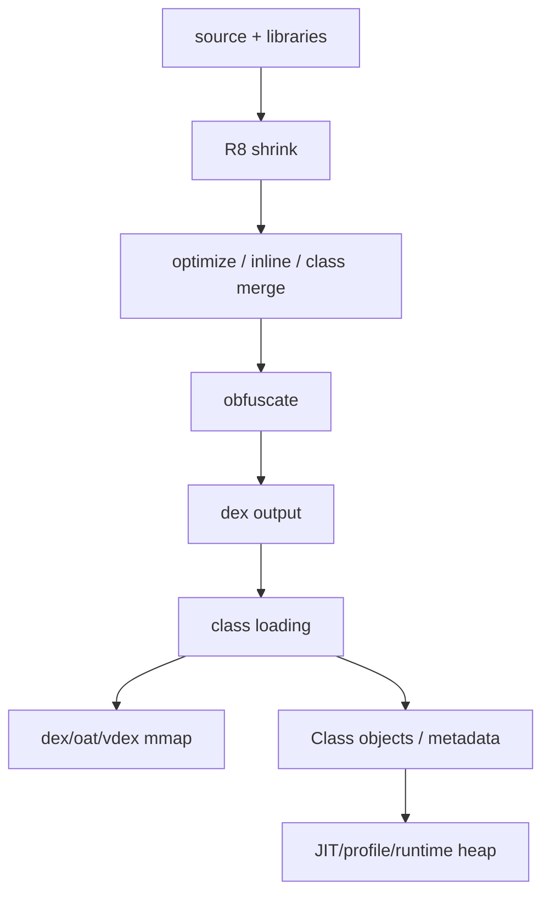
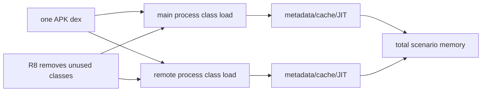
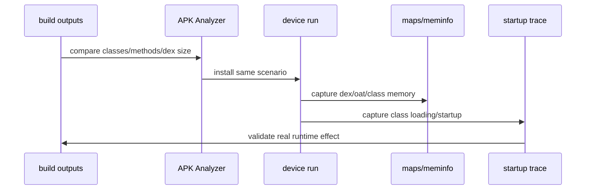
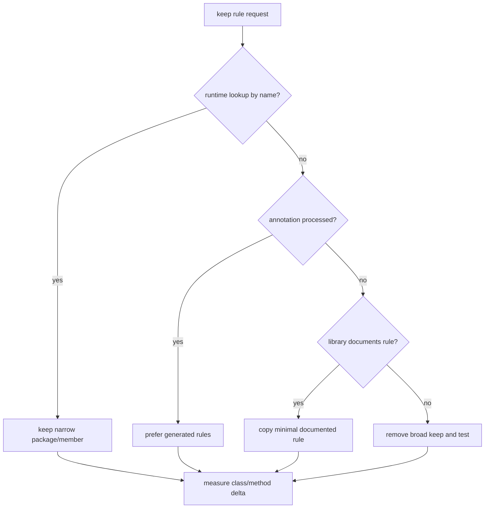
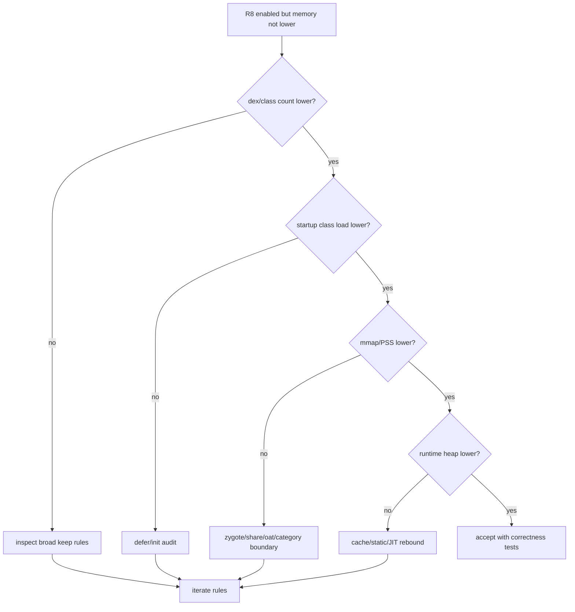

# Day 72: ProGuard/R8 对 dex、类加载、JIT 与运行时内存的影响

> 目标：承接 Day 71 的多进程重复成本模型，解释 R8 如何通过缩减类、方法、字段、dex 布局和初始化路径影响启动与运行时内存。

---

## 1. R8 到运行时内存路径



| R8 动作 | 可能降低 | 可能引入风险 |
|---|---|---|
| shrink unused code | dex size、class/method count | keep 规则错误导致运行时崩溃 |
| optimize/inlining | call path、临时对象 | 调试栈和 profile 行为变化 |
| class merging | class metadata | 反射/序列化依赖类名 |
| obfuscation | symbol/string footprint | 诊断可读性下降 |
| resource shrink | APK/加载资源 | 动态资源引用误删 |

---

## 2. 多进程重复成本



| 成本 | 单进程 | 多进程 | R8 影响 |
|---|---|---|---|
| dex/oat mmap | 一份进程账单 | 多进程 PSS 分摊 | 减少可映射内容 |
| class metadata | 一次加载 | 每进程独立加载 | 减少被加载类 |
| static init | 一次 | 每进程可能重复 | 移除无用入口 |
| JIT/profile | 一个运行时 | 每进程独立 | 热路径更短 |
| reflection keep | 规则集中 | 每进程都承担 | keep 过宽会放大成本 |

---

## 3. 证据链



| 对比项 | 工具 | 接受标准 |
|---|---|---|
| class/method count | APK Analyzer / `apkanalyzer` | 下降且 keep 不过宽 |
| dex size | APK diff | 减少目标模块 dex |
| startup mmap | `/proc/<pid>/maps`, `showmap` | dex/oat/vdex PSS 不升 |
| class loading | Perfetto / log tags | 首屏前加载类减少 |
| runtime heap | `dumpsys meminfo`, heap dump | Class/object/cache 不反弹 |
| correctness | instrumentation/smoke tests | 反射、序列化、JNI 正常 |

---

## 4. keep 规则边界



| 规则味道 | 内存问题 | 替代 |
|---|---|---|
| `-keep class ** { *; }` | 保留过多类/字段/方法 | 按入口和注解收窄 |
| SDK 整包 keep | 多进程重复 class load | 只 keep 反射入口 |
| model 全字段 keep | metadata/序列化成本 | 按序列化库生成规则 |
| native method keep | 必需但可收窄 | keep JNI 类和 native 方法 |
| enum/annotation keep | 视框架而定 | 用测试验证运行时查找 |

---

## 5. 命令包

```bash
./gradlew :app:assembleRelease
apkanalyzer dex packages app/build/outputs/apk/release/app-release.apk > dex-packages.txt
apkanalyzer dex references app/build/outputs/apk/release/app-release.apk > dex-refs.txt
apkanalyzer files list app/build/outputs/apk/release/app-release.apk | grep ".dex" > dex-files.txt
```

```bash
PKG=com.example.app
adb install -r app/build/outputs/apk/release/app-release.apk
adb shell am force-stop $PKG
adb shell am start -W $PKG/.MainActivity
PID=$(adb shell pidof $PKG | tr -d '\r')
adb shell dumpsys meminfo $PKG > r8-meminfo.txt
adb shell showmap -a $PID > r8-showmap.txt
adb shell cat /proc/$PID/maps | grep -E "dex|oat|vdex|art" > r8-maps.txt
```

---

## 6. 排障决策流



---

## 7. 版本与诊断边界

| 边界 | 说明 |
|---|---|
| ART version | oat/vdex/JIT/profile 行为随 Android 版本变化 |
| app startup profile | Baseline Profile 可能比 shrink 更影响首帧路径 |
| reflection | keep 过窄会崩，keep 过宽会保留无用类 |
| multidex | dex 数量下降不等于加载类下降 |
| obfuscation | 影响诊断符号，需保留 mapping |
| multi-process | 每个进程都要单独测 class load 和 JIT |

---

## 今日检查清单

- [ ] 已对比 R8 前后 class/method/dex 文件和 APK size。
- [ ] 已审查 broad keep 规则，尤其 SDK、反射、序列化、JNI。
- [ ] 已在真实设备采集 startup trace、meminfo、maps、showmap。
- [ ] 已按 Day 71 方法分别测主进程和远程进程。
- [ ] 已检查 R8 收益是否被 cache/static init/JIT 反弹抵消。
- [ ] 已运行 smoke/instrumentation 测试覆盖反射、序列化、JNI、资源动态引用。

---

## 8. 今天的结论

| 结论 | 工程含义 |
|---|---|
| R8 影响运行时内存但不是直接旋钮 | 构建输出必须用设备证据闭环 |
| keep 规则决定收益上限 | 过宽 keep 会让类加载和多进程重复成本继续存在 |
| dex 变小不等于峰值变低 | 要看 class loading、mmap、metadata、JIT 和 cache |
| 多进程会放大 R8 差异 | 每进程重复加载路径都要验证 |

Day 73 进入内存优化全局方法论：把观测、归因、干预、验证组织成可复用工程闭环。
