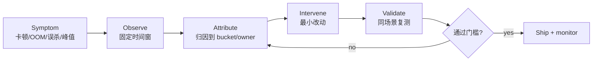
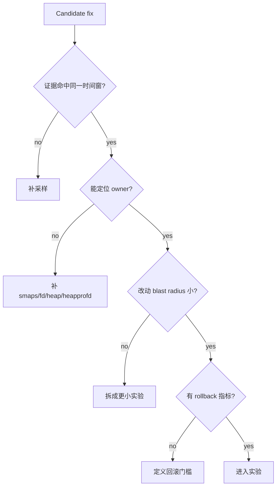
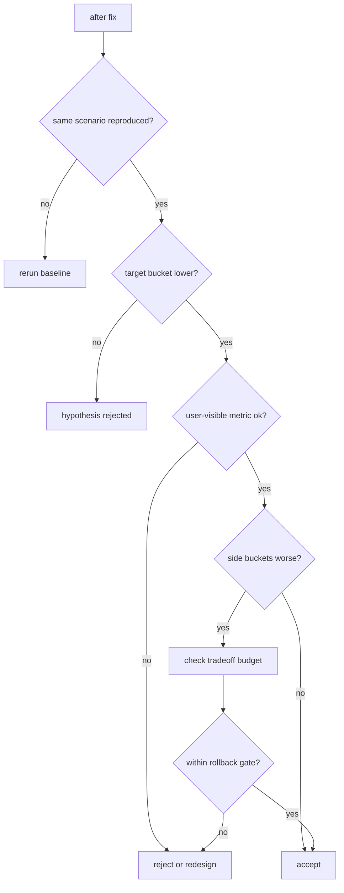

# Day 73: 内存优化全局方法论：观测、归因、干预、验证

> 目标：承接 Day 72 的 build-to-runtime 验证边界，把前面所有专项收敛成一套可复用的工程闭环。

---

## 1. 优化闭环



| 阶段 | 输出 | 失败味道 |
|---|---|---|
| Observe | 时间窗、设备、场景、症状强度 | 只看一次 `meminfo` 截图 |
| Attribute | Java/Native/Graphics/dma-buf/ZRAM/slab/memcg owner | 把 PSS 增长直接等同泄漏 |
| Intervene | 一个假设、一个改动、可回滚 | 同时改缓存、线程、图片、R8 |
| Validate | 前后对照、稳定性、体验指标 | 只证明内存下降，不证明不卡 |

---

## 2. 证据分层

```mermaid
flowchart TD
    A[User symptom] --> B[Perfetto timeline]
    B --> C[meminfo / showmap]
    C --> D[/proc maps / smaps / fd]
    D --> E[memcg / PSI / vmstat / zram]
    E --> F[AOSP/source path]
    F --> G[fix boundary]
```

| 证据层 | 适合回答 | 不能单独证明 |
|---|---|---|
| Perfetto | 何时发生、是否撞上帧/启动/kill | 具体对象 owner |
| `dumpsys meminfo` | 进程大类账单 | shared/native 真实生产者 |
| `maps/smaps/showmap` | 映射类别、PSS/RSS | 生命周期是否合理 |
| heap dump/MAT/Shark | Java retained path | fd、dma-buf、kernel slab |
| memcg/PSI/vmstat | 系统压力和 cgroup charge | App 内具体对象 |
| source path | 策略与字段含义 | 当前 ROM 是否改过 |

---

## 3. Day 72 的边界如何落地

| Day 72 反思 | 本文落地方式 |
|---|---|
| dex 变小不等于运行时峰值变低 | 把 build 输出放到 `Validate`，必须跟设备侧 maps/meminfo/startup trace 对齐 |
| 多进程重复成本需要逐进程验证 | 方法论要求按场景汇总所有 package 进程，不只看 main process |
| keep 规则收益需要正确性测试 | 干预阶段要求 blast radius、rollback 和 smoke/instrumentation gate |
| 缺少真实 before/after 样本 | 增加统一 worksheet，后续案例可直接填数而不是重写流程 |

---

## 4. 归因矩阵

| 增长现象 | 首查命令 | 二次确认 | 常见干预 |
|---|---|---|---|
| Java heap 上升 | `adb shell dumpsys meminfo $PKG` | heap dump + MAT/Shark | 释放 owner、缩短生命周期、降缓存 |
| Native heap 上升 | `showmap -a $PID` | heapprofd + `maps` | 修 native owner、池化、延迟初始化 |
| Graphics/dma-buf 上升 | `dumpsys meminfo`, `/proc/$PID/fd` | dmabuf exporter/mapper | 降图尺寸、取消请求、释放 Surface |
| dex/oat/vdex 上升 | `/proc/$PID/maps` | APK Analyzer + startup trace | R8、lazy load、拆模块 |
| PSI/allocstall 上升 | `/proc/pressure/memory`, `vmstat` | Perfetto + lmkd logs | 降峰值、调水位、削缓存 |
| ZRAM 抖动 | `/sys/block/zram0/mm_stat` | swap in/out timeline | 减匿名页、避免反复 fault-in |

---

## 5. 假设评分



| 分数 | 条件 |
|---|---|
| 0 | 只有直觉，没有时间窗证据 |
| 1 | 有现象，但 owner 不清 |
| 2 | owner 较清楚，但干预影响面大 |
| 3 | owner、改动、回滚、体验指标都明确 |

---

## 6. 命令包

```bash
PKG=com.example.app
PID=$(adb shell pidof $PKG | tr -d '\r')
adb shell dumpsys meminfo $PKG > meminfo.txt
adb shell showmap -a $PID > showmap.txt
adb shell cat /proc/$PID/smaps_rollup > smaps_rollup.txt
adb shell cat /proc/$PID/maps > maps.txt
adb shell ls -l /proc/$PID/fd > fd.txt
adb shell cat /proc/pressure/memory > psi-memory.txt
adb shell cat /proc/vmstat > vmstat.txt
adb shell cat /sys/block/zram0/mm_stat > zram-mm_stat.txt
```

```bash
adb shell am force-stop $PKG
adb shell am start -W $PKG/.MainActivity
adb shell am dumpheap $PID /data/local/tmp/before.hprof
adb pull /data/local/tmp/before.hprof .
```

---

## 7. 验证决策流



---

## 8. 报告模板

| 字段 | 示例 |
|---|---|
| 场景 | 冷启动到首屏 / 低端机连续滑动 / 后台保活后返回 |
| 时间窗 | T0 启动、T1 首帧、T2 图片进入、T3 GC/kill |
| 主要证据 | Perfetto slice、meminfo delta、smaps bucket、heap retained path |
| 假设 | 图片解码峰值撞上首帧前 800 ms |
| 改动 | 延迟非首屏图缓存预热，只改一处入口 |
| 接受标准 | P95 frame 不升、target PSS 降、kill/jank 不复现 |
| 回滚 | P95 startup 变慢 5% 或 crash/smoke 失败 |

---

## 今日检查清单

- [ ] 固定设备、版本、场景、时间窗和输入脚本。
- [ ] 至少两类证据指向同一个 owner 或同一个系统压力路径。
- [ ] 每个干预只对应一个假设。
- [ ] 同时记录内存收益和用户可见指标。
- [ ] 明确 side effect：CPU、I/O、启动、滚动、正确性、kill 风险。
- [ ] 把不能验证的 ROM/版本/权限边界写进结论。

---

## 9. 今天的结论

| 结论 | 工程含义 |
|---|---|
| 内存优化不是“看到大就删” | 先固定时间窗，再归因 owner |
| 单个工具不够 | heap、smaps、memcg、Perfetto、source path 要互相校验 |
| 改动必须可回滚 | 低端机优化很容易把内存问题换成卡顿或冷启动问题 |
| Day 72 的构建收益必须上设备验证 | APK 变小只是输入，运行时证据才是结论 |

Day 74 进入 AOSP 内存源码阅读路径：把这套方法论映射到 ART、AMS、lmkd、kernel 和 mmd 的源码入口。
