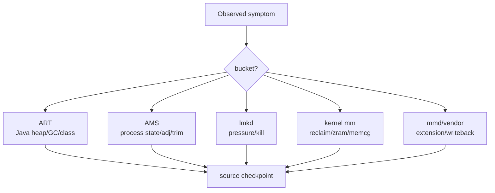
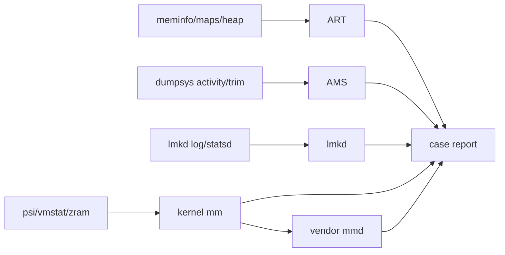
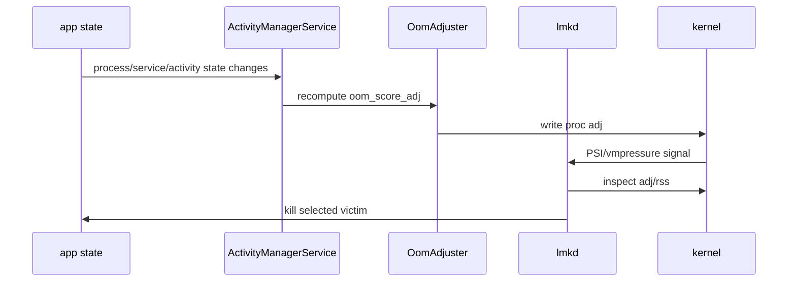
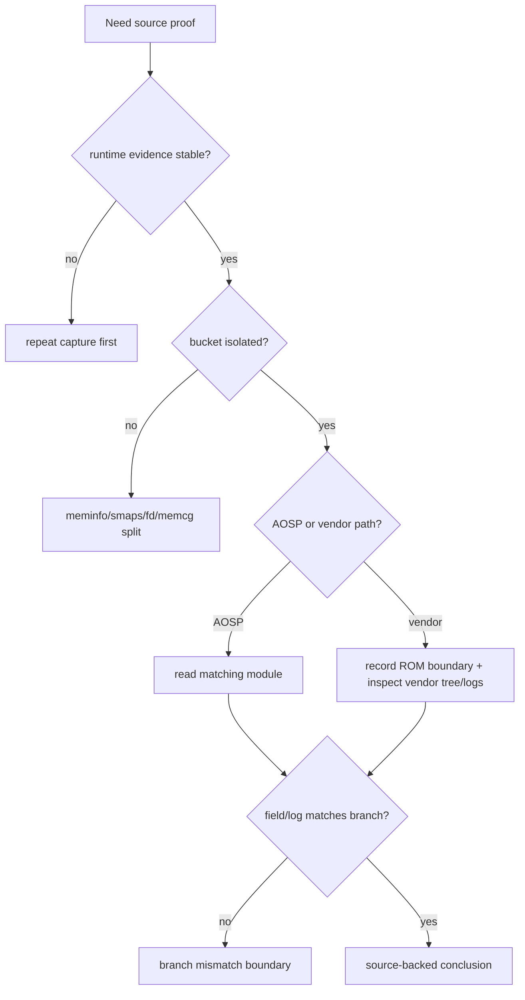

# Day 74: AOSP 内存源码阅读路径：ART、AMS、lmkd、kernel、mmd

> 目标：承接 Day 73 的证据到源码映射，把内存问题从现象、命令、日志一路追到 AOSP 入口。

---

## 1. 从证据进入源码



| 现象 | 先看证据 | 源码入口 |
|---|---|---|
| Java heap/OOM | heap dump, GC log, `meminfo` | `art/runtime/gc/`, `art/runtime/mirror/` |
| 类加载/dex 映射 | `/proc/$PID/maps`, startup trace | `art/runtime/class_linker.*`, `dex2oat/` |
| trim/compaction | logcat, `dumpsys activity processes` | `frameworks/base/services/core/java/com/android/server/am/` |
| 误杀/低优先级 kill | lmkd log, statsd, `oom_score_adj` | `system/memory/lmkd/` |
| allocstall/PSI | Perfetto, `/proc/pressure/memory`, `vmstat` | `kernel/mm/` |
| ZRAM writeback | `mm_stat`, `bd_stat`, sysfs | `kernel/drivers/block/zram/`, vendor `mmd` |

---

## 2. 源码阅读路径图



| 模块 | 读什么 | 不先读什么 |
|---|---|---|
| ART | allocation, GC cause, roots, spaces, class linker | 不从所有 runtime 文件漫游 |
| AMS | OomAdjuster, ProcessRecord, CachedAppOptimizer, trim dispatch | 不从 Activity 启动大流程泛读 |
| lmkd | PSI/vmpressure handlers, kill selection, property parsing | 不先改参数 |
| kernel mm | reclaim, compaction, memcg, PSI, zram | 不直接猜 vendor 策略 |
| mmd/vendor | writeback/recompression policy, sysfs glue | 不把厂商扩展当 AOSP 默认 |

---

## 3. ART 入口

| 问题 | 文件/目录 | 关键词 |
|---|---|---|
| GC 触发 | `art/runtime/gc/heap.cc` | `CollectGarbage`, `GcCause`, `RequestConcurrentGC` |
| collector 行为 | `art/runtime/gc/collector/` | `ConcurrentCopying`, `MarkSweep`, `SemiSpace` |
| space/allocator | `art/runtime/gc/space/`, `art/runtime/gc/accounting/` | `RosAlloc`, `BumpPointerSpace`, `LargeObjectSpace` |
| roots/reference | `art/runtime/gc/`, `art/runtime/reference_table.*` | `VisitRoots`, `ReferenceProcessor` |
| class/dex | `art/runtime/class_linker.*`, `art/runtime/dex_file*` | `LoadClass`, `DefineClass`, `DexFile` |

```bash
rg -n "GcCause|CollectGarbage|RequestConcurrentGC" art/runtime/gc
rg -n "BumpPointer|LargeObject|RosAlloc" art/runtime/gc
rg -n "VisitRoots|ReferenceProcessor" art/runtime
rg -n "LoadClass|DefineClass" art/runtime/class_linker*
```

---

## 4. AMS 与 lmkd



| 目标 | 源码入口 | 证据 |
|---|---|---|
| adj 为什么变了 | `OomAdjuster.java`, `ProcessRecord.java` | `dumpsys activity oom`, `/proc/$PID/oom_score_adj` |
| trim 为什么来了 | `ActivityManagerService.java`, `ProcessList.java` | app log + `onTrimMemory(level)` |
| cached compaction | `CachedAppOptimizer.java` | logcat + before/after anon RSS |
| lmkd kill | `system/memory/lmkd/lmkd.cpp` | `lowmemorykiller` log, statsd atom |
| lmkd 属性 | `system/memory/lmkd/` | `getprop | grep lmkd` |

```bash
rg -n "computeOomAdj|oom_score_adj|CachedAppOptimizer|onTrimMemory" frameworks/base/services/core/java/com/android/server/am
rg -n "psi|vmpressure|kill|oom_score_adj|minfree" system/memory/lmkd
```

---

## 5. kernel mm 与 mmd

| 现象 | kernel 路径 | 证据对齐 |
|---|---|---|
| direct reclaim | `mm/vmscan.c` | `pgscan_direct`, `allocstall`, Perfetto reclaim |
| compaction | `mm/compaction.c` | `compact_*` vmstat, stall slice |
| PSI | `kernel/sched/psi.c` | `/proc/pressure/memory` |
| memcg charge | `mm/memcontrol.c` | `memory.current`, `memory.stat`, `memory.events` |
| ZRAM | `drivers/block/zram/` | `mm_stat`, `io_stat`, `bd_stat` |
| writeback/recompression | kernel zram + vendor mmd | sysfs + vendor logs |

```bash
rg -n "allocstall|direct reclaim|balance_pgdat|shrink_node" kernel/mm
rg -n "psi_memstall|psi_group_change" kernel
rg -n "memory.current|memory.stat|mem_cgroup" kernel/mm
rg -n "zram|writeback|recompress" kernel/drivers/block/zram
```

---

## 6. 排障决策流



---

## 7. 版本边界表

| 边界 | 写结论时怎么处理 |
|---|---|
| Android branch | 每次记录 `android-14.0.0_r*`、`android-15.0.0_r*` 等目标分支 |
| OEM patch | lmkd、mmd、zram、adj 策略可能被改，必须标注 ROM |
| kernel version | reclaim、MGLRU、PSI、ZRAM 功能随 kernel 版本变化 |
| ART collector | collector 默认和日志字段随版本变化 |
| userdebug vs user | heapprofd、dmabuf、trace 权限不同 |

---

## 8. 源码笔记模板

| 字段 | 内容 |
|---|---|
| 证据 | `meminfo Native Heap +40MB at T2` |
| bucket | Native heap |
| owner 线索 | heapprofd stack / maps anon / fd |
| 源码路径 | `art/runtime/gc/heap.cc` 或 `system/memory/lmkd/lmkd.cpp` |
| 关键函数 | 函数名、属性名、日志字段 |
| 分支 | AOSP tag + device build fingerprint |
| 结论边界 | AOSP 已确认 / OEM 未确认 / 权限不足 |

---

## 今日检查清单

- [ ] 先有稳定现象和时间窗，再进源码。
- [ ] 已把证据归到 Java/Native/Graphics/dma-buf/memcg/ZRAM/slab 等 bucket。
- [ ] 已记录 AOSP tag、kernel version、ROM、build type。
- [ ] 每个源码结论都能回到一个命令、日志或 trace signal。
- [ ] OEM/mmd/vendor 差异没有写成 AOSP 默认行为。
- [ ] 无权限读取的路径已写入 blocker。

---

## 9. 今天的结论

| 结论 | 工程含义 |
|---|---|
| 源码阅读要从证据反推 | 先定 bucket 和时间窗，再读模块 |
| ART/AMS/lmkd/kernel 是一条链 | 单点源码不能解释所有内存事故 |
| vendor/mmd 必须单独标注 | 厂商内存扩展不是 AOSP 通用结论 |
| 读源码也要可验证 | 每个函数和字段都要对应日志、命令或 trace |

Day 75 进入 Android 版本演进：把源码路径和工具证据放进 5.0 到 17 的版本差异框架。
