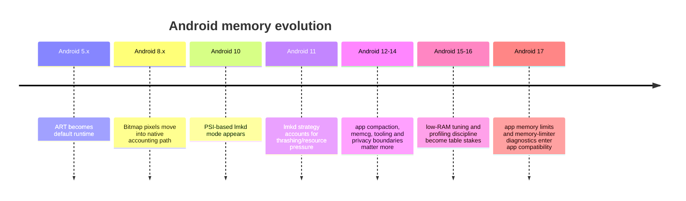
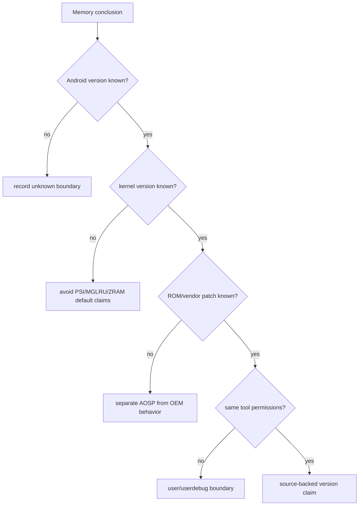
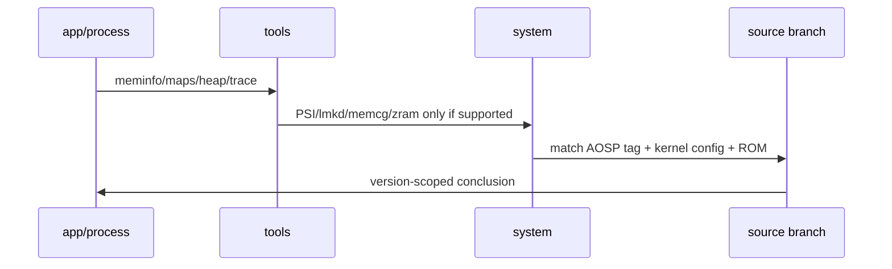
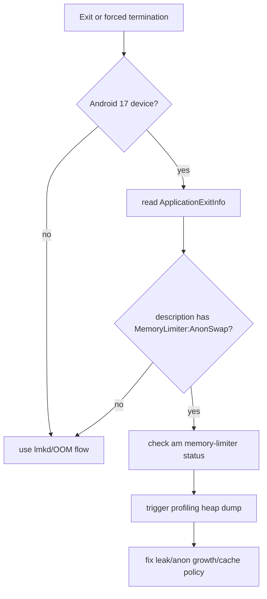

# Day 75: Android 版本演进中的内存变化：5.0 到 17

> 目标：承接 Day 74 的 branch/version/source-boundary 纪律，把 5.0 到 17 的内存变化放进可验证的版本框架。

---

## 1. 版本演进主线



| 阶段 | 主问题 | 诊断重心 |
|---|---|---|
| 5.x-7.x | ART 迁移、Java heap、Bitmap、leak | GC log、heap dump、`meminfo` |
| 8.x-9.x | Native/Graphics 归因变重要 | `showmap`, `maps`, Graphics bucket |
| 10.x-11.x | PSI/lmkd 从水位转向压力 | PSI、lmkd log、statsd、ZRAM |
| 12.x-14.x | compaction、memcg、权限边界 | cgroup、Perfetto、trim/compaction |
| 15.x-17.x | app 级限制、确定性、兼容性 | `ApplicationExitInfo`, trigger profiling, memory limiter |

---

## 2. 不同版本不能混用默认值



| 不能混用 | 原因 |
|---|---|
| Android 10 的 PSI lmkd 与 Android 9 的 vmpressure | 压力信号来源不同 |
| Android 11 lmkd 策略与旧 minfree 思维 | 11 起更强调 PSI、thrashing、resource use |
| Pixel/AOSP 与厂商 mmd | vendor 策略可能改 ZRAM/writeback/recompression |
| userdebug 工具能力与 user 量产机 | heapprofd、dmabuf、trace 权限不同 |
| API 行为与 kernel 行为 | Android API level 不等于 kernel feature 一定存在 |

---

## 3. 版本矩阵

| 版本 | 内存排查关键词 | 工程提醒 |
|---|---|---|
| 5.0/5.1 | ART 默认、AOT、GC、heap dump | 少用 HotSpot Young/Old 术语解释 ART |
| 6.x | Doze、运行时权限、后台行为 | 后台保活与缓存释放需要生命周期证据 |
| 7.x | JIT/profile 重新重要 | 启动和 JIT 内存要看 trace 与 maps |
| 8.x | Bitmap native accounting、background limits | 图片峰值可能不只在 Java heap |
| 9.x | LMKD/userspace 迁移期、heapprofd 起步 | native attribution 需要工具版本边界 |
| 10.x | PSI lmkd mode、cgroup abstraction | 压力判断从 free memory 转向 stall time |
| 11.x | PSI killing strategy、thrashing/resource use | lmkd victim 需要 PSI + adj + refault 证据 |
| 12.x | app hibernation、compaction/trim 场景更常见 | 后台内存优化要验证恢复延迟 |
| 13.x | MGLRU 在部分内核/设备上出现 | reclaim 结论必须记录 kernel 与 config |
| 14.x | 更强的后台/FGS/权限边界 | 可观测性和后台工作入口需分开验证 |
| 15.x | 低端机策略和 tooling 继续收紧 | 不能用单机型经验推所有 RAM class |
| 16.x | 大屏/多窗口场景扩大峰值组合 | 场景窗口要覆盖并发可见 UI |
| 17.x | app memory limits、memory-limiter 命令、SDK 37 行为 | 需要 `ApplicationExitInfo` 和 limiter status 证据 |

---

## 4. 官方可验证锚点

| 锚点 | 官方说明 | 本文使用方式 |
|---|---|---|
| Android 10 PSI lmkd | Android 10 release notes 写明支持 PSI monitor 的 lmkd mode | 把 10 作为 PSI lmkd 诊断分界 |
| Android 11 lmkd | AOSP lmkd 文档说明 11 引入新的 PSI killing strategy | 把 11 作为 thrashing/resource-use 分界 |
| Android 17 memory limits | Android 17 behavior changes 写明 app memory limits 与 `am memory-limiter` | 把 17 作为 app 级限制兼容性分界 |
| Android 17 MessageQueue | Android Developers Blog 写明 SDK 37+ lock-free MessageQueue | 面试/排查 Handler 时记录 target SDK 边界 |

Sources:
- https://source.android.com/docs/whatsnew/android-10-release
- https://source.android.com/docs/core/perf/lmkd
- https://developer.android.com/about/versions/17/behavior-changes-all
- https://developer.android.com/blog/categories/product-news/12

---

## 5. 证据随版本变化



| 想证明 | 低版本常用 | 新版本还要补 |
|---|---|---|
| 泄漏 | HPROF/MAT/LeakCanary | `ApplicationExitInfo`, trigger heap dump, background state |
| Native 增长 | `showmap`, `maps` | heapprofd、memcg、fd、dmabuf 权限边界 |
| 低内存 kill | minfree/adj/logcat | PSI、thrashing、statsd、memory limiter |
| 图片峰值 | Java heap/Bitmap count | Graphics/dma-buf/native heap |
| 启动峰值 | `am start -W`, `meminfo` | Perfetto、class load、dex/oat/vdex maps |

---

## 6. Android 17 兼容性路径



```bash
adb shell am memory-limiter status
adb shell am memory-limiter manual $PID 256
adb shell am memory-limiter manual $PID none
adb shell am memory-limiter ignore $UID
adb shell am memory-limiter ignore none
```

| 证据 | 接受标准 |
|---|---|
| `ApplicationExitInfo.reason` | 记录 `REASON_OTHER` 与 description |
| description | 只在包含 `MemoryLimiter:AnonSwap` 时归因 limiter |
| trigger heap dump | 找到匿名页/heap/cache 增长 owner |
| limiter manual test | 同场景可复现，且 fix 后不复现 |

---

## 7. 迁移排查清单

- [ ] 记录 API level、targetSdk、build fingerprint、kernel version、RAM class。
- [ ] 记录 AOSP tag 与是否存在 OEM memory service/mmd。
- [ ] 对 lmkd 结论区分 Android 10 PSI mode、Android 11 strategy、旧 vmpressure/minfree。
- [ ] 对 Android 17 额外检查 `ApplicationExitInfo` 与 `am memory-limiter status`。
- [ ] 对图像/Surface 问题补 Graphics、dma-buf、fd，而不是只看 Java heap。
- [ ] 对构建优化补 APK Analyzer、maps、meminfo、startup trace 和正确性测试。

---

## 8. 今天的结论

| 结论 | 工程含义 |
|---|---|
| Android 版本是内存结论的一部分 | 不写版本边界的结论不可复用 |
| lmkd 从水位走向 PSI/thrashing | 10/11 前后排查策略不同 |
| Android 17 带来 app 级 memory limiter 证据 | OOM/kill 分析要读 `ApplicationExitInfo` |
| source path 必须绑定 branch | Day 74 的源码路径只有在具体 tag 上才算证据 |

Day 76 进入面试高频：把 GC、泄漏、OOM、Native 内存问题组织成可回答、可追问、可落地验证的证据链。
