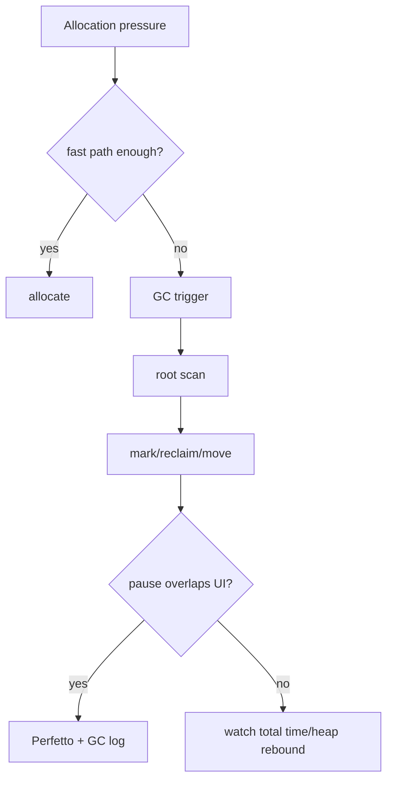
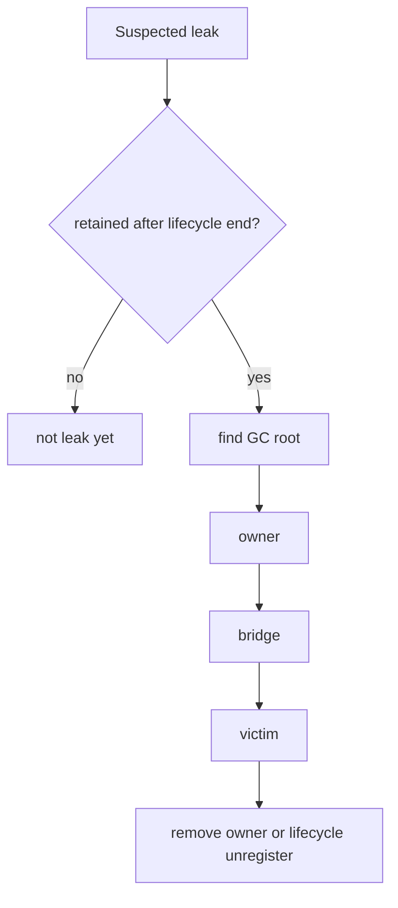
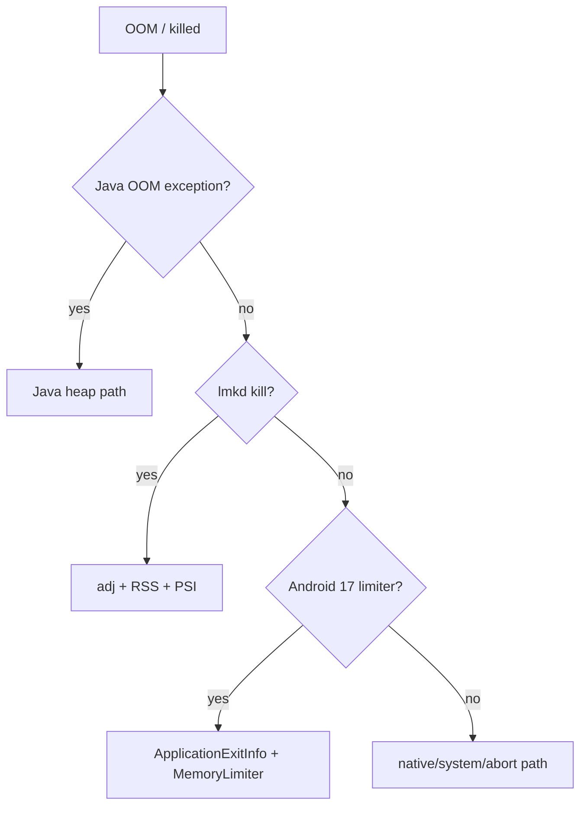
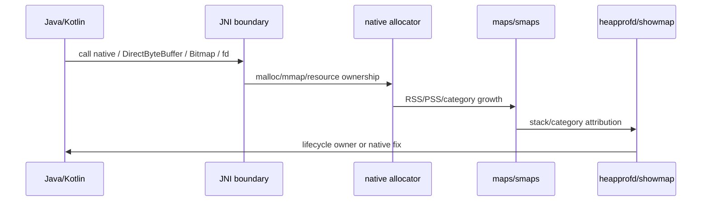
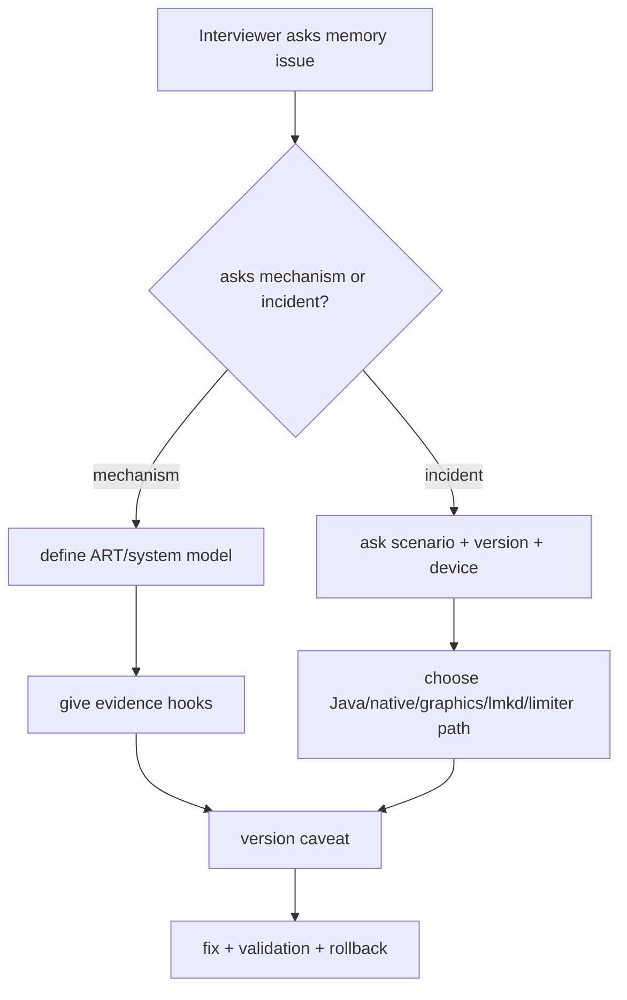

# Day 76: 面试高频：GC、泄漏、OOM 与 Native 内存

> 目标：把 GC、泄漏、OOM、Native 内存问题组织成可回答、可追问、可落地验证的证据链。

---

## 1. 回答框架


| 步骤 | 面试表达 |
|---|---|
| boundary | “先区分 Java heap、Native heap、Graphics、系统压力和版本。” |
| mechanism | “ART 的对象回收取决于 GC Roots 可达性，不是看对象大小。” |
| evidence | “我会用 heap dump/MAT/LeakCanary、meminfo、showmap、Perfetto 交叉验证。” |
| fix | “只改一个 owner 或峰值窗口，并定义回滚指标。” |
| caveat | “Android 10/11 的 lmkd、Android 17 memory limiter 要分开看。” |

---

## 2. GC 高频题



| 问题 | 高质量回答 | 追问陷阱 |
|---|---|---|
| ART GC 怎么判断对象可回收 | 从 GC Roots 可达性讲，落到 thread stack、JNI、static、class loader、monitor 等 roots | 不把“置 null”说成万能 |
| CMS/CC/Generational 差异 | 用 collector、space、read barrier/pause、Android 版本边界解释 | 不套 HotSpot Young/Old |
| GC 卡顿怎么排 | 区分 pause、total time、主线程重叠、scheduler contention | 不只看 logcat 一行 |
| 频繁 GC 怎么优化 | 先看 allocation rate、短命对象、缓存策略、图片解码、boxing | 不直接调大 heap |

| 证据 | 命令/工具 |
|---|---|
| GC 日志 | `adb logcat | grep -i "Clamp target GC heap\\|GC"` |
| heap 变化 | `adb shell dumpsys meminfo $PKG` |
| pause 与帧 | Perfetto `sched`, `gfx`, `art` slices |
| allocation 热点 | Android Studio Allocation / Perfetto heapprofd for native |

---

## 3. 泄漏 高频题



| 类型 | retained path 味道 | 修复边界 |
|---|---|---|
| Activity/Fragment | static/singleton/listener/Handler 持有 destroyed page | 解除引用、生命周期注销、view binding 置空 |
| Handler | MessageQueue -> Message -> callback/target/obj | cancel delayed messages, token cleanup |
| listener/observer | registry -> callback -> outer instance | `onStop/onDestroyView` unregister |
| resource wrapper | Java object 释放了但 fd/native 未关 | LeakCanary 不够，补 `/proc/$PID/fd` |

| 面试关键句 | 工程含义 |
|---|---|
| “泄漏是生命周期结束后仍被 GC Root 可达。” | 定义清楚，不把峰值误判成泄漏 |
| “LeakCanary 证明 Java retained path。” | fd/native/dma-buf 需要其他证据 |
| “修复后要复测 retained object 数和场景峰值。” | 不能只改代码不验证 |

---

## 4. OOM 高频题



| 问题 | 回答结构 |
|---|---|
| OOM 一定是 Java heap 满了吗 | 不是。要区分 Java OOM、native OOM、Graphics/dma-buf、系统低内存 lmkd kill、Android 17 app memory limit |
| largeHeap 有用吗 | 只能提高部分进程 heap 上限，不解决 owner、峰值、低端机 kill 风险 |
| 为什么后台进程被杀 | 看 `oom_score_adj`、lmkd log、PSI、RSS、ZRAM、victim benefit |
| 如何复现 OOM | 固定设备/RAM class/场景脚本，采集 meminfo、trace、heap、lmkd、exit info |

| 证据 | 接受标准 |
|---|---|
| Java exception | stack + heap dump 找到 owner |
| lmkd | kill log 同时有 adj、rss、reason、pressure |
| Android 17 limiter | `ApplicationExitInfo` description 包含 `MemoryLimiter:AnonSwap` |
| Native | tombstone/heapprofd/showmap 指向 native owner |

---

## 5. Native 内存 高频题



| 问题 | 高质量回答 | 必补证据 |
|---|---|---|
| Native 泄漏怎么查 | `meminfo` 定位 Native Heap/Graphics，再用 `showmap`、`maps`、heapprofd、fd 交叉验证 | heapprofd stack 或 maps/fd owner |
| JNI 引用会泄漏吗 | GlobalRef 跨调用持有会泄漏；LocalRef 通常随 native frame 释放但循环里也要管理 | JNI ref table/LeakCanary/崩溃日志 |
| DirectByteBuffer 归谁 | Java object 可达性控制 cleaner/native memory lifetime，native owner 也可能绕开 Java | heap + native PSS |
| Bitmap 为什么不在 Java heap | Android 8+ 常见像素数据更多体现在 native/graphics 账单 | meminfo Graphics/Native + fd/dmabuf |

```bash
PKG=com.example.app
PID=$(adb shell pidof $PKG | tr -d '\r')
adb shell dumpsys meminfo $PKG
adb shell showmap -a $PID
adb shell cat /proc/$PID/maps
adb shell ls -l /proc/$PID/fd
adb shell am dumpheap $PID /data/local/tmp/app.hprof
```

---

## 6. 版本边界速查

| 追问 | 答案边界 |
|---|---|
| Android 10 前后 lmkd 有什么差异 | 10 支持 PSI monitor mode；11 的策略进一步使用 PSI/thrashing/resource use |
| Android 17 OOM 怎么看 | 加查 `ApplicationExitInfo` 和 `am memory-limiter status` |
| Handler 泄漏在 Android 17 还一样吗 | retained path 思路仍成立，但 SDK 37+ MessageQueue 实现变化要标注 target SDK |
| Bitmap 内存看哪里 | Android 版本不同，Java heap/native/Graphics 归因不同，必须用设备证据 |
| MGLRU/ZRAM 默认吗 | 取决于 kernel/config/ROM，不能按 API level 推断 |

---

## 7. 排障回答决策流



---

## 8. 30 秒答案模板

| 题目 | 答案骨架 |
|---|---|
| “怎么定位内存泄漏？” | 先定义是否生命周期结束后仍可达；用 LeakCanary/HPROF 找 GC Root 到 victim 的 retained path；修 owner；用同场景复测 retained count 和 meminfo。 |
| “GC 为什么会卡？” | 先区分 GC pause 与 total time；看是否与 UI frame 重叠；再查 allocation rate、collector、root scan、LOS、JNI roots；用 Perfetto + GC log 验证。 |
| “OOM 怎么排？” | 分 Java OOM、native OOM、Graphics/dma-buf、lmkd kill、Android 17 memory limiter；不同路径用不同证据，不直接说 heap 太小。 |
| “Native 内存怎么看？” | 先用 meminfo/showmap/maps 定 bucket，再用 heapprofd/fd/tombstone 找 owner；JNI/Bitmap/DirectByteBuffer 要同时看 Java 可达性和 native 生命周期。 |

---

## 今日检查清单

- [ ] 回答先说边界：版本、设备、进程、bucket、场景。
- [ ] 机制解释落到 ART/system 结构，不背 JVM 泛泛概念。
- [ ] 每个问题都有至少两个工具证据。
- [ ] 修复建议包含验证和回滚。
- [ ] Android 10/11 lmkd 与 Android 17 memory limiter 有明确版本边界。
- [ ] 对 Native/Graphics/dma-buf 不用 Java heap 一把尺子。

---

## 9. 今天的结论

| 结论 | 面试价值 |
|---|---|
| 好答案先划边界 | 展示真实工程经验，不只是背概念 |
| GC/泄漏/OOM/Native 要分路径 | 避免把所有问题都说成“内存泄漏” |
| 工具证据比结论更重要 | 面试官可以继续追问命令、字段、source path |
| 版本意识是高级区分点 | Android 10/11/17 的边界能体现系统理解 |

Day 77 进入面试高频第二组：Bitmap、LMKD、PSI、水位与 ZRAM。
