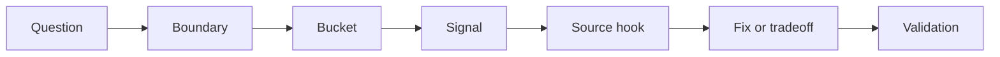
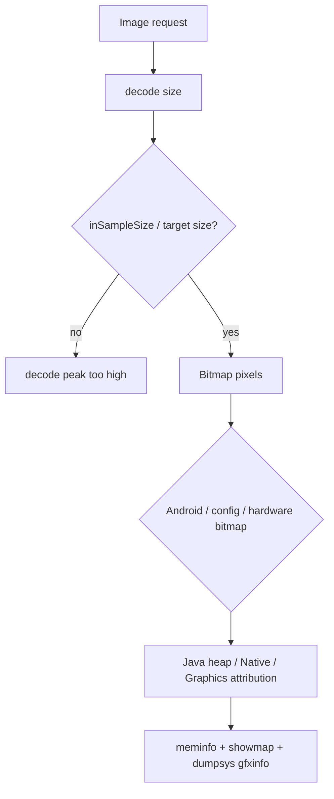
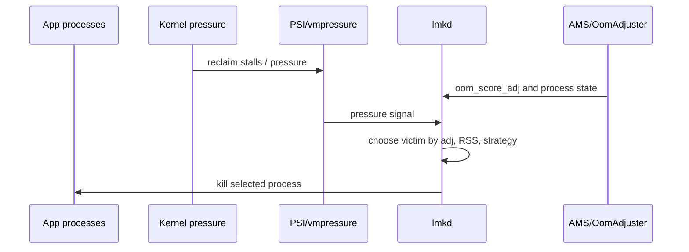
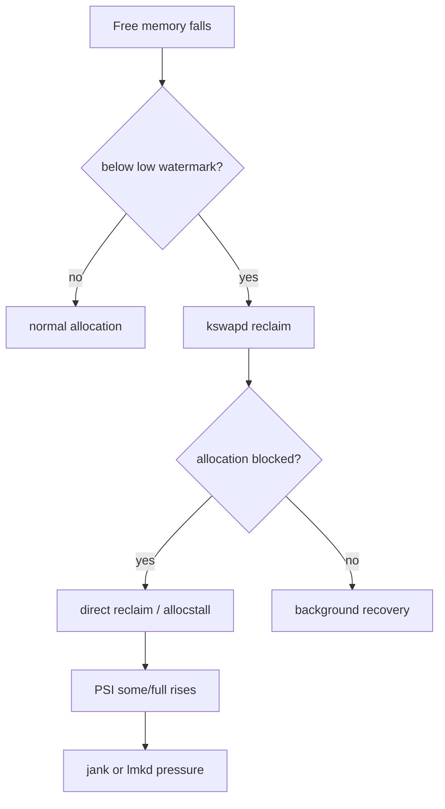
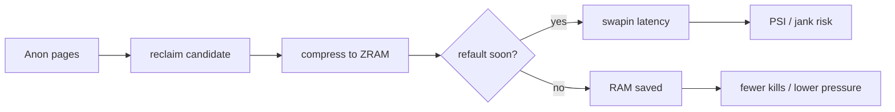
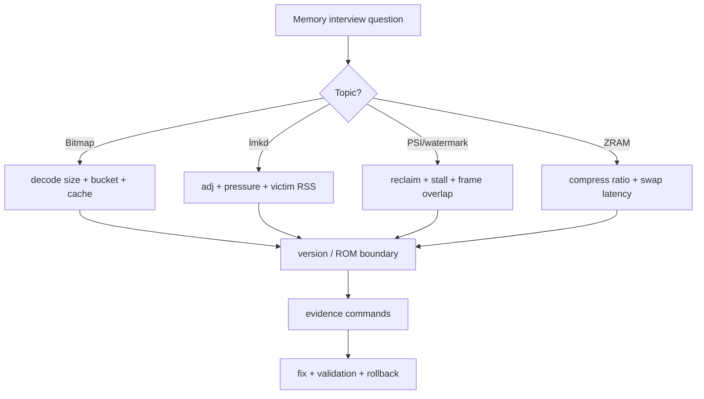

# Day 77: 面试高频：Bitmap、LMKD、PSI、水位与 ZRAM

> 目标：把 Bitmap、LMKD、PSI、水位、ZRAM 这组系统内存题，回答成“机制 + 证据 + 版本边界 + 验证”的工程链路。

---

## 1. 回答总框架



| 步骤 | 面试表达 |
|---|---|
| Boundary | “先确认 Android 版本、kernel、ROM、RAM class、前后台状态。” |
| Bucket | “Bitmap/Graphics、Native、Anon、File、Swap、System 不能混在一起。” |
| Signal | “用 meminfo、showmap、PSI、vmstat、lmkd log、zram mm_stat 交叉验证。” |
| Source hook | “必要时落到 ART Bitmap、lmkd、kernel reclaim、zram、memcg 路径。” |
| Tradeoff | “优化不是只降内存，还要看帧、启动、清晰度、kill benefit。” |
| Validation | “同一场景前后对比峰值、PSS/RSS、PSI、kill、swap 延迟。” |

---

## 2. Bitmap 高频题



| 问题 | 高质量回答 | 追问陷阱 |
|---|---|---|
| Bitmap 内存算在哪里 | Android 版本、Bitmap config、hardware bitmap、图像管线不同会影响 Java/Native/Graphics 归因 | 不只看 Java heap |
| inSampleSize 怎么算 | 目标显示尺寸、解码峰值、复用策略、质量损失一起看 | 不按原图尺寸直接解 |
| 大图 OOM 怎么排 | 先看解码瞬时峰值，再看缓存、列表预取、硬件纹理、dma-buf | 不把所有问题归为泄漏 |
| Glide 为什么能省内存 | request size、BitmapPool、memory cache、lifecycle pause/clear 共同控制峰值 | 不说“用了 Glide 就不会 OOM” |

| 证据 | 命令/工具 | 看什么 |
|---|---|---|
| App 账单 | `adb shell dumpsys meminfo $PKG` | Java Heap、Native Heap、Graphics、Views |
| 映射 | `adb shell showmap -a $PID` | anon、ashmem、dmabuf、graphics mappings |
| 列表峰值 | Perfetto + scripted scroll | fling、prefetch、decode 与 frame 是否重叠 |
| 图片请求 | image loader logs/cache stats | decode size、cache hit、pool hit |

---

## 3. LMKD 高频题



| 问题 | 回答结构 |
|---|---|
| 为什么后台进程被杀 | 系统压力触发 lmkd，victim 选择看 `oom_score_adj`、RSS、策略、kill benefit，不是单看进程名 |
| 为什么看似高优先级也会被杀 | 对齐 kill 时间点的 adj、进程状态、绑定关系、RSS、PSI；很多“高优先级”是 stale evidence |
| lmkd 和 Java OOM 区别 | Java OOM 是进程内分配失败；lmkd 是系统压力下外部 kill |
| 如何证明是 lmkd | logcat/statsd/ApplicationExitInfo 同时指向 low memory kill，并有 victim 信息 |

| 证据字段 | 接受标准 |
|---|---|
| `oom_score_adj` | kill 前后时间点一致，不能用事后 dumpsys 替代 |
| victim RSS/PSS | 能解释 kill benefit |
| PSI some/full | 说明压力是否已经影响任务执行 |
| kill reason | 与 lmkd 策略、thrashing、pressure 级别能对上 |

---

## 4. PSI、水位与 reclaim



| 概念 | 面试短答 | 证据 |
|---|---|---|
| watermark | zone 级别的 min/low/high 水位控制后台/直接回收 | `/proc/zoneinfo` |
| kswapd | 后台回收线程，水位低时唤醒 | `vmstat`, Perfetto sched |
| direct reclaim | 分配线程自己回收，容易造成卡顿 | `allocstall`, PSI full |
| PSI some/full | 任务因内存压力等待的时间比例 | `/proc/pressure/memory` |

| 追问 | 不够好的回答 | 更好的回答 |
|---|---|---|
| 水位调高是不是一定好 | “调高就不卡了” | 调高可能降低 direct reclaim，但会增加可用内存压力和 lmkd 提前 kill 风险 |
| PSI avg10 高说明什么 | “内存不足” | 说明最近 10 秒有任务因内存压力 stall，要结合 reclaim、swap、帧、kill 看 |
| 卡顿一定是 lmkd 晚了吗 | “是” | 先看 direct reclaim/compaction 是否卡在 UI 或关键线程上 |

---

## 5. ZRAM 高频题



| 问题 | 高质量回答 |
|---|---|
| ZRAM 解决了什么 | 用 CPU 压缩换 RAM 空间，缓解匿名页压力，代价是 swapin/swapout 延迟 |
| ZRAM 越大越好吗 | 不一定。要看压缩比、命中、thrashing、CPU、I/O、低端机延迟 |
| 怎么判断 swap 抖动 | 看 `mm_stat`、`vmstat` si/so、PSI、Perfetto stall、应用帧 |
| writeback/recompression 怎么讲 | Android/厂商实现差异大，要标注 kernel、ROM、mmd 或 vendor daemon 边界 |

```bash
PKG=com.example.app
PID=$(adb shell pidof $PKG | tr -d '\r')
adb shell dumpsys meminfo $PKG
adb shell cat /proc/pressure/memory
adb shell cat /proc/vmstat | grep -E "pgscan|pgsteal|allocstall|pswp"
adb shell cat /sys/block/zram0/mm_stat
adb logcat -b all | grep -i "lowmemorykiller\|lmkd\|MemoryPressure"
```

---

## 6. 排障回答决策流



---

## 7. 30 秒答案模板

| 题目 | 答案骨架 |
|---|---|
| “Bitmap OOM 怎么排？” | 先区分解码峰值、缓存常驻、列表预取和 Graphics/dma-buf；用 meminfo/showmap/Perfetto/image loader stats 看 bucket 和时间窗口；再控制尺寸、复用、生命周期和缓存上限。 |
| “lmkd 为什么杀进程？” | lmkd 是系统压力下按 adj、RSS、策略和 kill benefit 选择 victim；必须用 kill 时间点的 adj、PSI、lmkd log、statsd 或 exit info 证明。 |
| “PSI 有什么用？” | PSI 直接表达任务因内存压力等待的时间，比 free memory 更接近卡顿风险；要和 reclaim、ZRAM、frame timeline、lmkd 一起看。 |
| “水位怎么调？” | 只在有 direct reclaim/allocstall 证据时考虑，一次只改一个 knob，并定义 PSI、kill、可用内存、帧稳定性的回滚线。 |
| “ZRAM 越大越好吗？” | 不是。它用 CPU/延迟换容量，低端机要看压缩比、swapin、thrashing、PSI、帧和 kill 变化。 |

---

## 今日检查清单

- [ ] 回答 Bitmap 时明确 Android 版本和归因 bucket。
- [ ] 回答 lmkd 时使用 kill 时间点的 adj、RSS、PSI。
- [ ] 回答 PSI 时不要只说“内存不足”，要解释 stall。
- [ ] 回答水位时同时说收益和 kill 风险。
- [ ] 回答 ZRAM 时同时说压缩收益和 swap 延迟。
- [ ] 每个答案至少给出两个可执行证据命令。

---

## 8. 今天的结论

| 结论 | 面试价值 |
|---|---|
| Bitmap 是峰值和归因题 | 能区分 Java/Native/Graphics/dma-buf |
| LMKD 是系统策略题 | 能解释 adj、pressure、RSS 和 victim benefit |
| PSI 是 stall 证据 | 比 free memory 更贴近卡顿 |
| 水位和 ZRAM 都是 tradeoff | 高级答案必须包含副作用和回滚 |

Day 78 进入综合实战：把低端机卡顿与误杀进程放到同一条时间线里排查。
