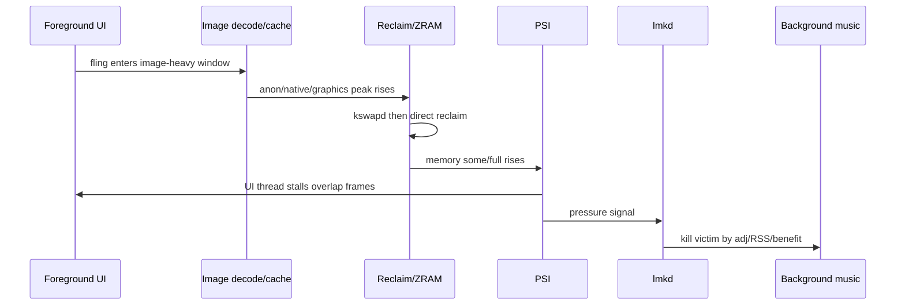
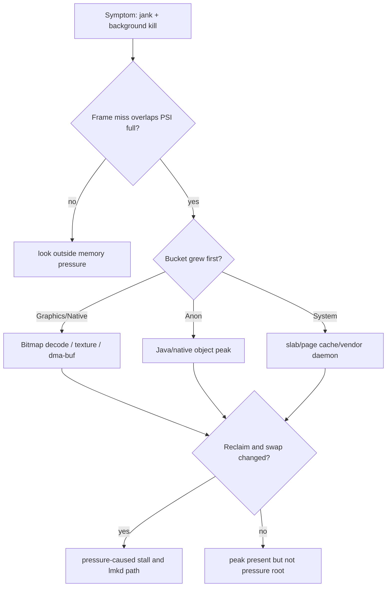
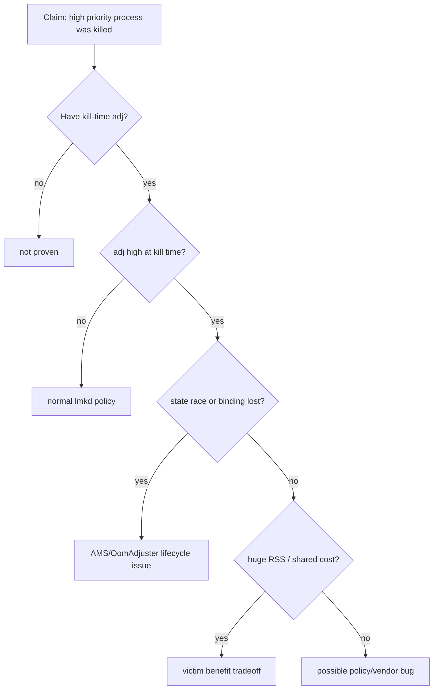
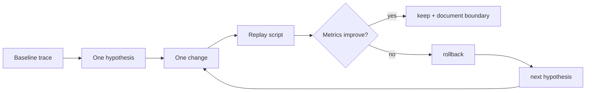

# Day 78: 综合实战：一次低端机卡顿和误杀进程的完整排查

> 目标：把低端机卡顿、PSI 抬升、ZRAM 抖动、lmkd kill 和“误杀高优先级进程”放到同一条证据时间线里。

---

## 1. 事故画像

| 字段 | 本案例设定 | 为什么必须写清 |
|---|---|---|
| 设备 | 低端机，3GB RAM，Android 11+ vendor ROM | lmkd/PSI/ZRAM 策略强依赖版本和 ROM |
| 场景 | 首屏进入后快速滚动图文流，同时后台音乐进程被杀 | 同时有前台 jank 和后台 victim |
| 症状 | frame miss、PSI full 抬升、swapin 增加、lmkd kill | 需要证明因果顺序 |
| 初始怀疑 | “lmkd 误杀高优先级进程” | 需要用 kill-time adj 验证，不看事后状态 |

---

## 2. 一条时间线



| 时间点 | 采集 | 关键问题 |
|---|---|---|
| T0 baseline | meminfo, vmstat, PSI, zram, process adj | 正常水位和 swap 基线是多少 |
| T1 enter feed | Perfetto marker, meminfo | 启动/进入阶段是否已经有峰值 |
| T2 fling | frame timeline, image loader stats | decode/prefetch 是否制造瞬时峰值 |
| T3 reclaim | vmstat, PSI, sched | 是否出现 direct reclaim/allocstall |
| T4 kill | lmkd log, statsd, exit info, adj snapshot | victim 是否真是高优先级 |
| T5 recovery | meminfo, PSI, zram, frames | 修复是否降低峰值和 stall |

---

## 3. 证据采集包

```bash
PKG=com.example.app
MUSIC=com.example.music
PID=$(adb shell pidof $PKG | tr -d '\r')

adb shell dumpsys meminfo $PKG
adb shell dumpsys activity processes | grep -E "$PKG|$MUSIC|oom|adj"
adb shell cat /proc/pressure/memory
adb shell cat /proc/vmstat | grep -E "allocstall|pgscan|pgsteal|pswp|compact"
adb shell cat /sys/block/zram0/mm_stat
adb shell showmap -a $PID
adb logcat -b all | grep -i "lmkd\|lowmemorykiller\|ActivityManager"
```

| 证据 | 如果成立 | 如果不成立 |
|---|---|---|
| Graphics/Native 快速增长 | 优先查 Bitmap/硬件纹理/dma-buf | 查 Java heap、dex/oat、cache |
| PSI full 与 frame miss 重叠 | 卡顿根因更像 reclaim stall | 看主线程锁、I/O、CPU 调度 |
| vmstat allocstall 增加 | 有 direct reclaim 证据 | 看 kswapd-only 或其他瓶颈 |
| zram swapin 激增 | 有热匿名页来回换入风险 | ZRAM 不是主因 |
| kill-time adj 较高 | 可能是状态传播/绑定问题 | 若 adj 低，kill 符合策略 |

---

## 4. 归因图



| Bucket | 证明 owner | 常见误判 |
|---|---|---|
| Java heap | heap dump, allocation, retained path | 把短时峰值说成泄漏 |
| Native heap | heapprofd, showmap, maps | 只看 PSS 不看 stack |
| Graphics/dma-buf | meminfo Graphics, fd, dmabuf exporter | 把图片都算进 Java heap |
| ZRAM/swap | mm_stat, vmstat, PSI, Perfetto | 只看 swap used 不看 swapin 延迟 |
| lmkd victim | kill log, adj snapshot, RSS, statsd | 用 kill 后 dumpsys 证明 kill 前状态 |

---

## 5. “误杀”拆解



| 分支 | 要补的证据 | 结论边界 |
|---|---|---|
| 正常策略 | kill-time adj 低，RSS 高，PSI 高 | 不是误杀 |
| stale evidence | 事后状态高，kill 时低 | 是观测时间错位 |
| 绑定丢失 | service/client 状态变化与 adj 下降同步 | 查 AMS/OomAdjuster |
| victim benefit | RSS/PSS 释放明显，系统压力下降 | 可能符合策略但体验差 |
| vendor bug | adj 高、RSS 不大、策略不合理 | 需要 ROM/lmkd 源码和日志 |

---

## 6. 干预矩阵

| 干预 | 适用证据 | 风险 | 验证 |
|---|---|---|---|
| 限制图片 decode size | Graphics/Native 在 fling 前后跳升 | 清晰度下降 | 峰值下降，帧稳定 |
| 降低预取窗口 | T2/T3 重叠、cache miss 高 | 滚动露白 | frame miss 和 decode 峰值下降 |
| 调整缓存上限 | 常驻 bitmap/cache 过高 | 重复解码 | PSS 下降但 CPU 不明显上升 |
| 水位单 knob 调整 | allocstall/direct reclaim 明确 | 提前 kill | PSI full 降，kill 不恶化 |
| ZRAM 策略调整 | swapin/thrashing 明确 | CPU/延迟上升 | mm_stat、PSI、frame 同时改善 |
| adj/绑定修复 | kill-time adj 异常 | 滥用保活 | victim 正确，系统压力不恶化 |

---

## 7. 验证闭环



| 指标 | 通过线 |
|---|---|
| frame miss | 同脚本下降，且无明显露白 |
| PSI full avg10 | T2-T4 压力窗口下降 |
| allocstall | 关键路径不再增长或明显下降 |
| ZRAM swapin | fling 窗口不再尖峰 |
| lmkd kill | victim 不再错误，kill 总数不恶化 |
| PSS/Graphics | 峰值下降，常驻不反弹 |

---

## 8. 今天的结论

| 结论 | 工程含义 |
|---|---|
| 先建时间线 | jank、reclaim、swap、kill 必须按时间排序 |
| “误杀”要看 kill-time adj | 事后状态不能证明 kill 前优先级 |
| Bitmap 峰值会放大系统压力 | 图片优化可能比 lmkd 调参更有效 |
| 水位/ZRAM 是 tradeoff | 只能在证据闭环里单变量调整 |

Day 79 进入上线前、灰度中、事故后的 Android 内存评审清单。
