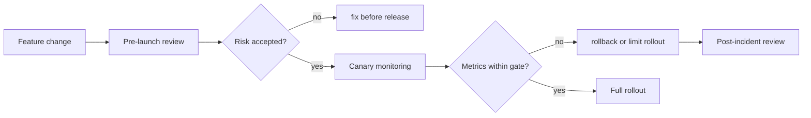
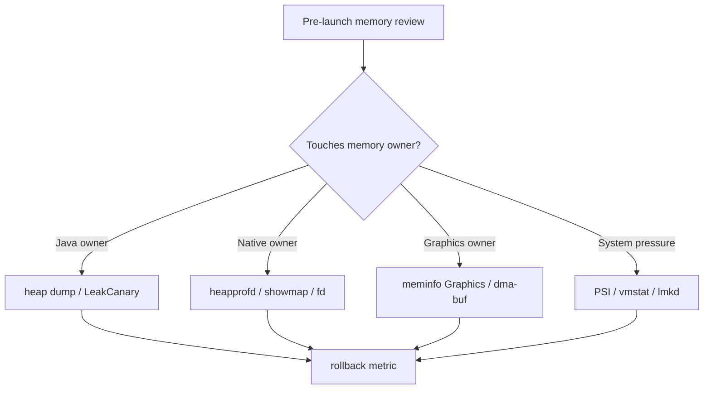
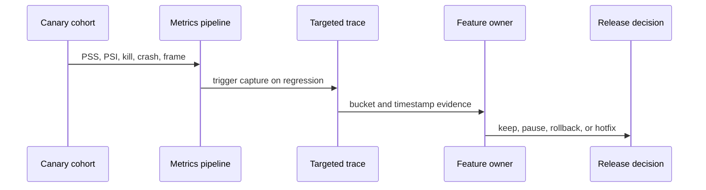
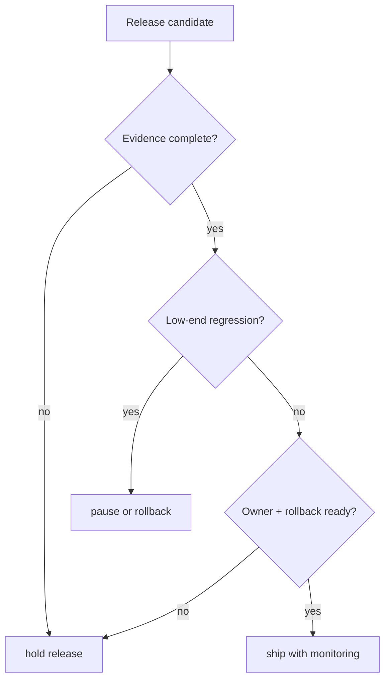

# Day 79: Android 内存评审清单：上线前、灰度中、事故后

> 目标：把 78 天的内存知识压缩成可执行的评审门禁：谁负责、看什么证据、什么时候回滚。

---

## 1. 评审总流程



| 阶段 | 目标 | 输出 |
|---|---|---|
| 上线前 | 找出峰值、泄漏、Native/Graphics、低端机风险 | 风险清单 + 验证脚本 |
| 灰度中 | 用真实流量确认指标没有恶化 | 看板 + 告警 + 回滚线 |
| 事故后 | 复盘时间线和证据链 | 根因、修复、预防门禁 |

---

## 2. 上线前清单

| 检查项 | 证据 | 拦截条件 |
|---|---|---|
| 新增 Bitmap/视频/大图 | decode size、Graphics、Native、dmabuf | 解码峰值无上限或低端机未测 |
| 新增缓存 | cache key、max size、trim 策略 | 没有上限、没有 `onTrimMemory` |
| 新增后台进程/服务 | 进程 PSS 汇总、adj、Binder/shared memory | 只看单进程，不看总包名成本 |
| 新增 JNI/native | heapprofd、showmap、fd、maps | 没有 owner 和释放路径 |
| 新增列表/预取 | scroll trace、prefetch、pool、image stats | fling 峰值无复测 |
| 新增启动预加载 | startup trace、meminfo T0-T5 | 首屏峰值上升无收益证明 |



---

## 3. 灰度监控清单

| 指标 | 看法 | 告警信号 |
|---|---|---|
| PSS p50/p95/p99 | 分版本、RAM class、进程、场景 | p95/p99 明显抬升 |
| Java heap | 看峰值和 retained count | 生命周期结束后不回落 |
| Native/Graphics | 看 showmap/meminfo bucket | Native 或 Graphics 随场景累积 |
| PSI some/full | 看低端机和关键场景 | full 与帧掉落重叠 |
| ZRAM | 看 swapin/swapout、压缩比 | 热窗口 swapin 尖峰 |
| lmkd | 看 victim、adj、RSS、reason | 关键进程 kill 增加 |
| Android 17 limiter | 看 ApplicationExitInfo 和 limiter status | 出现 limiter termination |



---

## 4. 事故后清单

| 问题 | 必要证据 | 不接受的说法 |
|---|---|---|
| 是泄漏还是峰值 | heap/retained path + 场景时间线 | “内存高就是泄漏” |
| 是 Java 还是 Native/Graphics | meminfo + showmap + heap/heapprofd | “dumpsys 一行就够了” |
| 是 OOM 还是 lmkd | exception/exit info/lmkd log | “用户说闪退所以是 OOM” |
| 是误杀吗 | kill-time adj/RSS/PSI/reason | “事后看它是前台” |
| 是水位/ZRAM 问题吗 | vmstat/zoneinfo/mm_stat/PSI | “free 小所以调大” |
| 修复有效吗 | 同脚本复测 + 回滚线 | “代码改了就好” |

---

## 5. 发布决策门



| 门禁 | 必须满足 |
|---|---|
| Evidence | 至少有 meminfo + 一个 bucket 专项证据 |
| Low-end | 低 RAM class 场景脚本跑过 |
| Owner | 每个增长 bucket 有代码 owner |
| Rollback | 指标、阈值、操作人、窗口明确 |
| Version | Android 10/11/17 等边界写清 |

---

## 6. Review 模板

```markdown
## Memory Review
- Change:
- Device / Android / RAM class:
- Scenario script:
- Buckets touched: Java / Native / Graphics / System / ZRAM / lmkd
- Baseline:
- Candidate:
- Regression:
- Owner:
- Rollback line:
- Remaining risk:
```

| 字段 | 填写标准 |
|---|---|
| Scenario script | 能被别人重复执行 |
| Baseline/Candidate | 同设备、同版本、同脚本 |
| Regression | 写具体指标，不写“略有上涨” |
| Owner | 指到模块和负责人 |
| Remaining risk | 包含 ROM、权限、采样偏差 |

---

## 7. 今天的结论

| 结论 | 实践价值 |
|---|---|
| 评审要分阶段 | 上线前、灰度中、事故后的证据不同 |
| 每个 bucket 都要有 owner | 否则优化会停在“内存高” |
| 低端机必须单独看 | PSI、ZRAM、lmkd 风险不等于高端机 |
| 回滚线是发布条件 | 没有回滚线就没有可控灰度 |

Day 80 进入最终总结：Android 内存专家知识图谱。
