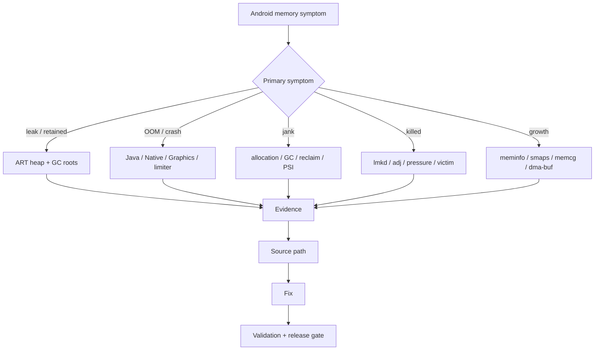
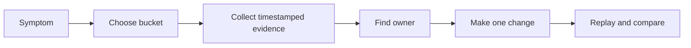
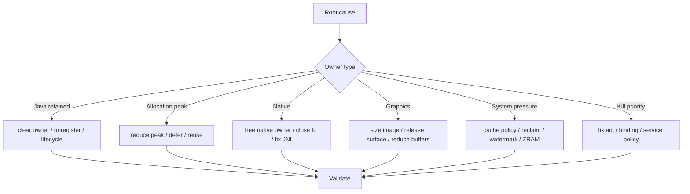
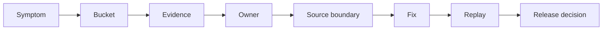

# Day 80: 总结：Android 内存专家知识图谱

> 目标：把 80 天内容压缩成一张可复用的路线图：从症状出发，找到证据、源码、修复和发布门禁。

---

## 1. 总知识图



| 能力层 | 对应主题 | 核心问题 |
|---|---|---|
| ART 基础 | heap、allocation、stack、metadata、string、object header | 对象在哪里、怎么分配、怎么被 roots 保活 |
| GC 与泄漏 | collectors、roots、LeakCanary、MAT、HPROF | 为什么没回收，谁持有谁 |
| 工具证据 | Profiler、heap dump、allocation、meminfo、showmap | 证据从哪里来，字段如何解释 |
| Native/Graphics | JNI、malloc、mmap、Bitmap、dma-buf | Java 之外的账单归谁 |
| 系统低内存 | reclaim、watermark、PSI、lmkd、ZRAM、mmd | 系统压力如何变成卡顿和 kill |
| 工程方法 | cases、interviews、review checklist | 怎么复现、归因、干预、验证、发布 |

---

## 2. 症状到证据



| 症状 | 首选证据 | 下一步 |
|---|---|---|
| Activity/Fragment 不释放 | LeakCanary, HPROF, MAT Path To GC Roots | 找 root-owner-bridge-victim |
| Java OOM | exception stack, heap dump, allocation timeline | 找峰值或 retained path |
| Native 增长 | meminfo Native, showmap, maps, heapprofd | 找 native stack 或 mapping owner |
| Graphics 增长 | meminfo Graphics, dmabuf/fd, image stats | 查 Bitmap/texture/Surface owner |
| 滚动卡顿 | Perfetto frame, allocation, PSI, vmstat | 判断 GC、decode、reclaim、swap |
| 后台被杀 | lmkd log, adj snapshot, RSS, PSI, exit info | 判断策略、误杀、victim benefit |
| 水位异常 | zoneinfo, vmstat, PSI, meminfo | 判断 kswapd/direct reclaim |
| ZRAM 抖动 | mm_stat, vmstat si/so, PSI, Perfetto | 判断容量收益还是 swapin 延迟 |

---

## 3. 源码阅读入口

| 模块 | 从证据进入 | 常看路径/方向 |
|---|---|---|
| ART heap/GC | GC log、heap dump、allocation pressure | `art/runtime/gc/`, allocator, collector, root visitor |
| Framework lifecycle | Activity/Fragment/Handler leak | lifecycle callbacks, MessageQueue, Handler, AndroidX |
| AMS/OomAdjuster | kill-time adj 异常 | `ActivityManagerService`, `OomAdjuster`, process state |
| lmkd | low memory kill | userspace lmkd PSI/vmpressure strategy |
| Kernel mm | direct reclaim, PSI, watermark | reclaim, compaction, pressure stall, zone watermarks |
| ZRAM/mmd/vendor | swap, writeback, recompression | kernel zram plus vendor daemon boundary |
| Graphics | dmabuf, Surface, texture | gralloc, SurfaceFlinger, GPU/vendor boundary |

```bash
rg "GcCause|CollectGarbage|VisitRoots" art/runtime/gc
rg "oom_score_adj|OomAdjuster|PROCESS_STATE" frameworks/base/services
rg "psi|vmpressure|kill" system/memory/lmkd
rg "allocstall|watermark|compact|reclaim" kernel/mm
```

---

## 4. 修复选择图



| 根因 | 好修复 | 坏修复 |
|---|---|---|
| retained Activity | 移除 owner 或生命周期解绑 | 只手动调用 GC |
| 解码峰值 | 限制目标尺寸、复用、控制预取 | 盲目加大 heap |
| Native 泄漏 | 明确 close/free owner 和线程边界 | 只看 Java heap |
| dma-buf/Graphics | 释放 Surface/Bitmap/texture owner | 把账单归给系统 |
| direct reclaim | 降峰值或单 knob 调水位并回滚 | 同时改多个系统参数 |
| lmkd kill | 修 adj/绑定或降低 victim RSS | 无边界保活 |

---

## 5. 发布门禁总表

| 门禁 | 最低证据 |
|---|---|
| 泄漏 | 场景结束后 retained count/heap dump 回落 |
| 峰值 | T0-T5 同脚本 meminfo/trace 对比 |
| Native | heapprofd/showmap/maps 至少两类证据一致 |
| Graphics | meminfo Graphics + image/dmabuf/fd owner |
| 低端机 | RAM class 分桶，PSI/ZRAM/lmkd 单独看 |
| Android 版本 | API level、target SDK、kernel、ROM、build type 写清 |
| 回滚 | 指标、阈值、操作人、窗口明确 |

---

## 6. 最终检查清单

- [ ] 先问症状、场景、版本、设备、RAM class、进程状态。
- [ ] 先分 bucket，再下结论。
- [ ] 每个结论至少有两个证据来源。
- [ ] 使用时间线证明因果，不用事后状态解释过去。
- [ ] 源码结论必须绑定 AOSP tag、kernel、ROM 或 build type。
- [ ] 一次只做一个干预，并设置 rollback line。
- [ ] 上线前、灰度中、事故后分别保留证据。

---

## 7. 后续建设方向

| 方向 | 价值 |
|---|---|
| 真实样本库 | 收集 HPROF、Perfetto、lmkd、PSI、zram、heapprofd 样本 |
| 自动时间线工具 | 对齐 meminfo、vmstat、PSI、trace、logcat 时间戳 |
| RAM-class 阈值 | 给低端机、中端机、高端机建立不同门禁 |
| Source map 脚本 | 从 bucket 和 symptom 生成 AOSP `rg` 命令 |
| Review CI | 把 Day 79 模板接入 release pipeline |

---

## 8. 80 天结论

Android 内存专家不是“知道很多字段”的人，而是能稳定完成这条链路的人：



如果这条链路能在泄漏、OOM、Native、Bitmap、PSI、ZRAM、lmkd、低端机卡顿和发布评审里反复成立，80 天计划就达到了目标。
